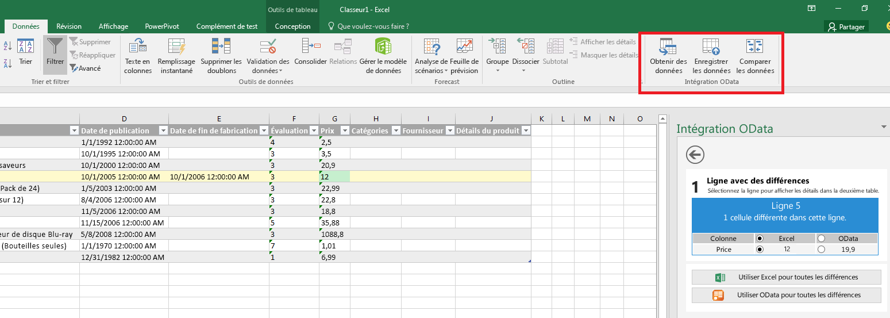
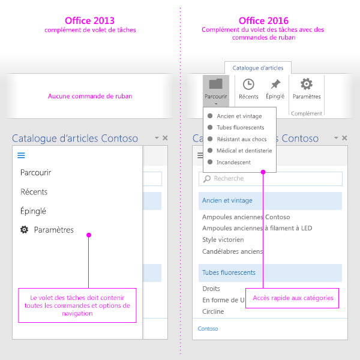

# Commandes de complément pour Excel, Word et PowerPoint

Les commandes de complément sont des éléments d’interface utilisateur qui étendent l’interface utilisateur d’Office et lancent des actions dans votre complément. Vous pouvez les utiliser pour ajouter un bouton sur le ruban ou un élément dans le menu contextuel. Lorsque les utilisateurs sélectionnent une commande de complément, ils lancent des actions telles que l’exécution de code JavaScript ou l’affichage d’une page du complément dans le volet Office. Les commandes de complément aident les utilisateurs à trouver et utiliser votre complément, ce qui favorise l’adoption et la réutilisation de votre complément, et améliore la fidélisation des clients.

Pour en savoir plus sur les fonctionnalités, regardez la vidéo sur les [commandes de complément du ruban Office](https://channel9.msdn.com/events/Build/2016/P551).

> [!NOTE]
> Les catalogues SharePoint n’acceptent pas les commandes de complément. Vous pouvez déployer des commandes de complément via le [déploiement centralisé](../publish/centralized-deployment.md) ou [AppSource](/office/dev/store/submit-to-appsource-via-partner-center), ou utiliser le [chargement de version test](../testing/create-a-network-shared-folder-catalog-for-task-pane-and-content-add-ins.md) pour déployer votre commande de complément à des fins de test. 

*Figure 1. Complément incluant des commandes en cours d’exécution dans Excel (version de bureau)*

*Figure 2. Complément incluant des commandes en cours d’exécution dans Excel sur le web*

## Fonctionnalités de commande

Les fonctionnalités de commande suivantes sont actuellement prises en charge.

> [!NOTE]
> Les compléments de contenu ne prennent actuellement pas en charge les commandes de complément.

**Points d’extension**

- Onglets de ruban - Permet d’étendre les onglets prédéfinis ou de créer un onglet personnalisé.
- Menus contextuels - Permet d’étendre les menus contextuels sélectionnés.

**Types de contrôles**

- Boutons simples - Permettent de déclencher des actions spécifiques.
- Menus - Menu déroulant simple avec des boutons qui déclenchent des actions.

**Actions**

- ShowTaskpane - Affiche un ou plusieurs volets où sont chargées des pages HTML personnalisées.
- ExecuteFunction - Charge une page HTML invisible, puis y exécute une fonction JavaScript. Pour afficher l’interface utilisateur au sein de votre fonction (par exemple, erreurs, avancement, entrées supplémentaires), vous pouvez utiliser l’API [displayDialog](/javascript/api/office/office.ui).  

## Plateformes prises en charge

Les commandes de complément sont actuellement prises en charge sur les plateformes suivantes.

- Outlook 2016 pour Windows (build 16.0.4678.1000+)
- Office sur Windows (build 16.0.6769+, connecté à l’abonnement Office 365)
- Office 2019 pour Windows
- Office sur Mac (build 15.33+, connecté à l’abonnement Office 365)
- Office 2019 sur Mac
- Office sur le web

D’autres plateformes seront bientôt disponibles.

## Débogage

Pour déboguer une commande de complément, vous devez l’exécuter dans Office sur le web. Pour plus de détails, voir [Débogage de compléments dans Office sur le web](../testing/debug-add-ins-in-office-online.md).

## Meilleures pratiques

Appliquez les meilleures pratiques suivantes lorsque vous développez des commandes de complément :

- Utilisez les commandes pour représenter une action spécifique avec un résultat clair et précis pour les utilisateurs. Ne combinez pas plusieurs actions dans un seul bouton.
- Proposez des actions détaillées permettant de réaliser plus efficacement des tâches courantes dans votre complément. Réduisez le nombre d’étapes nécessaires à la réalisation d’une action.
- Pour placer vos commandes dans le ruban Office :
    - Placez les commandes sur un onglet existant (Insertion, Révision, etc.) si la fonctionnalité ajoutée lui correspond. Par exemple, si votre complément permet aux utilisateurs d’insérer un élément multimédia, ajoutez un groupe à l’onglet Insertion. Notez que l’ensemble des onglets ne sont pas nécessairement disponibles dans toutes les versions d’Office. Pour plus d’informations, voir le [manifeste XML de compléments Office](../develop/add-in-manifests.md).
    - Placez les commandes sous l’onglet Accueil si la fonctionnalité ne correspond à aucun autre onglet, et si vous avez moins de six commandes de niveau supérieur. Vous pouvez également ajouter des commandes à l’onglet Accueil si votre complément doit fonctionner sur toutes les versions d’Office (par exemple, Office sur le web ou le bureau) et si un onglet n’est pas disponible dans toutes les versions (par exemple, si l’onglet Création n’existe pas dans Office sur le web).  
    - Placez des commandes dans un onglet personnalisé si vous avez plus de six commandes de niveau supérieur.
    - Nommez votre groupe en fonction du nom de votre complément. Si vous avez plusieurs groupes, nommez chaque groupe en fonction de la fonctionnalité offerte par les commandes de ce groupe.
    - N’ajoutez pas de boutons superflus pour augmenter la valeur de votre complément.

     > [!NOTE]
     > Les compléments qui occupent trop d’espace peuvent ne pas obtenir la [validation d’AppSource](/office/dev/store/validation-policies).

- Pour toutes les icônes, suivez les [règles de conception d’icône](add-in-icons.md).
- Proposez une version de complément qui fonctionne aussi sur les hôtes qui ne prennent pas en charge les commandes. Un seul manifeste de complément peut fonctionner sur les hôtes tenant compte ou non des commandes (par exemple, un volet Office dans le second cas).

   *Figure 3. Complément du volet Office dans Office 2013 et le même complément utilisant des commandes de complément dans Office 2016*

   

## Étapes suivantes

La meilleure façon de commencer à utiliser des commandes de complément consiste à consulter des [exemples de commandes de complément Office](https://github.com/OfficeDev/Office-Add-in-Commands-Samples/) sur GitHub.

Pour plus d’informations sur la spécification des commandes de complément dans votre manifeste, reportez-vous à l’article expliquant comment [créer des commandes de complément dans votre manifeste](../develop/create-addin-commands.md) et au contenu de référence sur [VersionOverrides](/office/dev/add-ins/reference/manifest/versionoverrides).
