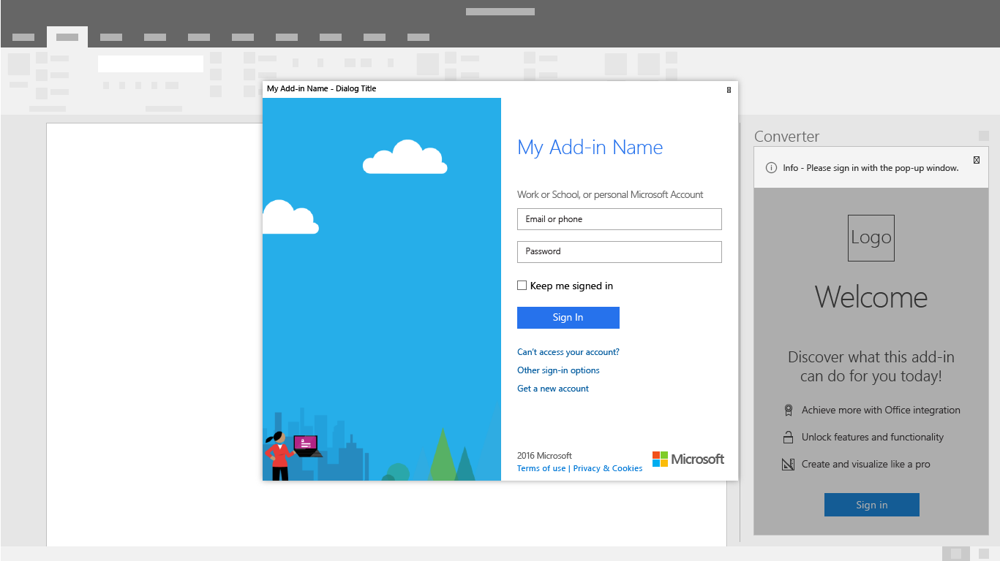

# Modèles d’authentification

Des compléments peuvent exiger que des utilisateurs se connectent ou s’inscrivent pour pouvoir accéder à certaines fonctions et fonctionnalités. Des zones de saisie pour le nom d’utilisateur et le mot de passe, ou des boutons qui lancent des flux d’informations d’identification tiers sont des contrôles d’interface courants dans les expériences d’authentification. Une expérience d’authentification simple et efficace est une première étape importante pour inciter des utilisateurs à commencer à utiliser votre complément.

## Meilleures pratiques

|À faire|À ne pas faire|
|:----|:----|
|Avant la connexion, décrivez la valeur de votre complément, ou montrez les fonctionnalités sans exiger de compte. |Attendez que des utilisateurs se connectent sans comprendre la valeur et les avantages de votre complément.|
|Guidez les utilisateurs dans les flux d’authentification à l’aide d’un bouton principal bien visible sur chaque écran. |Attirez l’attention sur les tâches secondaires et tertiaires avec des boutons et appels à l’action concurrents.|
|Utilisez des libellés de boutons clairs décrivant des tâches spécifiques telles que « Se connecter » ou « Créer un compte ».   |Utilisez des étiquettes de boutons vagues telles que « Soumettre » ou « Commencer » pour guider les utilisateurs tout au long des flux d’authentification.|
|Utilisez une boîte de dialogue pour attirer l’attention des utilisateurs sur les formulaires d’authentification.    |Enrichissez votre volet des tâches avec une première expérience d’exécution et des formulaires d’authentification.|
|Trouvez de petites efficacités dans le flux, comme la focalisation automatique sur des zones de saisie. |Ajoutez des étapes superflues à l’interaction, telles que l’obligation pour les utilisateurs de cliquer dans des champs de formulaire.|
|Offrez aux utilisateurs un moyen de se déconnecter et de se ré-authentifier.    |Obligez les utilisateurs à se désinstaller pour changer d’identité.|

## Flux d’authentification
Tant que l’authentification unique n’est pas disponible en aperçu, les compléments de production doivent donner aux utilisateurs la possibilité de se connecter directement à votre service ou à un fournisseur d’identité tel que Microsoft.

1. Mise en place de la première expérience d’exécution : positionnez votre bouton de connexion en tant qu’appel à l’action clair dans l’interface de première exécution de votre complément.

2. Boîte de dialogue pour le choix de fournisseur d’identité : affichez une liste claire de fournisseurs d’identité, dont un formulaire de nom d’utilisateur et de mot de passe, le cas échéant. Il se peut que l’interface utilisateur de votre complément se bloque lorsque la boîte de dialogue d’authentification est ouverte.

3. Connexion au fournisseur d’identité : le fournisseur d’identité aura sa propre interface utilisateur. Microsoft Azure Active Directory vous permet de personnaliser les pages de connexion et d’accès afin d’uniformiser l’apparence de votre service.  [En savoir plus](https://docs.microsoft.com/azure/active-directory/fundamentals/customize-branding).

4. Progression : indiquez la progression du chargement des paramètres et de l’interface utilisateur.

> [!NOTE] 
> Lorsque vous utilisez le service d’identité de Microsoft vous avez la possibilité d’utiliser un bouton de connexion personnalisable à l’aide de thèmes lumineux et sombres.En savoir plus.

## Authentification unique (aperçu)

> [!NOTE]
> L’API d’authentification unique est actuellement prise en charge en préversion pour Word, Excel, Outlook et PowerPoint. Pour plus d’informations sur la prise en charge de l’authentification unique, voir  [Ensembles de conditions requises de l’API d’identité](https://docs.microsoft.com/office/dev/add-ins/reference/requirement-sets/identity-api-requirement-sets?view=office-js). Si vous utilisez un complément Outlook, veillez à activer l’authentification moderne pour la location d’Office 365. Pour plus d’informations sur la manière de procéder, voir  [Exchange Online : Activation de votre client pour l’authentification moderne](https://social.technet.microsoft.com/wiki/contents/articles/32711.exchange-online-how-to-enable-your-tenant-for-modern-authentication.aspx).

Une fois l’authentification unique généralement disponible pour les compléments de production, utilisez-la pour fluidifier l’expérience des utilisateurs finaux. L’identité de l’utilisateur au sein d’Office (compte Microsoft ou identité Office 365) est utilisée pour la connexion à votre complément. Par conséquent, les utilisateurs ne se connectent qu’une seule fois. Cela permet d’éliminer les frictions dans l’expérience, en facilitant la prise en main pour vos clients.

1. Lorsqu’un complément est installé, un utilisateur voit une fenêtre de consentement semblable à la fenêtre ci-dessous : 
> [!NOTE]
> L’éditeur du complément contrôle le logo, les chaînes et les étendues d’autorisation inclus dans la fenêtre de consentement. L’interface utilisateur est préconfigurée par Microsoft.

2. Le complément est chargé une fois que l’utilisateur a accepté. Il peut extraire et afficher les informations personnalisées nécessaires de l’utilisateur.

## Voir aussi
- En savoir plus sur [développement de compléments d’authentification unique (aperçu)](https://docs.microsoft.com/office/dev/add-ins/develop/sso-in-office-add-ins)