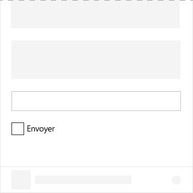

# Composant de case ? cocher dans Office UI Fabric

Une case ? cocher est un ?l?ment de l?interface utilisateur qui permet aux utilisateurs d?activer ou de d?sactiver des options dans les compl?ments. Utilisez les cases ? cocher pour permettre aux utilisateurs de s?lectionner des options. En outre, une case ? cocher peut ?tre associ?e ? un contr?le. Lorsque la case ? cocher est s?lectionn?e ou d?s?lectionn?e, le comportement du contr?le associ? change. Par exemple, le contr?le associ? peut basculer entre l??tat visible ou masqu?.
  
#### Exemple : Case ? cocher dans un volet des t?ches

## Meilleures pratiques

|**? faire**|**? ne pas faire**|
|:------------|:--------------|
|Utiliser les cases ? cocher pour indiquer l??tat.   |Ne pas utiliser les cases ? cocher pour afficher/indiquer une action.   |
|Utiliser plusieurs cases ? cocher lorsque les utilisateurs peuvent s?lectionner plusieurs options qui ne s?excluent pas mutuellement.|Ne pas utiliser de case ? cocher lorsque les utilisateurs ne peuvent choisir qu?une seule option. Utiliser les cases d?option lorsqu?ils ne doivent s?lectionner qu?une seule option.|
|Autoriser les utilisateurs ? choisir n?importe quelle combinaison d?options lorsque plusieurs cases ? cocher sont regroup?es.|Ne pas placer deux groupes de cases ? cocher l?un ? c?t? de l?autre. S?parer les deux groupes avec des ?tiquettes.|
|Utiliser une case ? cocher unique pour un param?tre secondaire. Par exemple, la case ? cocher **M?moriser mes informations** est un param?tre secondaire utilis? dans un sc?nario de connexion.|Ne pas utiliser de cases ? cocher pour activer et d?sactiver des param?tres. Pour passer d?un ?tat activ? ? d?sactiv? ou vice-versa, utiliser un bouton bascule.|

## Variantes

|**Variation**|**Description**|**Exemple**|
|:------------|:--------------|:----------|
|**Case ? cocher non contr?l?e**|? utiliser comme ?tat de case ? cocher par d?faut. ||
|**Case ? cocher non contr?l?e avec la valeur Vrai s?lectionn?e par d?faut**|? utiliser lorsque l?instance de case ? cocher conserve son propre ?tat ||
|**Case ? cocher non contr?l?e d?s?lectionn?e avec la valeur Vrai s?lectionn?e par d?faut**|?tat d?sactiv? de la case ? cocher. ||
|**Case ? cocher contr?l?e**|L??tat s?lectionn? de cette case ? cocher est d?cid? ? un autre endroit de votre interface utilisateur. Dans ce sc?nario, la valeur correcte est transmise ? la case ? cocher par un ?v?nement **onChange** et le nouveau rendu de l?interface utilisateur. ||

## Impl?mentation

Pour plus d?informations, reportez-vous ? [Case ? cocher](https://dev.office.com/fabric#/components/checkbox) et [D?marrer avec un exemple de code Fabric React](https://github.com/OfficeDev/Word-Add-in-GettingStartedFabricReact).

## Voir aussi

- [Mod?les de conception UX](https://github.com/OfficeDev/Office-Add-in-UX-Design-Patterns-Code)
- [Office UI Fabric dans des compl?ments Office](office-ui-fabric.md)
