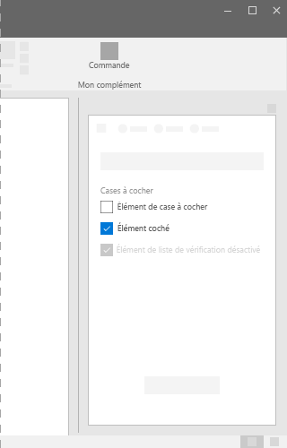

# Composant de case ? cocher dans Office UI FabricCheckbox component in Office UI Fabric

Une case ? cocher est un ?l?ment de l?interface utilisateur qui permet aux utilisateurs d?activer ou de d?sactiver des options dans les compl?ments. Utilisez les cases ? cocher pour permettre aux utilisateurs de s?lectionner des options. En outre, une case ? cocher peut ?tre associ?e ? un contr?le. Lorsque la case ? cocher est s?lectionn?e ou d?s?lectionn?e, le comportement du contr?le associ? change. Par exemple, le contr?le associ? peut basculer entre l??tat visible ou masqu?.A check box is a UI element that allows users to select or clear options in add-ins. Use check boxes to allow users to select among options. Additionally, a check box may be paired with a related control. When the check box is selected or cleared, the behavior of the related control changes. For example, the related control may toggle between the visible or hidden states.
  
#### Exemple : Case ? cocher dans un volet des t?chesExample: Check box in a task pane

## Meilleures pratiquesBest practices

|**? faire****Do**|**? ne pas faire****Don't**|
|:------------|:--------------|
|Utiliser les cases ? cocher pour indiquer l??tat.Use check boxes to indicate status.   |Ne pas utiliser les cases ? cocher pour afficher/indiquer une action.Don?t use check boxes to show/indicate an action.   |
|Utiliser plusieurs cases ? cocher lorsque les utilisateurs peuvent s?lectionner plusieurs options qui ne s?excluent pas mutuellement.Use multiple check boxes when users can select multiple options, and the options are not mutually exclusive.|Ne pas utiliser de case ? cocher lorsque les utilisateurs ne peuvent choisir qu?une seule option. Utiliser les cases d?option lorsqu?ils ne doivent s?lectionner qu?une seule option.Don?t use a check box when users can choose only one option. When selecting only one option is required, use radio buttons.|
|Autoriser les utilisateurs ? choisir n?importe quelle combinaison d?options lorsque plusieurs cases ? cocher sont regroup?es.Allow users to choose any combination of options when several check boxes are grouped together.|Ne pas placer deux groupes de cases ? cocher l?un ? c?t? de l?autre. S?parer les deux groupes avec des ?tiquettes.Don't put two groups of check boxes next to each other. Separate the two groups with labels.|
|Utiliser une case ? cocher unique pour un param?tre secondaire.Use a single check box for a secondary setting. Par exemple, la case ? cocher **M?moriser mes informations** est un param?tre secondaire utilis? dans un sc?nario de connexion.For example, the **Remember me?** check box is a secondary setting used in a sign-in scenario.|Ne pas utiliser de cases ? cocher pour activer et d?sactiver des param?tres. Pour passer d?un ?tat activ? ? d?sactiv? ou vice-versa, utiliser un bouton bascule.Don?t use check boxes to turn settings on or off. To change between an on or off state, use a toggle.|

## VariantesVariants

|**Variation****Variation**|**Description****Description**|**Exemple****Example**|
|:------------|:--------------|:----------|
|**Case ? cocher non contr?l?e****Uncontrolled check box**|? utiliser comme ?tat de case ? cocher par d?faut.Use as the default check box state. ||
|**Case ? cocher non contr?l?e avec la valeur Vrai s?lectionn?e par d?faut****Uncontrolled check box with default checked true**|? utiliser lorsque l?instance de case ? cocher conserve son propre ?tatUse when the check box instance maintains its own state. ||
|**Case ? cocher non contr?l?e d?s?lectionn?e avec la valeur Vrai s?lectionn?e par d?faut****Disabled uncontrolled check box with default checked true**|?tat d?sactiv? de la case ? cocher.Disabled state of the check box. ||
|**Case ? cocher contr?l?e****Controlled check box**|L??tat s?lectionn? de cette case ? cocher est d?cid? ? un autre endroit de votre interface utilisateur. Dans ce sc?nario, la valeur correcte est transmise ? la case ? cocher par un ?v?nement **onChange** et le nouveau rendu de l?interface utilisateur.The checked state of this check box is decided at another location in your UI. In this scenario, the correct value is passed to the check box by an **onChange** event and re-rendering of the UI. ||

## Impl?mentationImplementation

Pour plus d?informations, reportez-vous ? [Case ? cocher](https://dev.office.com/fabric#/components/checkbox) et [D?marrer avec un exemple de code Fabric React](https://github.com/OfficeDev/Word-Add-in-GettingStartedFabricReact).For details, see [Checkbox](https://dev.office.com/fabric#/components/checkbox) and [Getting started with Fabric React code sample](https://github.com/OfficeDev/Word-Add-in-GettingStartedFabricReact).

## Voir aussiSee also

- [Mod?les de conception UXUX Design Patterns](https://github.com/OfficeDev/Office-Add-in-UX-Design-Patterns-Code)
- [Office UI Fabric dans des compl?ments OfficeOffice UI Fabric in Office Add-ins](office-ui-fabric.md)
