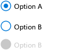

# Composant ChoiceGroup dans Office UI Fabric

Le composant ChoiceGroup, ?galement appel? bouton radio, pr?sente aux utilisateurs deux options ou plus qui s?excluent mutuellement. Les utilisateurs ne peuvent s?lectionner qu?un seul bouton ChoiceGroup dans un groupe. Chaque option est repr?sent?e par un bouton ChoiceGroup. 
  
#### Exemple : ChoiceGroup dans un volet des t?ches

 

## Meilleures pratiques

|**? faire**|**? ne pas faire**|
|:------------|:--------------|
|Conserver les options ChoiceGroup au m?me niveau.   |Ne pas utiliser de ChoiceGroups ou de cases ? cocher imbriqu?s.   |
|Utiliser des ChoiceGroups avec 2 ? 7 options, en v?rifiant qu?il y a suffisamment d?espace ? l??cran pour afficher toutes les options. Dans le cas contraire, utiliser une case ? cocher ou une liste d?roulante.|Ne pas utiliser lorsque les options sont des nombres avec un intervalle fixe, par exemple, 10, 20, 30 et ainsi de suite. ? la place, utiliser un composant de curseur.|
|Si les utilisateurs ne choisissent aucune option, envisager d?inclure une option comme **Aucune** ou **Non concern?**.|Ne pas utiliser de boutons ChoiceGroup pour un choix binaire unique.|
|Si possible, aligner les boutons ChoiceGroup verticalement et non horizontalement. L?alignement horizontal est plus difficile ? lire et ? localiser.||
|Lister les options dans un ordre logique. Par exemple, commencer par les options les plus susceptibles d??tre activ?es, les plus simples ou les moins risqu?es. |Ne pas ranger les options par ordre alphab?tique, car ce classement d?pend de la langue.|

## Variantes

|**Variation**|**Description**|**Exemple**|
|:------------|:--------------|:----------|
|**ChoiceGroups**|? utiliser lorsque les images ne sont pas n?cessaires pour effectuer une s?lection.| |
|**ChoiceGroups utilisant des images**|? utiliser lorsque les images sont n?cessaires pour effectuer une s?lection.| |

## Impl?mentation

Pour plus d?informations, reportez-vous ? [ChoiceGroup](https://dev.office.com/fabric#/components/choicegroup) et [D?marrer avec un exemple de code Fabric React](https://github.com/OfficeDev/Word-Add-in-GettingStartedFabricReact).

## Voir aussi

- [Mod?les de conception UX](https://github.com/OfficeDev/Office-Add-in-UX-Design-Patterns-Code)
- [Office UI Fabric dans des compl?ments Office](office-ui-fabric.md)
