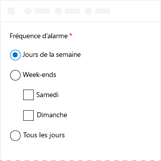

# Composant ChoiceGroup dans Office UI FabricChoiceGroup component in Office UI Fabric

Le composant ChoiceGroup, également appelé bouton radio, présente aux utilisateurs deux options ou plus qui s’excluent mutuellement. Les utilisateurs ne peuvent sélectionner qu’un seul bouton ChoiceGroup dans un groupe. Chaque option est représentée par un bouton ChoiceGroup.The ChoiceGroup component, also known as a radio button, presents users with two or more mutually exclusive options. Users can select only one ChoiceGroup button in a group. Each option is represented by one ChoiceGroup button. 
  
#### Exemple : ChoiceGroup dans un volet des tâchesExample: ChoiceGroup in a task pane

 

## Meilleures pratiquesBest practices

|**À faire****Do**|**À ne pas faire****Don't**|
|:------------|:--------------|
|Conserver les options ChoiceGroup au même niveau.Keep ChoiceGroup options at the same level.   |Ne pas utiliser de ChoiceGroups ou de cases à cocher imbriqués.Don't use nested ChoiceGroups or check boxes.   |
|Utiliser des ChoiceGroups avec 2 à 7 options, en vérifiant qu’il y a suffisamment d’espace à l’écran pour afficher toutes les options.Use ChoiceGroups with 2-7 options, ensuring there is enough screen space to show all options. Dans le cas contraire, utiliser une case à cocher ou une liste déroulante.Otherwise, use a check box or drop-down list.|Ne pas utiliser lorsque les options sont des nombres avec un intervalle fixe, par exemple, 10, 20, 30 et ainsi de suite. À la place, utiliser un composant de curseur.Don't use when the options are numbers with a fixed step, for example 10, 20, 30, and so on. Instead, use a slider component.|
|Si les utilisateurs ne choisissent aucune option, envisager d’inclure une option comme **Aucune** ou **Non concerné**.If users may not choose any of the options, consider including an option such as **None** or **Does not apply**.|Ne pas utiliser de boutons ChoiceGroup pour un choix binaire unique.Don’t use two ChoiceGroup buttons for a single binary choice.|
|Si possible, aligner les boutons ChoiceGroup verticalement et non horizontalement. L’alignement horizontal est plus difficile à lire et à localiser.If possible, align ChoiceGroup buttons vertically instead of horizontally. Horizontal alignment is harder to read and localize.||
|Lister les options dans un ordre logique. Par exemple, commencer par les options les plus susceptibles d’être activées, les plus simples ou les moins risquées.List options in logical order, for example, the most likely option to be selected to the least, the simplest operation to the most complex, or the least risk to the highest risk. |Ne pas ranger les options par ordre alphabétique, car ce classement dépend de la langue.Don't use alphabetical ordering because it is language dependent.|

## VariantesVariants

|**Variation****Variation**|**Description****Description**|**Exemple****Example**|
|:------------|:--------------|:----------|
|**ChoiceGroups****ChoiceGroups**|À utiliser lorsque les images ne sont pas nécessaires pour effectuer une sélection.Use when imagery is not necessary for making a selection.| |
|**ChoiceGroups utilisant des images****ChoiceGroups using images**|À utiliser lorsque les images sont nécessaires pour effectuer une sélection.Use when imagery is necessary for making a selection.| |

## ImplémentationImplementation

Pour plus d’informations, reportez-vous à [ChoiceGroup](https://dev.office.com/fabric#/components/choicegroup) et [Démarrer avec un exemple de code Fabric React](https://github.com/OfficeDev/Word-Add-in-GettingStartedFabricReact).For details, see [ChoiceGroup](https://dev.office.com/fabric#/components/choicegroup) and [Getting started with Fabric React code sample](https://github.com/OfficeDev/Word-Add-in-GettingStartedFabricReact).

## Voir aussiSee also

- [Modèles de conception UXUX Design Patterns](https://github.com/OfficeDev/Office-Add-in-UX-Design-Patterns-Code)
- [Office UI Fabric dans des compléments OfficeOffice UI Fabric in Office Add-ins](office-ui-fabric.md)
