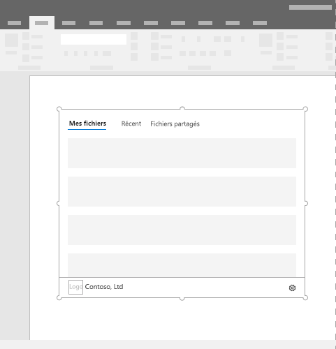

# Compléments Office de contenu

Les compléments de contenu sont des surfaces qui peuvent être incorporées directement dans des documents Excel ou PowerPoint. Les compléments de contenu permettent aux utilisateurs d’accéder aux contrôles d’interface qui exécutent le code pour modifier des documents ou afficher des données d’une source de données. Utilisez les compléments de contenu lorsque vous souhaitez incorporer des fonctionnalités directement dans le document.  

*Figure 1. Mise en page type pour les compléments de contenu*

## Meilleures pratiques

- Inclure un élément de navigation ou de commande comme le CommandBar ou le tableau croisé dynamique en haut de votre complément.
- Inclure un élément de la marque tel que BrandBar en bas de votre complément (s’applique aux compléments Excel et PowerPoint uniquement).

## Variantes

Les tailles des compléments de contenu pour Excel et PowerPoint dans le bureau Office et Microsoft 365 sont spécifiées par l’utilisateur.

## Menu Caractéristique

Personality menus can obstruct navigational and commanding elements located near the top right of the add-in. The following are the current dimensions of the personality menu on Windows and Mac.

Pour Windows, le menu Caractéristique mesure 12 x 32 pixels, comme illustré.

*Figure 2. Menu Caractéristique sur Windows* 

Pour Mac, le menu Caractéristique mesure 26 x 26 pixels, mais flotte à 8 pixels de la droite et à 6 pixels du haut, ce qui permet d’augmenter l’espace occupé à 34 x 32 pixels, comme illustré.

*Figure 3. Menu Caractéristique sur Mac*

## Implémentation

Pour consulter un exemple qui implémente un complément de contenu, reportez-vous à [Excel Content Add-in Humongous Insurance](https://github.com/OfficeDev/Excel-Content-Add-in-Humongous-Insurance) dans GitHub.

## Considérations relatives à la prise en charge

- Vérifiez si votre complément Office fonctionne sur une [plateforme hôte Office spécifique](../overview/office-add-in-availability.md).
- Certains compléments de contenu peuvent exiger que l’utilisateur accepte que le complément lise et écrive dans Excel ou PowerPoint. Vous pouvez déclarer le [niveau des autorisations](../develop/requesting-permissions-for-api-use-in-content-and-task-pane-add-ins.md) que vous souhaitez attribuer à votre utilisateur dans le manifeste du complément.  
- Content add-ins are supported in Excel and PowerPoint in Office 2013 version and later. If you open an add-in in a version of Office that doesn't support Office web add-ins, the add-in will be displayed as an image.

## Voir aussi

- [Disponibilité des compléments Office sur les plateformes et les hôtes](../overview/office-add-in-availability.md)
- [Office UI Fabric dans des compléments Office](../design/office-ui-fabric.md)
- [Modèles de conception de l’expérience utilisateur pour les compléments Office](../design/ux-design-pattern-templates.md)
- [Demande d’autorisations d’utilisation de l’API dans des compléments](../develop/requesting-permissions-for-api-use-in-content-and-task-pane-add-ins.md)
