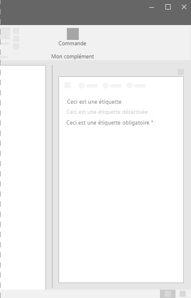

# Composant d’étiquette dans la structure de l’interface utilisateur d’Office

Utilisez des étiquettes pour nommer ou donner un titre à un composant ou un groupe de composants. Associées à un autre composant ou groupe de composants, les étiquettes doivent se trouver à proximité des composants ou des groupes associés. Certains composants ont des étiquettes prédéfinies comme les listes déroulantes ou les boutons bascule.
  
#### Exemple : Étiquette dans un volet de tâches

## Meilleures pratiques

|**À faire**|**À ne pas faire**|
|:------------|:--------------|
|Utilisez la casse pour une phrase, par exemple **Prénom**.|N’utilisez pas la casse pour un titre, par exemple **Prénom**.|
|Soyez court et concis.|N’utilisez pas de phrases complètes ni de signes de ponctuation complexes comme les virgules ou les points-virgules.|
|Lorsque vous ajoutez une étiquette à des composants, utilisez un nom ou une locution nominale courte comme texte d’étiquette.| |

## Variantes

|**Variation**|**Description**|**Exemple**|
|:------------|:--------------|:----------|
|**Étiquette par défaut**|À utiliser pour les étiquettes standard.| |
|**Étiquette désactivée**|À utiliser lorsque le composant associé est désactivé.| |
|**Étiquette requise**|À utiliser lorsque le composant associé est requis.| |

## Implémentation

Pour plus d’informations, reportez-vous à [Étiquette](https://dev.office.com/fabric#/components/label) et [Démarrer avec un exemple de code React de la structure](https://github.com/OfficeDev/Word-Add-in-GettingStartedFabricReact).

## Voir aussi

- [Modèles de conception UX](https://github.com/OfficeDev/Office-Add-in-UX-Design-Patterns-Code)
- [Office UI Fabric dans des compléments Office](office-ui-fabric.md)
