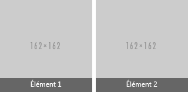

# Composant de la liste dans la structure de l?interface utilisateur d?OfficeList component in Office UI Fabric

Les listes proposent une mise en page coh?rente lors de l?interaction avec des ensembles de contenu importants, m?me lorsque le contenu est principalement du texte. Les listes permettent aux utilisateurs de parcourir facilement du contenu.Lists provide a consistent layout when interacting with large collections of content, even when the content is text-heavy. Lists allow users to easily scan through content. 
  
#### Exemple : Liste dans un volet de t?chesExample: List in a task pane

## Meilleures pratiquesBest practices

- Terminer chaque entr?e d?une liste par un point si :End each entry in a list with a period if:
  - Toutes les entr?es sont des phrases compl?tes.All entries are complete sentences.
  - Une ou plusieurs entr?es contiennent un fragment et une phrase compl?te qui propose des informations suppl?mentaires.One or more of the entries contains both a fragment and a complete sentence that offers additional information.
  - Toutes les entr?es compl?tent la phrase d?introduction ou le fragment.The entries all complete the introductory sentence or fragment.
- Listes cons?cutives distinctes dans une page avec un titre.Separate consecutive lists on a page with headings.

## VariantesVariants

|**Variation****Variation**|**Description****Description**|**Exemple****Example**|
|:------------|:--------------|:----------|
|**Liste de la grille****Grid list**|? utiliser lorsque des informations d?taill?es sont requises avec chaque ?l?ment de liste.Use when detailed information is needed with each list item.| |
|**Liste d??l?ments ? hauteur variable****Variable height item list**|? utiliser lorsque des images et des textes importants sont n?cessaires.Use when large imagery and text is needed.| |

## Impl?mentationImplementation

Pour plus d?informations, reportez-vous ? [Liste](https://dev.office.com/fabric#/components/list) et [D?marrer avec un exemple de code React de la structure](https://github.com/OfficeDev/Word-Add-in-GettingStartedFabricReact).For details, see [List](https://dev.office.com/fabric#/components/list) and [Getting started with Fabric React code sample](https://github.com/OfficeDev/Word-Add-in-GettingStartedFabricReact).

## Voir aussiSee also

- [Mod?les de conception UXUX Design Patterns](https://github.com/OfficeDev/Office-Add-in-UX-Design-Patterns-Code)
- [Office UI Fabric dans des compl?ments OfficeOffice UI Fabric in Office Add-ins](office-ui-fabric.md)
