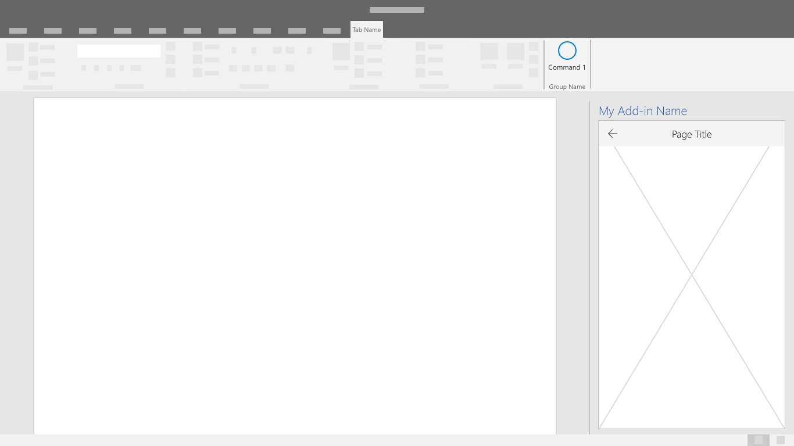

# Modèles de navigationNavigation patterns

Les principales fonctionnalités d’un complément sont accessibles via les types de commande spécifique et la zone de l’écran limitée.The main features of an add-in are accessed through specific command types and limited screen area. Il est important que la navigation soit intuitive, fournisse du contexte et permette à l’utilisateur de se déplacer facilement au sein du complément.It is important that navigation is intuitive, provides context, and allows the user to move easily throughout the add-in.

## Meilleures pratiquesBest practices

| À faireDo    | À ne pas faireDon't |
| :---- | :---- |
| Vérifiez que l’utilisateur dispose d’une option de navigation clairement visible.Ensure the user has a clearly visible navigation option. | Ne compliquez pas le processus de navigation en utilisant des éléments d’interface utilisateur non standard.Don't complicate the navigation process by using non-standard UI.
| Servez-vous des composants suivants le cas échéant pour permettre aux utilisateurs de parcourir le complément.Utilize the following components as applicable to allow users to navigate through your add-in. | N’ajoutez pas de difficultés qui empêcherait l’utilisateur de savoir où il se trouve ou de comprendre le contexte au sein du complémentDon't make it difficult for the user to understand their current place or context within the add-in

## Barre de commandesCommand Bar

La barre de commandes est une surface dans le volet Office qui héberge des commandes qui fonctionnent sur le contenu de la fenêtre, du panneau ou de la région parent qu’elle contient.The CommandBar is a surface within the task pane that houses commands that operate on the content of the window, panel, or parent region it resides above. Exemples de fonctionnalités facultatives : point d’accès au menu « hamburger », recherche et commandes sur le côté.Optional features include a hamburger menu access point, search, and side commands.

## Barre d’ongletsTab Bar

La barre d’onglets affiche la navigation à l’aide de boutons avec du texte et des icônes verticalement empilés.The tab bar shows navigation using buttons with vertically stacked text and icons. Utiliser la barre d’onglets pour permettre la navigation à l’aide des onglets avec des titres courts et explicites.Use the tab bar to provide navigation using tabs with short and descriptive titles.

## Bouton PrécédentBack Button

Le bouton précédent permet aux utilisateurs de récupérer à partir d’une action de navigation d’exploration.The back button allows users to recover from a drill-down navigational action. Ce modèle permet de vous assurer que les utilisateurs suivent une série d’étapes ordonnées.This pattern helps ensure users follow an ordered series of steps.

