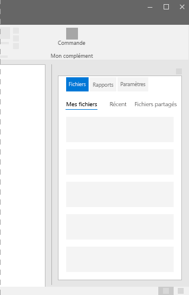

# Composant de tableau croisé dynamique dans Office UI Fabric

Les tableaux croisés dynamiques permettent d’accéder rapidement au contenu fréquemment consulté. Les tableaux croisés dynamiques permettent de naviguer entre deux vues de contenu ou plus. Les en-têtes de texte spécifient le contenu qui se trouve dans chaque section du tableau croisé dynamique. Le contenu de chaque section du tableau croisé dynamique peut appartenir à différentes catégories de contenu. Dans les compléments Office, utilisez le contrôle de tableau croisé dynamique avec des styles d’onglet. Les onglets peuvent utiliser une combinaison d’icônes et de texte pour communiquer le type de contenu de cet onglet. 

#### Exemple : Tableau croisé dynamique dans un volet Office

## Meilleures pratiques

|**À faire**|**À ne pas faire**|
|:------------|:--------------|
|Les étiquettes de navigation doivent être concises, utilisant de préférence un ou deux mots seulement, plutôt qu’une phrase.|N’utilisez pas de phrases complètes ni de signes de ponctuation complexes comme les virgules ou les points-virgules.|
|Conservez les en-têtes de tableau croisé dynamique à l’écran même si un autre onglet est sélectionné.| |
|Limitez les contrôles de tableau croisé dynamique à 3, 4 ou 5 onglets.| |
|Utilisez les tableaux croisés dynamiques comme éléments de navigation près du haut de la page. Ne combinez pas de tableaux croisés dynamiques dans le contenu de la page.| |
|Utilisez des tableaux croisés dynamiques sur les pages au contenu important, qui nécessitent beaucoup de défilements.| |

## Variantes

|**Variation**|**Description**|**Exemple**|
|:------------|:--------------|:----------|
|**Exemple de base**|À utiliser comme option de tableau croisé dynamique par défaut.| |
|**Liens de style d’onglet**|À utiliser lorsque les boutons de tableau croisé dynamique de style d’onglet sont privilégiés.| |

## Implémentation

Pour plus d’informations, reportez-vous à [Tableau croisé dynamique](https://dev.office.com/fabric#/components/pivot) et [Démarrer avec un exemple de code Fabric React](https://github.com/OfficeDev/Word-Add-in-GettingStartedFabricReact).

## Voir aussi

- [Modèles de conception UX](https://github.com/OfficeDev/Office-Add-in-UX-Design-Patterns-Code)
- [Office UI Fabric dans des compléments Office](office-ui-fabric.md)
