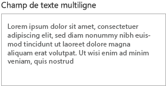

# Composant TextField dans Office UI Fabric

Les champs de texte permettent aux utilisateurs de saisir du texte. Ils sont g?n?ralement utilis?s pour capturer une seule ligne de texte mais peuvent ?tre configur?s pour capturer plusieurs lignes de texte. Le texte s?affiche ? l??cran dans un format simple et uniforme.
  
#### Exemple : TextField dans un volet Office

## Meilleures pratiques

|**? faire**|**? ne pas faire**|
|:------------|:--------------|
|Utiliser des champs de texte pour accepter la saisie de donn?es sur un formulaire ou une page.|Ne pas utiliser de champs de texte pour rendre une copie de base dans un ?l?ment de corps d?une page.|
|?tiqueter les champs de texte avec des noms utiles.|Ne pas utiliser de champs de texte pour saisir une date ou une heure. Utiliser plut?t un s?lecteur de date et heure.|
|Utiliser un texte de l?espace r?serv? concis pour sp?cifier le contenu qui doit ?tre saisi.|Ne pas utiliser de champs de texte si des options d?entr?e valides peuvent ?tre pr?d?finies. Utiliser plut?t une liste d?roulante.|
|Fournir tous les ?tats appropri?s pour les champs de texte (statique, pointage, focus, engag?, non disponible, erreur).||
|Marquer clairement les champs obligatoires et facultatifs.||
|Si possible, mettre en forme les champs de texte en fonction du format de donn?es attendu. Par exemple, lors de la capture d?un num?ro de t?l?phone ? 10 chiffres, utiliser trois champs distincts pour stocker les diff?rentes parties du num?ro de t?l?phone.||

## Variantes

|**Variation**|**Description**|**Exemple**|
|:------------|:--------------|:----------|
|**Default TextField (champ de texte par d?faut)**|? utiliser comme champ de texte par d?faut.| |
|**Disabled TextField (champ de texte d?sactiv?)**|? utiliser lorsque le champ de texte est d?sactiv?.| |
|**Required TextField (champ de texte obligatoire)**|? utiliser lorsque le champ de texte est obligatoire.| |
|**TextField with a placeholder (champ de texte avec un espace r?serv?)**|? utiliser lorsqu?un texte de l?espace r?serv? est n?cessaire.| |
|**TextField with multiple lines (champ de texte avec plusieurs lignes)**|? utiliser lorsque plusieurs lignes de texte sont n?cessaires.| |

## Impl?mentation

Pour plus d?informations, reportez-vous ? [TextField](https://dev.office.com/fabric#/components/textfield) et [D?marrer avec un exemple de code Fabric React](https://github.com/OfficeDev/Word-Add-in-GettingStartedFabricReact).

## Voir aussi

- [Mod?les de conception UX](https://github.com/OfficeDev/Office-Add-in-UX-Design-Patterns-Code)
- [Office UI Fabric dans des compl?ments Office](office-ui-fabric.md)
