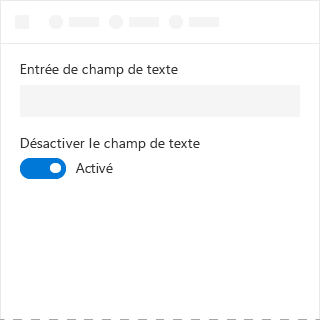

# Composant de bouton bascule dans Office UI FabricToggle component in Office UI Fabric

Les boutons bascules sont des commutateurs physiques qui activent ou d?sactivent des ?l?ments. Utilisez les boutons bascules pour pr?senter deux options qui s?excluent mutuellement (par exemple, on et off), lorsque le choix d?une option provoque une action imm?diate.Toggles represent a physical switch to turn things on or off. Use toggles to present two mutually exclusive options (for example, on or off), where choosing an option results in an immediate action.
  
#### Exemple : bouton bascule dans un volet OfficeExample: Toggle in a task pane

## Meilleures pratiquesBest practices

|**? faire****Do**|**? ne pas faire****Don't**|
|:------------|:--------------|
|Utiliser les boutons bascule pour les param?tres binaires lorsque les modifications sont imm?diatement appliqu?es.Use toggles for binary settings when changes are immediately applied.   |Ne pas utiliser de boutons bascule si les utilisateurs doivent effectuer une ?tape suppl?mentaire avant que les modifications prennent effet.Don?t use toggles if users must perform an extra step before changes take effect.   |
|Remplacer les ?tiquettes **On** et **Off** uniquement s?il existe des ?tiquettes plus sp?cifiques ? utiliser pour un param?tre. Utiliser des ?tiquettes courtes (3 ? 4 caract?res) qui repr?sentent des oppos?s binaires.Only replace the **On** and **Off** labels if there are more specific labels to use for a setting. Use short (3-4 character) labels that represent binary opposites.| |

## VariantesVariants

|**Variation****Variation**|**Description****Description**|**Exemple****Example**|
|:------------|:--------------|:----------|
|**Enabled and checked (Activ? et s?lectionn?)****Enabled and checked**|? utiliser lorsque l??tat bascul? est actif.Use when the toggled state is active.| |
|**Enabled and unchecked (Activ? et d?s?lectionn?)****Enabled and unchecked**|? utiliser lorsque l??tat bascul? est inactif.Use when the toggled state is inactive.| |
|**Disabled and checked (D?sactiv? et s?lectionn?)****Disabled and checked**|? utiliser lorsque l??tat actif ne peut pas ?tre modifi?.Use when the active state cannot be changed.| |
|**Disabled and unchecked (D?sactiv? et d?s?lectionn?)****Disabled and unchecked**|? utiliser lorsque l??tat inactif ne peut pas ?tre modifi?.Use when the inactive state cannot be changed.| |

## Impl?mentationImplementation

Pour plus d?informations, reportez-vous ? [Bouton bascule](https://dev.office.com/fabric#/components/toggle) et [D?marrer avec un exemple de code Fabric React](https://github.com/OfficeDev/Word-Add-in-GettingStartedFabricReact).For details, see [Toggle](https://dev.office.com/fabric#/components/toggle) and [Getting started with Fabric React code sample](https://github.com/OfficeDev/Word-Add-in-GettingStartedFabricReact).

## Voir aussiSee also

- [Mod?les de conception UXUX Design Patterns](https://github.com/OfficeDev/Office-Add-in-UX-Design-Patterns-Code)
- [Office UI Fabric dans des compl?ments OfficeOffice UI Fabric in Office Add-ins](office-ui-fabric.md)
