# Modèles d’interaction pour les compléments Office

Les Compléments Office peuvent améliorer l’expérience de création et de productivité, tout en connectant le contenu des applications hôtes Office à des flux de travail web de plus grande envergure. Un certain nombre de scénarios courants s’appliquent aux composants de contenu, du volet Office et Outlook que vous pouvez développer. Cet article décrit certains des scénarios les plus courants et fournit des modèles d’interaction recommandés pour l’expérience utilisateur associée au complément. Vous pouvez décomposer, combiner ou mélanger et associer ces modèles d’interaction en fonction de vos scénarios uniques.

 **Scénarios courants pour les compléments**

| Type de complément | Scénarios courants |
| ------ | ------ |
|  Contenu  |  Visualisation de données   Widgets et outils  |
|  Volet de tâches  |  Transformation et traitement des données   Création plus efficace   Localisation de contenu et insertion de données   Publication ou téléchargement de contenu vers un service web  |
|  Outlook  |  Pontage entre le contenu du courrier électronique et une application externe   Informations supplémentaires sur le contenu d’un courrier électronique ou d’un rendez-vous   Informations contribuant à améliorer votre productivité  |

## Visualisation des données avec un complément de contenu

Cet exemple présente un complément de contenu pour Excel qui génère un graphique à partir des données d’une feuille de calcul.

Dans ce modèle d’interaction, le complément ne devient actif que lorsque vous sélectionnez et liez des données pour générer le graphique. Il est important de communiquer l’objet du complément et la procédure d’activation dans la vue initiale du complément. 

**Complément de contenu pour Excel qui génère un graphique à partir des données d’une feuille de calcul**
 

 
<ul><li>
Afin de renforcer l’idée selon laquelle l’utilisateur doit effectuer une action avant de choisir le bouton, affichez les instructions avec un bouton désactivé (A).
</li><li>
Une fois que vous avez sélectionné une plage de cellules, le bouton Créer un graphique devient actif (B-C).
</li><li>
La visualisation remplit le conteneur et remplace la vue précédente (D).
</li><li>
Affichez tout élément d’interface utilisateur supplémentaire sur le bord inférieur du complément avec un bouton de paramètres (engrenage) pour vous permettre d’accéder à une vue dans laquelle vous pouvez réinitialiser ou gérer le complément.
</li></ul>Convient mieux pour :
<ul><li>
Compléments qui nécessitent que vous sélectionniez les données avant l’activation
</li></ul>

## Transformation du contenu avec un complément du volet Office

Cet exemple présente un complément du volet Office qui traduit le texte de votre document dans une autre langue.

Dans ce modèle d’interaction, vous devez d’abord sélectionner le texte à traduire dans le document.

**Complément du volet Office qui traduit le texte de votre document dans une autre langue**
 
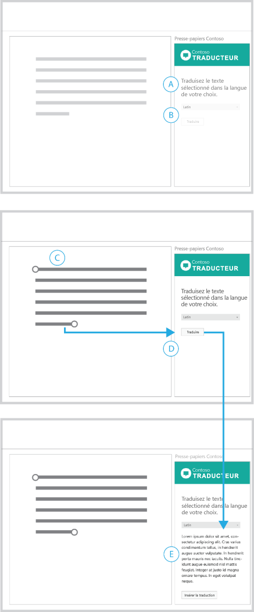
 
<ul><li>
Communiquez l’objet du complément dans un titre et indiquez que l’utilisateur doit d’abord effectuer une sélection (A).
</li><li>
Le menu de langue et le bouton Traduire sont désactivés, renforçant l’idée que l’utilisateur doit effectuer une action pour poursuivre. Après sélection du contenu dans le document, ces deux éléments deviennent actifs (D).
</li><li>
Une fois que l’utilisateur choisit Traduire, l’interface utilisateur se développe pour afficher le contenu traduit, ainsi qu’un bouton permettant de le réinsérer dans le document (E).
</li><li>
Vous pouvez fournir un bouton Effacer ou Réinitialiser qui rétablit la vue initiale.
</li></ul>Convient mieux pour :
<ul><li>
Compléments qui nécessitent que vous sélectionniez des données avant l’activation
</li><li>
Interface utilisateur qui se déroule ou est révélée au fur et à mesure de votre progression dans un scénario
</li></ul>

## Données de processus avec un complément du volet Office

Cet exemple présente un complément du volet Office qui vérifie les données dans Excel.

Dans ce modèle d’interaction, vous devez sélectionner une plage de cellules dans la feuille de calcul pour commencer.

**Complément du volet Office qui vérifie les données dans Excel**
 
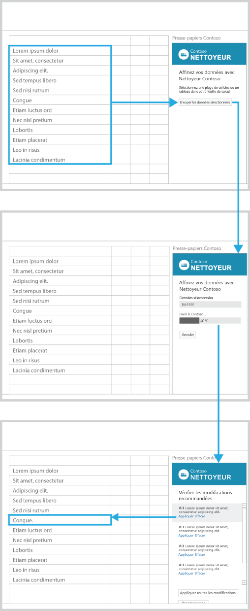
 
<ul><li>
L’objectif du complément est décrit dans le titre. Les instructions vous aideront à commencer.
</li><li>
Le bouton Envoyer les données sélectionnées est désactivé, renforçant l’idée que l’utilisateur doit effectuer une action pour progresser (A).
</li><li>
Une fois que l’utilisateur a sélectionné une plage de cellules dans sa feuille de calcul (B), le bouton Envoyer les données sélectionnées devient actif.
</li><li>
Une fois que l’utilisateur a cliqué sur ce bouton, l’interface utilisateur est remplacée par la plage de cellules sélectionnée, une barre de progression et un bouton Annuler.
</li><li>
La barre de progression indique l’état du processus et le bouton Annuler permet de l’interrompre (D).
</li><li>
Lorsque le processus est terminé, les résultats sont automatiquement affichés (E). La sélection d’un élément dans la liste active la cellule correspondante dans la feuille de calcul.
</li></ul>Convient mieux pour :
<ul><li>
Processus d’une durée indéterminée
</li></ul>

## Analyse du contenu avec un complément du volet Office

Cet exemple présente un complément du volet Office qui affiche les définitions des mots que vous tapez.

Dans ce modèle d’interaction, vous devez d’abord sélectionner le texte dans le document pour afficher les résultats.

**Complément du volet Office qui affiche les définitions des mots au fur et à mesure de la saisie**
 
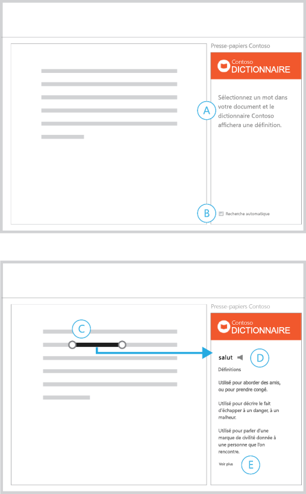
 
<ul><li>
Un titre explique l’objet du complément et comment commencer (A).
</li><li>
La recherche automatique est activée par défaut, avec la possibilité de la désactiver (B).
</li><li>
Une fois que vous effectuez une sélection, le complément affiche le contenu correspondant (D).
</li><li>
Fournissez un lien pour afficher plus d’informations (E).
</li></ul>Convient mieux pour :
<ul><li>
Compléments qui renvoient automatiquement du contenu au fur et à mesure de la création
</li><li>
Compléments qui nécessitent que vous sélectionniez du contenu avant l’activation
</li></ul>

## Localisation de contenu avec un complément du volet Office

Cet exemple présente un complément du volet Office pour la recherche de contenu.

Dans ce modèle d’interaction, entrez une chaîne dans la zone de recherche ou choisissez parmi une liste de contenus sélectionnés pour commencer.

**Complément du volet Office pour la recherche de contenu**
 
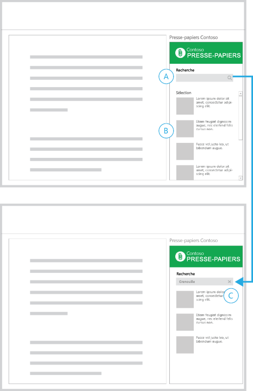
 
<ul><li>
La vue initiale contient une zone Recherche (A) et une liste de contenus sélectionnés (B).
</li><li>
Lorsque l’utilisateur entre une chaîne dans la zone de recherche, l’icône de recherche est remplacée par une icône de fermeture (C).
</li><li>
Choisissez l’icône Fermer pour revenir à la vue initiale.
</li></ul>Convient mieux pour :
<ul><li>
Compléments qui renvoient automatiquement du contenu au fur et à mesure de la création
</li><li>
Compléments qui nécessitent que vous sélectionniez du contenu avant l’activation
</li></ul>

## Insertion d’un élément multimédia avec un complément du volet Office

Dans ce modèle d’interaction, vous pouvez sélectionner une image à partir des résultats de la recherche pour l’insérer dans le document.

**Complément du volet Office pour l’insertion d’une image**
 
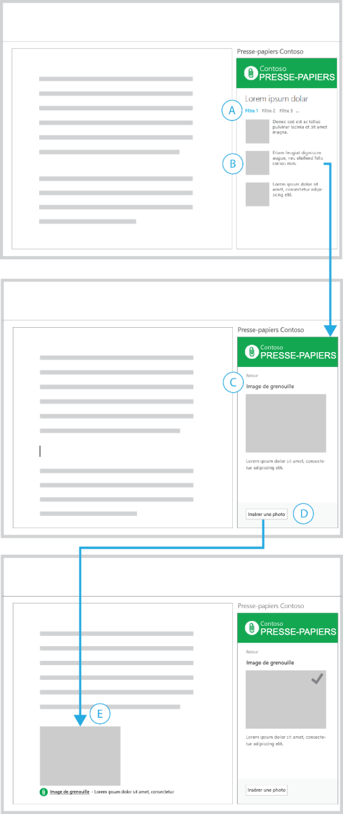
 
<ul><li>
Vous avez filtré la liste des résultats de recherche (A) et sélectionné le contenu à insérer (B).
</li><li>
Une vue détaillée du contenu sélectionné est affichée (C) avec un bouton permettant de revenir à la liste.
</li><li>
Un bouton Insérer une photo se trouve dans le pied de page (D). Lorsque vous cliquez sur ce bouton, l’image est insérée dans le document.
</li><li>
Une courte description de la provenance de l’image est incluse avec le contenu inséré (E). 
</li><li>
L’interface utilisateur du complément confirme visuellement la réussite de l’action.
</li></ul>Convient mieux pour :
<ul><li>
Compléments permettant d’insérer du contenu
</li></ul>

## Insertion du texte sélectionné avec un complément du volet Office

Dans ce modèle d’interaction, vous sélectionnez du texte à partir des résultats de la recherche pour l’insérer dans le document.

**Complément du volet Office pour l’insertion de texte**
 
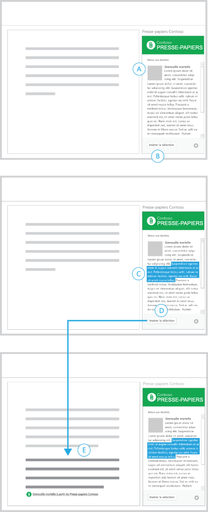
 
<ul><li>
Vous avez déjà localisé une portion de contenu (A).
</li><li>
Un bouton Insérer une sélection désactivé est affiché dans le pied de page (B).
</li><li>
Lorsque vous sélectionnez une chaîne de texte (C), le bouton Insérer une sélection devient actif.
</li><li>
Une fois que l’utilisateur choisit ce bouton, le complément insère le texte sélectionné dans le document avec une référence à la source du contenu (E).
</li></ul>Convient mieux pour :
<ul><li>
Compléments de recherche et d’insertion de contenu
</li></ul>

## Publication sur un service web avec un complément du volet Office

Cet exemple présente un complément du volet Office pour la publication d’un document en tant qu’article de blog.

Dans ce modèle d’interaction, vous avez terminé d’écrire le contenu d’un document et vous souhaitez le publier sur votre blog.

**Complément du volet Office pour la publication d’un document en tant qu’article de blog**
 
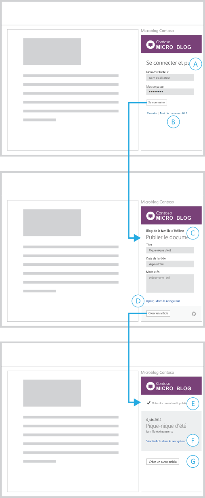
 
<ul><li>
Tout d’abord, un formulaire de connexion s’affiche pour entrer vos informations d’identification (A).
</li><li>
Des liens de création de compte et de gestion des problèmes de connexion classiques sont fournis (B). La sélection de ces liens ouvre les pages correspondantes dans un navigateur.
</li><li>
Lorsque vous êtes connecté, le complément affiche un formulaire permettant créer un nouvel article de blog (C).
</li><li>
Le nom du compte avec lequel vous vous êtes connecté (et sous lequel vous effectuerez vos publications) apparaît en haut du complément. Le complément fournit un lien pour afficher un aperçu de l’article (D). Sélectionnez-le pour afficher l’aperçu dans un navigateur.
</li><li>
Après la sélection de Créer un article, le complément affiche une vue confirmant que le contenu du document a été publié (E).
</li><li>
Le complément fournit un lien permettant d’afficher l’article dans un navigateur (F), ainsi qu’un bouton permettant de créer un autre article (G).
</li></ul>Convient mieux pour :
<ul><li>
Compléments qui génèrent, publient ou partagent du contenu sur les réseaux sociaux, les sites de blog et les services web
</li><li>
Compléments qui nécessitent que vous vous connectiez à un service
</li></ul>

## Obtention d’informations supplémentaires sur des personnes avec un complément Outlook

 **Exemple 1**

**Page de résultats et de détails**
 
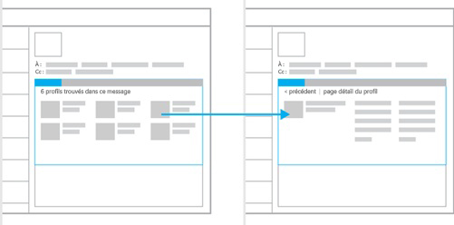
 
Convient mieux pour :
<ul><li>
Présentation de l’étendue de votre contenu si vous disposez d’ensembles de données volumineux qu’il serait utile de mettre en avant
</li><li>
Pages de détails qui utilisent la taille complète du conteneur de complément
</li><li>
Modèles de navigation qui bénéficient d’un flux « aller-retour »
</li></ul>
 
 **Exemple 2**

**Page de détails avec navigation persistante**
 
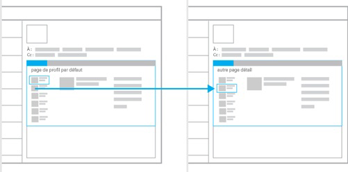
 
Convient mieux pour :
<ul><li>
Affichage, par défaut, du premier résultat d’un ensemble de données
</li><li>
Structures de navigation fonctionnant comme des onglets (navigation linéaire à un seul niveau)
</li><li>
Réduction des actions de sélection en maintenant la navigation disponible en permanence
</li><li>
Fourniture d’espace pour afficher la navigation en permanence
</li></ul>

## Obtention d’informations supplémentaires sur le contenu avec un complément Outlook

 **Exemple 1**

**Page de résultats et de détails**
 
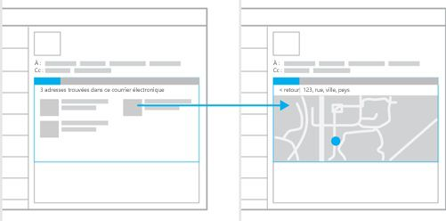
 
Convient mieux pour :
<ul><li>
Présentation de l’étendue de votre contenu si vous disposez d’ensembles de données volumineux qu’il serait utile d’afficher
</li><li>
Sélection ou choix exigé avant l’affichage de détails supplémentaires
</li><li>
Pages de détails qui utilisent la taille complète du conteneur de complément
</li><li>
Modèles de navigation qui bénéficient d’un flux « aller-retour »
</li></ul>
 
 **Exemple 2**

**Page de détails avec contenu secondaire**
 
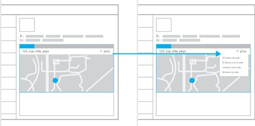
 
Convient mieux pour :
<ul><li>
Situations dans lesquelles vous souhaitez mettre en avant un élément de contenu
</li><li>
Présentation de votre contenu sans interaction de l’utilisateur
</li><li>
Navigation persistante (pouvant être ajoutée à ce modèle pour un mélange de simplicité et de facilité de navigation)
</li></ul>

## Connexion à un service en ligne et présentation des données

Ces exemples illustrent des modèles d’interaction pour l’obtention de données et de contenu à partir d’un service en ligne. Ils peuvent être utilisés dans les trois types de complément : compléments de contenu, compléments du volet Office et compléments Outlook.

 **Exemple 1**

**Carrousel**
 

 
Convient mieux pour :
<ul><li>
Petites quantités de données qui peuvent être exposées individuellement ou par groupe
</li><li>
Exposition de contenu sous forme de galerie, comme un diaporama ou une galerie d’images
</li><li>
Situations dans lesquelles un modèle de navigation suivant/précédent fonctionne bien
</li></ul>
 
 **Exemple 2**

**Assistant**
 
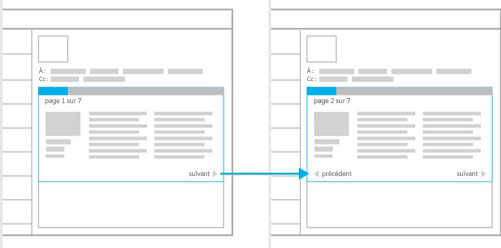
 
Convient mieux pour :
<ul><li>
Contenu à présenter dans un ordre spécifique
</li><li>
Grandes quantités de contenu adaptées à une consommation sous forme de série de petits éléments
</li><li>
Expériences de consommation de type livre
</li><li>
Situations dans lesquelles une série d’étapes ou d’actions est nécessaire pour effectuer une tâche
</li></ul>
 
 **Exemple 3**

**Formulaire, résultats et détails**
 
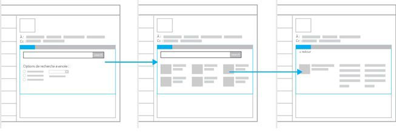
 
Convient mieux pour :
<ul><li>
Compléments qui nécessitent la saisie de données
</li><li>
Point d’entrée dans un modèle de résultats et de détails
</li></ul>

## Voir aussi

- [Instructions de conception pour les compléments Office](../add-in-design.md)
    
