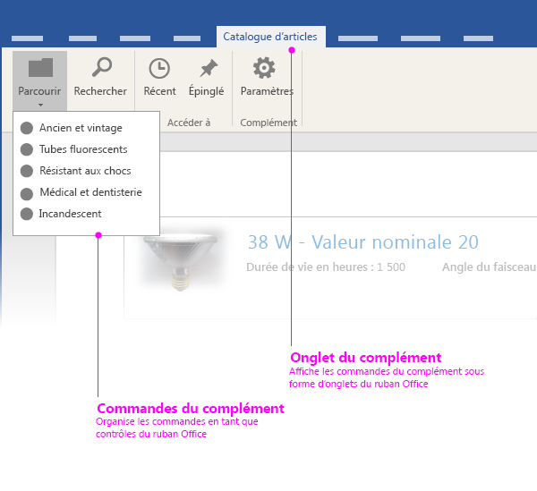
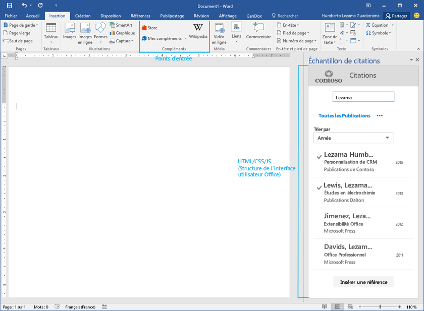

# Éléments de l’interface utilisateur des compléments Office

Vous pouvez utiliser deux types d’éléments d’interface utilisateur dans vos compléments Office : 

- Des commandes de complément 
- Des éléments d’interface HTML personnalisés

## Des commandes de complément
Les commandes sont définies dans le [fichier manifeste XML du complément](../../develop/create-addin-commands.md) et sont restituées sous forme d’extensions natives dans l’interface utilisateur d’Office. Par exemple, vous pouvez utiliser des commandes de complément pour ajouter des boutons au ruban Office. 

Actuellement, les commandes de complément sont uniquement prises en charge pour les compléments de messagerie. Pour plus d’informations, consultez la page relative aux [commandes de complément de messagerie](https://docs.microsoft.com/fr-fr/outlook/add-ins/add-in-commands-for-outlook). 

Excel, PowerPoint et Word disposent de points d’entrée prédéfinis pour les compléments de volet de tâches et de contenu sous l’onglet Insertion du ruban Office. Des fonctionnalités de commande personnalisées seront bientôt disponibles pour les compléments de volet de tâches et de contenu. 

## Éléments d’interface utilisateur HTML personnalisés

Les compléments peuvent incorporer des éléments d’interface utilisateur HTML personnalisés aux clients Office. Les conteneurs disponibles pour afficher ces éléments varient selon le type de complément. Par exemple, les compléments de volet de tâches affichent les éléments d’interface utilisateur HTML personnalisés dans le volet droit du document, tandis que les compléments de contenu les affichent directement dans les documents Office.

Quel que soit le type de complément que vous créez, vous pouvez utiliser des blocs de construction communs pour créer des éléments d’interface utilisateur HTML personnalisés. Nous vous recommandons d’utiliser [Office UI Fabric](https://github.com/OfficeDev/Office-UI-Fabric) pour ces éléments, afin que votre complément s’intègre harmonieusement à l’interface Office. Vous pouvez également utiliser vos propres éléments d’interface utilisateur pour obtenir un rendu plus personnalisé.

Office UI Fabric fournit les éléments suivants :

- Typographie
- Couleur
- Icônes
- Animations
- Composants d’entrée
- dispositions
- Éléments de navigation

Vous pouvez télécharger [Office UI Fabric à partir de Github](https://github.com/OfficeDev/Office-UI-Fabric).

Vous pouvez également consulter un [exemple d’utilisation d’Office UI Fabric dans des compléments Office](https://github.com/OfficeDev/Office-Add-in-Fabric-UI-Sample).

> [!NOTE]
> Si vous décidez d’utiliser votre propre jeu de polices et d’icônes, veillez à ce qu’elles n’entrent pas en conflit avec celles d’Office. Par exemple, n’utilisez pas d’icônes qui sont identiques ou semblables à celles d’Office, mais représentent quelque chose de différent dans votre complément. 

### Création d’une palette de couleurs personnalisée
Si vous décidez d’utiliser votre propre palette de couleurs, gardez les points suivants à l’esprit : 
 
- Utilisez la couleur pour mettre votre marque en valeur et rendre l’expérience utilisateur de votre complément plus agréable et conviviale.
- Utilisez des couleurs qui ont du sens et utilisez-les de manière cohérente dans votre complément. Par exemple, choisissez une couleur d’accentuation pour donner à votre complément un thème visuel cohérent.
- Évitez d’utiliser la même couleur pour les éléments interactifs et non interactifs. Si vous utilisez une couleur pour indiquer aux utilisateurs les éléments avec lesquels ils peuvent interagir, comme les objets de navigation, les liens et les boutons, utilisez-en une autre pour les éléments statiques.
- Si vous utilisez de la couleur pour le texte ou du texte blanc sur un fond de couleur, veillez à ce que le contraste de ces couleurs soit suffisant pour répondre aux directives d’accessibilité (rapport de contraste de 4,5:1).
- Pensez aux personnes atteintes de daltonisme : n’utilisez pas que des couleurs pour indiquer l’interactivité.

### Thèmes 
Que vous décidiez d’adopter le jeu de couleurs Office ou d’utiliser le vôtre, nous vous encourageons à utiliser nos API d’application de thèmes. Les compléments qui reprennent les thèmes visuels d’Office s’intégreront bien plus harmonieusement avec les produits Office.

- Pour les compléments de volet de tâches et de messagerie, utilisez la propriété [Context.officeTheme](https://dev.office.com/reference/add-ins/shared/office.context.officetheme) pour utiliser les thèmes correspondant à ceux des applications Office. Actuellement, cette API n’est disponible que dans Office 2016.  
- Pour plus d’informations sur les compléments de contenu pour PowerPoint, reportez-vous à l’article expliquant comment [utiliser des thèmes Office dans vos compléments PowerPoint](../../powerpoint/use-document-themes-in-your-powerpoint-add-ins.md).

<!-- Link to theming API docs and Humberto's seed sample. Add screenshot of themed add-in. -->

## Voir aussi

- [Instructions de conception pour les compléments Office](../add-in-design.md)
