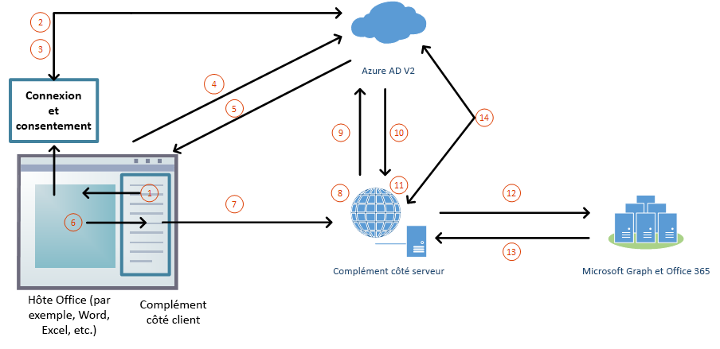

# Autorisez Microsoft Graph dans votre complément Office (préversion)

Un utilisateur se connecte à Office (plates-formes de bureau, mobiles et en ligne) à l’aide de son compte Microsoft personnel ou professionnel ou d'école (Office 365). La meilleure façon pour un complément Office d'obtenir un accès autorisé à [Microsoft Graph](https://developer.microsoft.com/graph/docs) est d’utiliser les informations d’identification à partir de la connexion de l’utilisateur à Office. Cela lui permet d’accéder à ses données Microsoft Graph sans devoir se connecter une deuxième fois. 

> [!NOTE]
> L’API d’authentification unique est actuellement en préversion pour Word, Excel, Outlook et PowerPoint. Pour plus d’informations sur l’endroit où l’API d’authentification unique est actuellement prise en charge, consultez la rubrique [Ensembles de conditions requises de l’API d’identité](https://docs.microsoft.com/javascript/office/requirement-sets/identity-api-requirement-sets?view=office-js).
> Si vous utilisez un complément Outlook, veillez à activer l’authentification moderne pour la location d’Office 365. Pour plus d’informations sur la manière de procéder, consultez [Exchange Online : Activation de votre client pour l’authentification moderne](https://social.technet.microsoft.com/wiki/contents/articles/32711.exchange-online-how-to-enable-your-tenant-for-modern-authentication.aspx).

## Architecture de complément pour SSO et Microsoft Graph

Outre l’hébergement des pages et du JavaScript de l’application Web, le complément doit également héberger, dans le même [nom de domaine complet](https://docs.microsoft.com/windows/desktop/DNS/f-gly#_dns_fully_qualified_domain_name_fqdn__gly), une ou plusieurs API Web qui recevront un jeton d’accès à Microsoft Graph et effectueront des requêtes.

Le manifeste du complément contient un balisage qui spécifie comment le complément est enregistré dans le point de terminaison Azure Active Directory (Azure AD) v2.0 et il indique les autorisations à Microsoft Graph dont le complément a besoin.

### Fonctionnement à l’exécution

Le diagramme suivant montre le fonctionnement du processus de connexion et d'accès à Microsoft Graph.

1. Dans le complément, JavaScript appelle une nouvelle API Office.js [getAccessTokenAsync](https://docs.microsoft.com/office/dev/add-ins/develop/sso-in-office-add-ins#sso-api-reference). Cela indique à l’application hôte Office qu’elle doit obtenir un jeton d’accès au complément. (Ci-après, cela s'appelle le **jeton d'accès de démarrage** car il est remplacé par un second jeton plus tard dans le processus. Pour un exemple de jeton d'accès de démarrage décodé, consultez la rubrique [Exemple de jeton d'accès](sso-in-office-add-ins.md#example-access-token).
1. Si l’utilisateur n’est pas connecté, l’application hôte Office ouvre une fenêtre contextuelle pour que l’utilisateur se connecte.
1. Si c’est la première fois que l’utilisateur actuel utilise votre complément, il est invité à donner son consentement.
1. L’application hôte Office demande le **jeton d'accès de démarrage** au point de terminaison Azure AD version 2.0 pour l’utilisateur actuel.
1. Azure AD envoie le jeton de démarrage à l’application hôte Office.
1. L’application hôte Office envoie le **jeton d'accès de démarrage** au complément en tant que partie de l’objet résultat renvoyé par l’appel `getAccessTokenAsync`.
1. Un code JavaScript dans le complément effectue une requête HTTP vers une API web hébergée sur le même domaine complet que le complément et inclut le **jeton d'accès de démarrage** comme preuve d’autorisation.  
1. Le code côté serveur valide le **jeton d'accès de démarrage**entrant.
1. Le code côté serveur utilise le flux « au nom de » (défini par l'[Échange de jetons OAuth2](https://tools.ietf.org/html/draft-ietf-oauth-token-exchange-02) et l'[application démon ou serveur pour un scénario d'API Web Azure](https://docs.microsoft.com/azure/active-directory/develop/active-directory-authentication-scenarios#daemon-or-server-application-to-web-api)) pour obtenir un jeton d'accès pour Microsoft Graph en échange du jeton d'accès de démarrage.
1. Azure AD renvoie le jeton d'accès à Microsoft Graph (et un jeton d’actualisation si le complément demande l’autorisation *offline_access*) au complément.
1. Le code côté serveur met en cache le jeton d'accès pour Microsoft Graph.
1. Le code côté serveur envoie des requêtes à Microsoft Graph et inclut le jeton d'accès à Microsoft Graph.
1. Microsoft Graph renvoie des données au complément, qui peut les transmettre à l’interface utilisateur du complément.
1. Lorsque le jeton d'accès à Microsoft Graph expire, le code côté serveur peut utiliser son jeton d'actualisation pour obtenir un nouveau jeton d'accès à Microsoft Graph.

## Développez un complément SSO qui accède à Microsoft Graph

Vous développez un complément qui accède à Microsoft Graph comme vous le feriez pour tout autre complément utilisant l'authentification unique. Pour une description détaillée, voir [Activez la connexion unique pour les compléments Office](https://docs.microsoft.com/office/dev/add-ins/develop/sso-in-office-add-ins). La différence est qu'il est obligatoire pour le complément d'avoir une API Web côté serveur, et ce qu'on appelle le jeton d'accès dans cet article s'appelle le « jeton d'accès de démarrage ». 

Selon votre langage et votre environnement de travail, des bibliothèques peuvent être disponibles pour simplifier le code côté serveur que vous devez écrire. Votre code doit effectuer les opérations suivantes :

* Validez le jeton d'accès de démarrage du complément reçu du gestionnaire de jetons que vous avez créé précédemment. Pour plus d'informations, consultez la rubrique [Valider le jeton d'accès](sso-in-office-add-ins.md#validate-the-access-token). 
* Démarrez le flux « de la part de » avec un appel au point de terminaison Azure AD version 2.0 qui inclut le jeton d'accès de démarrage, certaines métadonnées relatives à l’utilisateur et les informations d’identification du complément (ID et clé secrète).
* Mettez en cache le jeton d'accès renvoyé à Microsoft Graph. Pour obtenir plus d'informations sur ce flux, consultez la rubrique[Azure Active Directory v2.0 et flux OAuth 2.0 « de la part de »](https://docs.microsoft.com/azure/active-directory/develop/active-directory-v2-protocols-oauth-on-behalf-of).
* Créez une ou plusieurs méthodes d'API web qui obtiennent des données Microsoft Graph, en transmettant le jeton d'accès mis en cache vers Microsoft Graph.

> [!NOTE]
> Pour des exemples de jetons d'accès décodés pour Microsoft Graph qui ont été obtenus « de la part du » flux, consultez la rubrique [Azure Active Directory version 2.0 et OAuth 2.0 de la part du lux](https://docs.microsoft.com/azure/active-directory/develop/active-directory-v2-protocols-oauth-on-behalf-of).

Pour une aide détaillée pas à pas et des exemples de scénarios, consultez les rubriques suivantes :

* [Créer un complément Office Node.js qui utilise l’authentification unique](create-sso-office-add-ins-nodejs.md)
* [Créer un complément Office ASP.NET qui utilise l’authentification unique](create-sso-office-add-ins-aspnet.md)
* [Scénario : implémenter l’authentification unique sur votre service dans un complément Outlook](https://docs.microsoft.com/outlook/add-ins/implement-sso-in-outlook-add-in)

