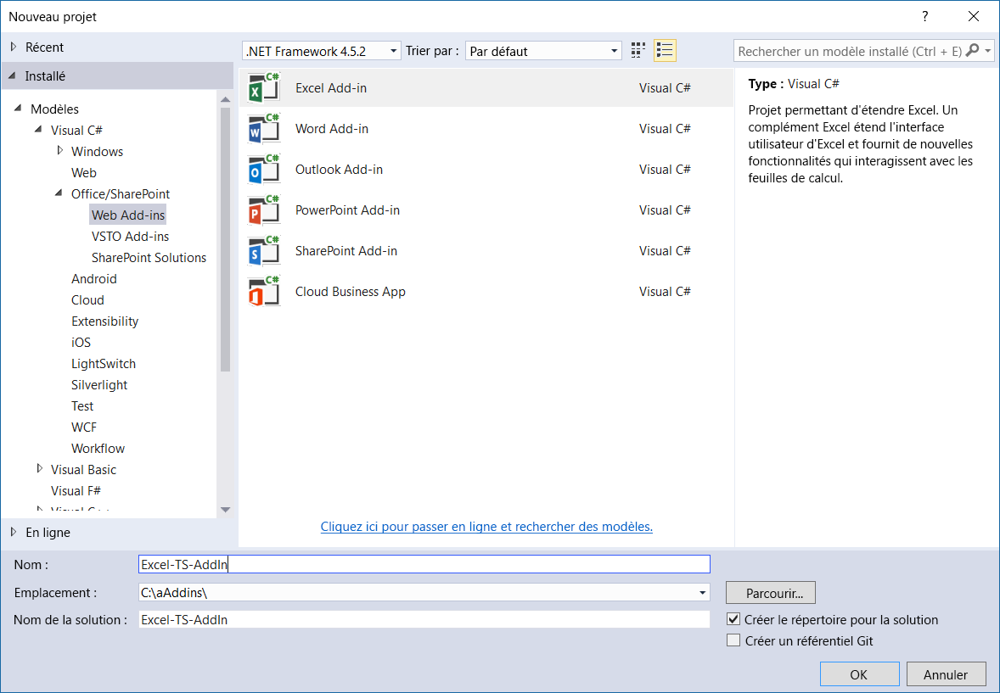
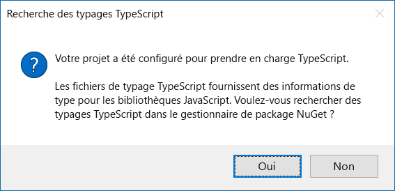

# <a name="convert-an-office-add-in-task-pane-template-in-visual-studio-to-typescript"></a>Convertir un modèle de volet de tâche de complément Office de Visual Studio vers TypeScript


Vous pouvez utiliser le modèle JavaScript de complément Office dans Visual Studio pour créer un complément qui utilise TypeScript. Après avoir créé le nouveau complément dans Visual Studio, vous pouvez convertir le projet au format TypeScript.  Ainsi, vous n’êtes pas obligé de commencer le projet TypeScript de complément Office de zéro.  

   > **Remarque :** pour découvrir comment créer un projet TypeScript de complément Office sans l’aide de Visual Studio, consultez [Créer un complément Office avec n’importe quel éditeur](../../docs/get-started/create-an-office-add-in-using-any-editor.md).

Dans votre projet TypeScript, vous pouvez avoir un mélange de fichiers TypeScript et JavaScript, qui seront compilés. En effet, TypeScript est un sur-ensemble typé de code JavaScript compilé en code JavaScript. 

Cet article explique comment convertir un modèle de volet de tâches pour complément Excel dans Visual Studio à partir de JavaScript en TypeScript. Vous pouvez utiliser la même procédure pour convertir d’autres modèles JavaScript de complément Office au format TypeScript.

Pour afficher ou télécharger l’exemple de code sur lequel s’appuie cet article, consultez [Excel-Add-In-TS-Start](https://github.com/officedev/Excel-Add-In-TS-Start) sur GitHub.

## <a name="prerequisites"></a>Conditions préalables

Assurez-vous que les éléments suivants sont installés :

* [Visual Studio 2015 ou version ultérieure.](https://www.visualstudio.com/downloads/)
* [Outils de développement Office pour Visual Studio](https://www.visualstudio.com/fr-FR/features/office-tools-vs.aspx)
* [Publication de service cumulative pour la mise à jour 3 de Microsoft Visual Studio 2015 (KB3165756)](https://msdn.microsoft.com/fr-FR/library/mt752379.aspx)
* Excel 2016
* [TypeScript 2.1 pour Visual Studio 2015](http://download.microsoft.com/download/6/D/8/6D8381B0-03C1-4BD2-AE65-30FF0A4C62DA/TS2.1-dev14update3-20161206.2/TypeScript_Dev14Full.exe) (après avoir installé la mise à jour 3 de Visual Studio 2015)

    > **Remarque :**  Pour plus d’informations sur l’installation de TypeScript 2.1, reportez-vous à l’article relatif à la [publication de TypeScript 2.1](https://blogs.msdn.microsoft.com/typescript/2016/12/07/announcing-typescript-2-1/).

## <a name="create-new-add-in-project"></a>Créer un projet de complément

1.  Ouvrez Visual Studio et accédez à **Fichier** > **Nouveau** > **Projet**. 
2.  Sous **Office/SharePoint**, choisissez **Complément Excel**, puis **OK**.

    

3.  Dans l’assistant de création d’application, choisissez **Ajouter de nouvelles fonctionnalités à Excel** et choisissez **Terminer**.
4.  Effectuez un test rapide du complément Excel créé en appuyant sur F5 ou sur le bouton **Démarrer** vert pour lancer le complément. Le complément sera hébergé localement sur IIS, et Excel s’ouvrira avec le complément chargé.

## <a name="convert-the-add-in-project-to-typescript"></a>Convertir le projet de complément au format TypeScript

1. Dans **Explorateur de solutions**, renommez le fichier Home.js en l’appelant Home.ts.
2. Sélectionnez **Oui** lorsque vous devez indiquer si vous êtes sûr de vouloir modifier l’extension du nom de fichier.  
3. Sélectionnez **Oui** lorsque vous devez indiquer si vous souhaitez rechercher des typages TypeScript sur NuGet, comme indiqué sur la capture d’écran suivante. Cette action ouvre le **gestionnaire de package NuGet**.

    

4. Choisissez **Parcourir** dans le **gestionnaire de package NuGet**.  
5. Dans la zone de recherche, saisissez **office-js tag:typescript**.
6. Installez **office.js.TypeScript.DefinitelyTyped** et **jquery.TypeScript.DefinitelyTyped**, comme montré dans la capture d’écran suivante.

    

7. Ouvrez Home.ts (anciennement Home.js). Retirez la référence suivante de la partie supérieure du fichier Home.ts :

    ```///<reference path="/Scripts/FabricUI/MessageBanner.js" />```

8. Ajoutez les instructions suivantes en haut du fichier Home.ts :

    ```declare var fabric: any;```

9. Remplacez **‘1.1’** par **1.1** ; plus clairement : enlevez les guillemets de la ligne suivante du fichier Home.ts :

    ```if (!Office.context.requirements.isSetSupported('ExcelApi', 1.1)) {```
 
## <a name="run-the-converted-add-in-project"></a>Exécuter le projet de complément converti

1. Appuyez sur F5 ou le bouton **Démarrer** vert pour lancer le complément. 
2. Après le démarrage d’Excel, appuyez sur le bouton **Afficher le volet de tâches** sur le ruban **Accueil**.
3. Sélectionnez toutes les cellules contenant des nombres.
4. Appuyez sur le bouton **Mettre en surbrillance** dans le volet des tâches. 

## <a name="homets-code-file"></a>Fichier de code Home.ts

Pour référence, voici le code inclus dans le fichier Home.ts. Ce fichier inclut le nombre minimal de modifications nécessaires afin que votre complément fonctionne.

>**Remarque :** pour obtenir un exemple complet de fichier JavaScript converti au format TypeScript, voir [Excel-Add-In-TS-StartWeb/Home.ts](https://github.com/officedev/Excel-Add-In-TS-Start/blob/master/Excel-Add-In-TS-StartWeb/Home.ts). 

```
declare var fabric: any;

(function () {
    "use strict";

    var cellToHighlight;
    var messageBanner;

    // The initialize function must be run each time a new page is loaded.
    Office.initialize = function (reason) {
        $(document).ready(function () {
            // Initialize the FabricUI notification mechanism and hide it
            var element = document.querySelector('.ms-MessageBanner');
            messageBanner = new fabric.MessageBanner(element);
            messageBanner.hideBanner();
            
            // If not using Excel 2016, use fallback logic.
            if (!Office.context.requirements.isSetSupported('ExcelApi', 1.1)) {
                $("#template-description").text("This sample will display the value of the cells you have selected in the spreadsheet.");
                $('#button-text').text("Display!");
                $('#button-desc').text("Display the selection");

                $('#highlight-button').click(
                    displaySelectedCells);
                return;
            }

            $("#template-description").text("This sample highlights the highest value from the cells you have selected in the spreadsheet.");
            $('#button-text').text("Highlight!");
            $('#button-desc').text("Highlights the largest number.");
                
            loadSampleData();

            // Add a click event handler for the highlight button.
            $('#highlight-button').click(
                hightlightHighestValue);
        });
    }

    function loadSampleData() {

        var values = [
                        [Math.floor(Math.random() * 1000), Math.floor(Math.random() * 1000), Math.floor(Math.random() * 1000)],
                        [Math.floor(Math.random() * 1000), Math.floor(Math.random() * 1000), Math.floor(Math.random() * 1000)],
                        [Math.floor(Math.random() * 1000), Math.floor(Math.random() * 1000), Math.floor(Math.random() * 1000)]
        ];

        // Run a batch operation against the Excel object model.
        Excel.run(function (ctx) {
            // Create a proxy object for the active sheet
            var sheet = ctx.workbook.worksheets.getActiveWorksheet();
            // Queue a command to write the sample data to the worksheet
            sheet.getRange("B3:D5").values = values;

            // Run the queued-up commands, and return a promise to indicate task completion
            return ctx.sync();
        })
        .catch(errorHandler);
    }

    function hightlightHighestValue() {

        // Run a batch operation against the Excel object model.
        Excel.run(function (ctx) {

            // Create a proxy object for the selected range and load its address and values properties.
            var sourceRange = ctx.workbook.getSelectedRange().load("values, address, rowIndex, columnIndex, rowCount, columnCount");

            // Run the queued-up command, and return a promise to indicate task completion
            return ctx.sync().
                .then(function () {
                    var highestRow = 0;
                    var highestCol = 0;
                    var highestValue = sourceRange.values[0][0];

                    // Find the cell to highlight
                    for (var i = 0; i < sourceRange.rowCount; i++) {
                        for (var j = 0; j < sourceRange.columnCount; j++) {
                            if (!isNaN(sourceRange.values[i][j]) && sourceRange.values[i][j] > highestValue) {
                                highestRow = i;
                                highestCol = j;
                                highestValue = sourceRange.values[i][j];
                            }
                        }
                    }

                    cellToHighlight = sourceRange.getCell(highestRow, highestCol);
                    sourceRange.worksheet.getUsedRange().format.fill.clear();
                    sourceRange.worksheet.getUsedRange().format.font.bold = false;

                    cellToHighlight.load("values");
                })
                   // Run the queued-up commands.
                .then(ctx.sync)
                .then(function () {
                    // Highlight the cell
                    cellToHighlight.format.fill.color = "orange";
                    cellToHighlight.format.font.bold = true;
                })
                .then(ctx.sync)
        })
        .catch(errorHandler);
    }

    function displaySelectedCells() {
        Office.context.document.getSelectedDataAsync(Office.CoercionType.Text,
            function (result) {
                if (result.status === Office.AsyncResultStatus.Succeeded) {
                    showNotification('The selected text is:', '"' + result.value + '"');
                } else {
                    showNotification('Error', result.error.message);
                }
            });
    }

    // Helper function for treating errors.
    function errorHandler(error) {
        // Always be sure to catch any accumulated errors that bubble up from the Excel.run execution
        showNotification("Error", error);
        console.log("Error: " + error);
        if (error instanceof OfficeExtension.Error) {
            console.log("Debug info: " + JSON.stringify(error.debugInfo));
        }
    }

    // Helper function for displaying notifications
    function showNotification(header, content) {
        $("#notificationHeader").text(header);
        $("#notificationBody").text(content);
        messageBanner.showBanner();
        messageBanner.toggleExpansion();
    }
})();

```

## <a name="additional-resources"></a>Ressources supplémentaires

* [Discussion sur la mise en œuvre de promesses sur StackOverflow](https://stackoverflow.com/questions/44461312/office-addins-file-in-its-typescript-version-doesnt-work)
* [Exemples de compléments Office sur GitHub](https://github.com/officedev)
