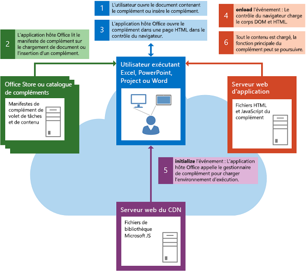

# <a name="loading-the-dom-and-runtime-environment"></a>Chargement du DOM et de l’environnement d’exécution


Un complément doit s’assurer que le DOM et l’environnement d’exécution des Compléments Office ont été chargés avant d’exécuter sa propre logique personnalisée. 

## <a name="startup-of-a-content-or-task-pane-add-in"></a>Démarrage d’un complément de contenu ou du volet Office

La figure suivante illustre le flux des événements impliqués au démarrage d’un complément de contenu ou du volet Office dans Excel, PowerPoint, Project, Word ou Access.



Les événements suivants se produisent lors du démarrage d’un complément de contenu ou du volet Office : 


1. L’utilisateur ouvre un document qui contient déjà un complément ou insère un complément dans le document.
    
2. L’application hôte Office lit le manifeste XML du complément à partir d’AppSource, d’un catalogue de compléments sur SharePoint ou du catalogue de dossiers partagés duquel il provient.
    
3. L’application hôte Office ouvre la page HTML du complément dans un contrôle de navigateur.
    
    Les deux étapes suivantes, 4 et 5, se produisent de manière asynchrone et parallèlement. C’est pour cela que le code de votre complément doit veiller à ce que le chargement du DOM et de l’environnement d’exécution du complément soit terminé avant de continuer.
    
4. Le contrôle de navigateur charge le DOM et le corps HTML, puis demande au gestionnaire d’événements l’événement  **window.onload**.
    
5. L’application hôte Office charge l’environnement d’exécution, lequel télécharge et met en cache l’API JavaScript pour les fichiers de bibliothèque JavaScript à partir du serveur de réseau de distribution de contenu, puis appelle le gestionnaire d’événements du complément pour l’événement [initialize](/javascript/api/office#initialize-reason-) de l’objet [Office](/javascript/api/office) si un gestionnaire lui a été affecté. Il vérifie alors également si des rappels (ou des fonctions `then()` chaînées) ont été transmis (ou chaînées) au gestionnaire `Office.onReady`. Pour plus d’informations sur la distinction entre `Office.initialize` et `Office.onReady`, voir [Initialisation de votre complément](/office/dev/add-ins/develop/understanding-the-javascript-api-for-office#initializing-your-add-in).
    
6. Lorsque le chargement du DOM et du corps HTML est terminé et que le complément finit de s’initialiser, la fonction principale du complément peut poursuivre.
    

## <a name="startup-of-an-outlook-add-in"></a>Démarrage d’un complément Outlook


La figure suivante illustre le flux des événements impliqués au démarrage d’un complément Outlook exécuté sur un ordinateur de bureau, une tablette ou un smartphone.


Les événements suivants se produisent lors du démarrage d’un complément Outlook : 


1. Lorsqu’Outlook démarre, il lit les manifestes XML pour les compléments Outlook qui ont été installés pour le compte de messagerie de l’utilisateur.
    
2. L’utilisateur sélectionne un élément dans Outlook.
    
3. Si l’élément sélectionné répond aux conditions d’activation d’un complément Outlook, Outlook active le complément et affiche son bouton dans l’interface utilisateur.
    
4. Si l’utilisateur clique sur le bouton pour démarrer le complément Outlook, Outlook ouvre la page HTML dans un contrôle de navigateur. Les deux étapes suivantes, 5 et 6, se produisent en parallèle.
    
5. Le contrôle de navigateur charge le modèle objet de document (DOM) et le corps HTML, puis appelle le gestionnaire d’événements pour l’événement  **onload**.
    
6. Outlook charge l’environnement d’exécution, lequel télécharge et met en cache l’API JavaScript pour les fichiers de bibliothèque JavaScript à partir du serveur de réseau de distribution de contenu, puis appelle le gestionnaire d’événements du complément pour l’événement [initialize](/javascript/api/office#initialize-reason-) de l’objet [Office](/javascript/api/office) du complément si un gestionnaire lui a été affecté. Il vérifie alors également si des rappels (ou des fonctions `then()` chaînées) ont été transmis (ou chaînées) au gestionnaire `Office.onReady`. Pour plus d’informations sur la distinction entre `Office.initialize` et `Office.onReady`, voir [Initialisation de votre complément](/office/dev/add-ins/develop/understanding-the-javascript-api-for-office#initializing-your-add-in).
    
7. Lorsque le chargement du DOM et du corps HTML est terminé et que le complément finit de s’initialiser, la fonction principale du complément peut poursuivre.
    

## <a name="checking-the-load-status"></a>Vérification du statut de chargement

Vous pouvez vérifier que le chargement du DOM et de l’environnement d’exécution est bien terminé en utilisant la fonction jQuery [.ready()](https://api.jquery.com/ready/) : `$(document).ready()`. Par exemple, le gestionnaire d'événements **onReady** suivant s'assure que le DOM est d'abord chargé avant le code spécifique à l'initialisation du complément. Par la suite, le gestionnaire **onReady** utilise la propriété [mailbox.item](https://docs.microsoft.com/javascript/api/outlook/office.mailbox) pour obtenir l'élément sélectionné dans Outlook, et appelle la fonction principale du complément, `initDialer`.

```js
Office.onReady()
    .then(
        // Checks for the DOM to load.
        $(document).ready(function () {
            // After the DOM is loaded, add-in-specific code can run.
            var mailbox = Office.context.mailbox;
            _Item = mailbox.item;
            initDialer();
        });
);
```

Vous pouvez également utiliser le même code dans un gestionnaire d’événements **initialize** comme illustré dans l’exemple suivant.

```js
Office.initialize = function () {
    // Checks for the DOM to load.
    $(document).ready(function () {
        // After the DOM is loaded, add-in-specific code can run.
        var mailbox = Office.context.mailbox;
        _Item = mailbox.item;
        initDialer();
    });
}
```

Il est possible d’utiliser cette même technique dans les gestionnaires **onReady** ou **initialize** de tout complément Office.

Le numéroteur téléphonique fourni comme exemple de complément Outlook présente une approche légèrement différente, puisqu’il utilise uniquement JavaScript pour vérifier ces mêmes conditions. 

> [!IMPORTANT]
> Même si aucune tâche d’initialisation n’est à effectuer dans votre complément, vous devez inclure au moins un appel **Office.onReady** ou affecter une fonction de gestionnaire d’événements **Office.initialize** minimale comme dans l’exemple suivant.
>
>```js
>Office.onReady();
>```
>
>```js
>Office.initialize = function () {};
>```
>
> Si vous n’appelez pas **Office.onReady** ou n’affectez pas un Gestionnaire d’événements **Office.initialize**, votre complément peut déclencher une erreur lors de son démarrage. En outre, si un utilisateur essaie d’utiliser votre complément avec un client web Office Online, notamment Excel Online, PowerPoint Online ou Outlook Web App, l’exécution du complément échouera.
>
> Si votre complément comprend plusieurs pages, chaque fois qu’il charge une nouvelle page, celle-ci doit soit appeler **Office.onReady**, soit affecter un gestionnaire d’événements **Office.initialize**.

## <a name="see-also"></a>Voir aussi

- [Présentation de l’API JavaScript pour Office](understanding-the-javascript-api-for-office.md)
    
