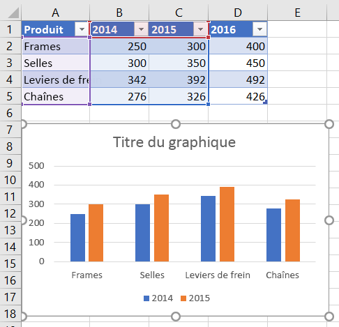

# <a name="work-with-charts-using-the-excel-javascript-api"></a>Utiliser des graphiques à l’aide de l’API JavaScript pour Excel

Cet article fournit des exemples de code qui montrent comment effectuer des tâches courantes à l’aide de graphiques utilisant l’API JavaScript pour Excel. Pour une liste complète des propriétés et des méthodes prises en charge par les objets **Chart** et **ChartCollection**, reportez-vous à la rubrique [Objet Chart (API JavaScript pour Excel)](https://dev.office.com/reference/add-ins/excel/chart) et [Objet ChartCollection (API JavaScript pour Excel)](https://dev.office.com/reference/add-ins/excel/chartcollection).

## <a name="create-a-chart"></a>Créer un graphique

L’exemple de code suivant crée un graphique dans la feuille de calcul nommée **Sample**. Il s’agit d’un graphique en **courbes** qui est fondé sur les données de la plage **A1:B13**.

```js
Excel.run(function (context) {
    var sheet = context.workbook.worksheets.getItem("Sample");
    var dataRange = sheet.getRange("A1:B13");
    var chart = sheet.charts.add("Line", dataRange, "auto");

    chart.title.text = "Sales Data";
    chart.legend.position = "right"
    chart.legend.format.fill.setSolidColor("white");
    chart.dataLabels.format.font.size = 15;
    chart.dataLabels.format.font.color = "black";

    return context.sync();
}).catch(errorHandlerFunction);
```

**Nouveau graphique en courbes**


## <a name="add-a-data-series-to-a-chart"></a>Ajouter une série de données à un graphique

L’exemple de code suivant ajoute une série de données au premier graphique de la feuille de calcul. La nouvelle série de données correspond à la colonne nommée **2016** et repose sur les données de la plage **D2:D5**.

> [!NOTE]
> Cet exemple utilise des API qui ne sont actuellement disponibles qu'en préversion publique (bêta). Pour exécuter cet exemple de code, vous devez utiliser la bibliothèque bêta du CDN Office.js : https://appsforoffice.microsoft.com/lib/beta/hosted/office.js.

```js
Excel.run(function (context) {
    var sheet = context.workbook.worksheets.getItem("Sample");
    var chart = sheet.charts.getItemAt(0);
    var dataRange = sheet.getRange("D2:D5");

    var newSeries = chart.series.add("2016");
    newSeries.setValues(dataRange);

    return context.sync();
}).catch(errorHandlerFunction);
```

**Graphique avant l’ajout de la série de données 2016**



**Graphique après l’ajout de la série de données 2016**


## <a name="set-chart-title"></a>Définir le titre du graphique

L’exemple de code suivant définit le titre du premier graphique dans la feuille de calcul sur **Sales Data by Year**. 

```js
Excel.run(function (context) {
    var sheet = context.workbook.worksheets.getItem("Sample");

    var chart = sheet.charts.getItemAt(0);
    chart.title.text = "Sales Data by Year";

    return context.sync();
}).catch(errorHandlerFunction);
```

**Graphique après la définition du titre**


## <a name="set-properties-of-an-axis-in-a-chart"></a>Définir les propriétés d’un axe d’un graphique

Les graphiques qui utilisent le [système de coordonnées cartésiennes](https://en.wikipedia.org/wiki/Cartesian_coordinate_system), comme les histogrammes, les graphiques à barres et les nuages de points, ont un axe des abscisses et un axe des ordonnées. Ces exemples montrent comment définir le titre et afficher les unités d’un axe dans un graphique.

### <a name="set-axis-title"></a>Définir le titre d’un axe

L’exemple de code suivant définit le titre de l’axe des abscisses pour le premier graphique de la feuille de calcul sur **Product**.

```js
Excel.run(function (context) {
    var sheet = context.workbook.worksheets.getItem("Sample");

    var chart = sheet.charts.getItemAt(0);
    chart.axes.categoryAxis.title.text = "Product";

    return context.sync();
}).catch(errorHandlerFunction);
```

**Graphique après la définition de l’axe des abscisses**


### <a name="set-axis-display-unit"></a>Définir l’unité d’affichage de l’axe

L’exemple de code suivant définit l’unité d’affichage de l’axe des ordonnées pour le premier graphique de la feuille de calcul sur **Hundreds**.

> [!NOTE]
> Cet exemple utilise des API qui ne sont actuellement disponibles qu'en préversion publique (bêta). Pour exécuter cet exemple de code, vous devez utiliser la bibliothèque bêta du CDN Office.js : https://appsforoffice.microsoft.com/lib/beta/hosted/office.js.

```js
Excel.run(function (context) {
    var sheet = context.workbook.worksheets.getItem("Sample");

    var chart = sheet.charts.getItemAt(0);
    chart.axes.valueAxis.displayUnit = "Hundreds";

    return context.sync();
}).catch(errorHandlerFunction);
```

**Graphique après la définition de l’unité d’affichage de l’axe des ordonnées**


## <a name="set-visibility-of-gridlines-in-a-chart"></a>Définir la visibilité du quadrillage dans un graphique

L’exemple de code suivant masque le quadrillage principal de l’axe des ordonnées du premier graphique de la feuille de calcul. Vous pouvez afficher le quadrillage principal de l’axe des ordonnées du graphique en définissant `chart.axes.valueAxis.majorGridlines.visible` sur **true**.

```js
Excel.run(function (context) {
    var sheet = context.workbook.worksheets.getItem("Sample");

    var chart = sheet.charts.getItemAt(0);
    chart.axes.valueAxis.majorGridlines.visible = false;

    return context.sync();
}).catch(errorHandlerFunction);
```

**Graphique avec du quadrillage masqué**


## <a name="chart-trendlines"></a>Courbes de tendance de graphiques

### <a name="add-a-trendline"></a>Ajouter une courbe de tendance

L’exemple de code suivant ajoute une courbe de tendance de moyenne mobile à la première série du premier graphique de la feuille de calcul nommée **Sample**. La courbe de tendance affiche une moyenne mobile sur 5 périodes.

> [!NOTE]
> Cet exemple utilise des API qui ne sont actuellement disponibles qu'en préversion publique (bêta). Pour exécuter cet exemple de code, vous devez utiliser la bibliothèque bêta du CDN Office.js : https://appsforoffice.microsoft.com/lib/beta/hosted/office.js.

```js
Excel.run(function (context) {
    var sheet = context.workbook.worksheets.getItem("Sample");

    var chart = sheet.charts.getItemAt(0);
    var seriesCollection = chart.series;
    seriesCollection.getItemAt(0).trendlines.add("MovingAverage").movingAveragePeriod = 5;

    return context.sync();
}).catch(errorHandlerFunction);
```

**Graphique avec courbe de tendance de moyenne mobile**


### <a name="update-a-trendline"></a>Mettre à jour une courbe de tendance

L’exemple de code suivant définit la courbe de tendance sur le type **Linear** pour la première série du premier graphique de la feuille de calcul nommée **Sample**.

> [!NOTE]
> Cet exemple utilise des API qui ne sont actuellement disponibles qu'en préversion publique (bêta). Pour exécuter cet exemple de code, vous devez utiliser la bibliothèque bêta du CDN Office.js : https://appsforoffice.microsoft.com/lib/beta/hosted/office.js.

```js
Excel.run(function (context) {
    var sheet = context.workbook.worksheets.getItem("Sample");

    var chart = sheet.charts.getItemAt(0);
    var seriesCollection = chart.series;
    var series = seriesCollection.getItemAt(0);
    series.trendlines.getItem(0).type = "Linear";

    return context.sync();
}).catch(errorHandlerFunction);
```

**Graphique avec une courbe de tendance linéaire**


## <a name="see-also"></a>Voir aussi

- [Concepts de base de l’API JavaScript pour Excel](excel-add-ins-core-concepts.md)
- [Objet Chart (API JavaScript pour Excel)](https://dev.office.com/reference/add-ins/excel/chart) 
- [Objet ChartCollection (API JavaScript pour Excel)](https://dev.office.com/reference/add-ins/excel/chartcollection)