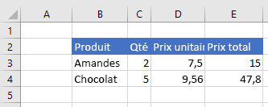

# <a name="clear-or-delete-ranges-using-the-excel-javascript-api"></a><span data-ttu-id="733a5-103">Effacer ou supprimer des plages à l’aide de Excel API JavaScript</span><span class="sxs-lookup"><span data-stu-id="733a5-103">Clear or delete ranges using the Excel JavaScript API</span></span>

<span data-ttu-id="733a5-104">Cet article fournit des exemples de code qui effacent et suppriment des plages avec l Excel API JavaScript.</span><span class="sxs-lookup"><span data-stu-id="733a5-104">This article provides code samples that clear and delete ranges with the Excel JavaScript API.</span></span> <span data-ttu-id="733a5-105">Pour obtenir la liste complète des propriétés et méthodes pris en charge par `Range` [l’objet, voir Excel. Classe Range](/javascript/api/excel/excel.range).</span><span class="sxs-lookup"><span data-stu-id="733a5-105">For the complete list of properties and methods supported by the `Range` object, see [Excel.Range class](/javascript/api/excel/excel.range).</span></span>

[!include[Excel cells and ranges note](../includes/note-excel-cells-and-ranges.md)]

## <a name="clear-a-range-of-cells"></a><span data-ttu-id="733a5-106">Effacer une plage de cellules</span><span class="sxs-lookup"><span data-stu-id="733a5-106">Clear a range of cells</span></span>

<span data-ttu-id="733a5-107">L’exemple de code suivant efface tout le contenu et la mise en forme des cellules de la plage **E2 : E5**.</span><span class="sxs-lookup"><span data-stu-id="733a5-107">The following code sample clears all contents and formatting of cells in the range **E2:E5**.</span></span>  

```js
Excel.run(function (context) {
    var sheet = context.workbook.worksheets.getItem("Sample");
    var range = sheet.getRange("E2:E5");

    range.clear();

    return context.sync();
}).catch(errorHandlerFunction);
```

### <a name="data-before-range-is-cleared"></a><span data-ttu-id="733a5-108">Données avant l’effacement de la plage</span><span class="sxs-lookup"><span data-stu-id="733a5-108">Data before range is cleared</span></span>


### <a name="data-after-range-is-cleared"></a><span data-ttu-id="733a5-110">Données après l’effacement de plage</span><span class="sxs-lookup"><span data-stu-id="733a5-110">Data after range is cleared</span></span>


## <a name="delete-a-range-of-cells"></a><span data-ttu-id="733a5-112">Supprimer une plage de cellules</span><span class="sxs-lookup"><span data-stu-id="733a5-112">Delete a range of cells</span></span>

<span data-ttu-id="733a5-113">L’exemple de code suivant supprime les cellules de la plage **B4:E4** et déplace les autres cellules vers le haut pour remplir l’espace qui a été libéré par les cellules supprimées.</span><span class="sxs-lookup"><span data-stu-id="733a5-113">The following code sample deletes the cells in the range **B4:E4** and shifts other cells up to fill the space that was vacated by the deleted cells.</span></span>

```js
Excel.run(function (context) {
    var sheet = context.workbook.worksheets.getItem("Sample");
    var range = sheet.getRange("B4:E4");

    range.delete(Excel.DeleteShiftDirection.up);

    return context.sync();
}).catch(errorHandlerFunction);
```

### <a name="data-before-range-is-deleted"></a><span data-ttu-id="733a5-114">Données avant la suppression d’une plage</span><span class="sxs-lookup"><span data-stu-id="733a5-114">Data before range is deleted</span></span>


### <a name="data-after-range-is-deleted"></a><span data-ttu-id="733a5-116">Données après la suppression d’une plage</span><span class="sxs-lookup"><span data-stu-id="733a5-116">Data after range is deleted</span></span>




## <a name="see-also"></a><span data-ttu-id="733a5-118">Voir aussi</span><span class="sxs-lookup"><span data-stu-id="733a5-118">See also</span></span>

- [<span data-ttu-id="733a5-119">Utiliser des cellules à l’aide de Excel API JavaScript</span><span class="sxs-lookup"><span data-stu-id="733a5-119">Work with cells using the Excel JavaScript API</span></span>](excel-add-ins-cells.md)
- [<span data-ttu-id="733a5-120">Définir et obtenir des plages à l’aide de Excel API JavaScript</span><span class="sxs-lookup"><span data-stu-id="733a5-120">Set and get ranges using the Excel JavaScript API</span></span>](excel-add-ins-ranges-set-get.md)
- [<span data-ttu-id="733a5-121">Modèle d’objet JavaScript Excel dans les compléments Office</span><span class="sxs-lookup"><span data-stu-id="733a5-121">Excel JavaScript object model in Office Add-ins</span></span>](excel-add-ins-core-concepts.md)
