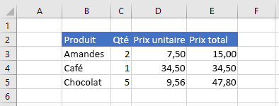

# <a name="set-range-format-using-the-excel-javascript-api"></a><span data-ttu-id="b0d48-103">Définir le format de plage à l’aide Excel API JavaScript</span><span class="sxs-lookup"><span data-stu-id="b0d48-103">Set range format using the Excel JavaScript API</span></span>

<span data-ttu-id="b0d48-104">Cet article fournit des exemples de code qui définissent la couleur de police, la couleur de remplissage et le format de nombre pour les cellules d’une plage avec Excel API JavaScript.</span><span class="sxs-lookup"><span data-stu-id="b0d48-104">This article provides code samples that set font color, fill color, and number format for cells in a range with the Excel JavaScript API.</span></span> <span data-ttu-id="b0d48-105">Pour obtenir la liste complète des propriétés et méthodes que l’objet prend en `Range` charge, [voir Excel. Classe Range](/javascript/api/excel/excel.range).</span><span class="sxs-lookup"><span data-stu-id="b0d48-105">For the complete list of properties and methods that the `Range` object supports, see [Excel.Range class](/javascript/api/excel/excel.range).</span></span>

[!include[Excel cells and ranges note](../includes/note-excel-cells-and-ranges.md)]

## <a name="set-font-color-and-fill-color"></a><span data-ttu-id="b0d48-106">Définir la couleur de police et la couleur de remplissage</span><span class="sxs-lookup"><span data-stu-id="b0d48-106">Set font color and fill color</span></span>

<span data-ttu-id="b0d48-107">L’exemple de code ci-dessous définit la couleur de police et la couleur de remplissage des cellules de la plage **B2:E2**.</span><span class="sxs-lookup"><span data-stu-id="b0d48-107">The following code sample sets the font color and fill color for cells in range **B2:E2**.</span></span>

```js
Excel.run(function (context) {
    var sheet = context.workbook.worksheets.getItem("Sample");

    var range = sheet.getRange("B2:E2");
    range.format.fill.color = "#4472C4";
    range.format.font.color = "white";

    return context.sync();
}).catch(errorHandlerFunction);
```

### <a name="data-in-range-before-font-color-and-fill-color-are-set"></a><span data-ttu-id="b0d48-108">Données de la plage avant la définition de la couleur de police et de la couleur de remplissage</span><span class="sxs-lookup"><span data-stu-id="b0d48-108">Data in range before font color and fill color are set</span></span>


### <a name="data-in-range-after-font-color-and-fill-color-are-set"></a><span data-ttu-id="b0d48-110">Données de la plage après la définition de la couleur de police et de la couleur de remplissage</span><span class="sxs-lookup"><span data-stu-id="b0d48-110">Data in range after font color and fill color are set</span></span>


## <a name="set-number-format"></a><span data-ttu-id="b0d48-112">Définir le format de nombre</span><span class="sxs-lookup"><span data-stu-id="b0d48-112">Set number format</span></span>

<span data-ttu-id="b0d48-113">L’exemple de code ci-dessous définit le format de nombre des cellules dans la plage **D3:E5**.</span><span class="sxs-lookup"><span data-stu-id="b0d48-113">The following code sample sets the number format for the cells in range **D3:E5**.</span></span>

```js
Excel.run(function (context) {
    var sheet = context.workbook.worksheets.getItem("Sample");

    var formats = [
        ["0.00", "0.00"],
        ["0.00", "0.00"],
        ["0.00", "0.00"]
    ];

    var range = sheet.getRange("D3:E5");
    range.numberFormat = formats;

    return context.sync();
}).catch(errorHandlerFunction);
```

### <a name="data-in-range-before-number-format-is-set"></a><span data-ttu-id="b0d48-114">Données de la plage avant la définition du format de nombre</span><span class="sxs-lookup"><span data-stu-id="b0d48-114">Data in range before number format is set</span></span>


### <a name="data-in-range-after-number-format-is-set"></a><span data-ttu-id="b0d48-116">Données de la plage après la définition du format de nombre</span><span class="sxs-lookup"><span data-stu-id="b0d48-116">Data in range after number format is set</span></span>



## <a name="see-also"></a><span data-ttu-id="b0d48-118">Voir aussi</span><span class="sxs-lookup"><span data-stu-id="b0d48-118">See also</span></span>

- [<span data-ttu-id="b0d48-119">Modèle d’objet JavaScript Excel dans les compléments Office</span><span class="sxs-lookup"><span data-stu-id="b0d48-119">Excel JavaScript object model in Office Add-ins</span></span>](excel-add-ins-core-concepts.md)
- [<span data-ttu-id="b0d48-120">Utiliser des cellules à l’aide Excel API JavaScript</span><span class="sxs-lookup"><span data-stu-id="b0d48-120">Work with cells using the Excel JavaScript API</span></span>](excel-add-ins-cells.md)
- [<span data-ttu-id="b0d48-121">Définir et obtenir des plages à l’aide de Excel API JavaScript</span><span class="sxs-lookup"><span data-stu-id="b0d48-121">Set and get ranges using the Excel JavaScript API</span></span>](excel-add-ins-ranges-set-get.md)
- [<span data-ttu-id="b0d48-122">Définir et obtenir des valeurs de plage, du texte ou des formules à l’aide Excel API JavaScript</span><span class="sxs-lookup"><span data-stu-id="b0d48-122">Set and get range values, text, or formulas using the Excel JavaScript API</span></span>](excel-add-ins-ranges-set-get-values.md)
