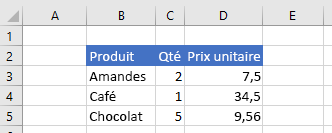
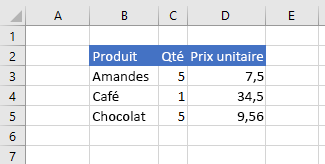
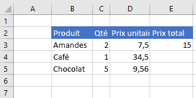

# <a name="work-with-ranges-using-the-excel-javascript-api"></a>Utilisation de plages à l’aide de l’API JavaScript pour Excel

Cet article fournit des exemples de code qui expliquent comment effectuer des tâches courantes avec des plages à l’aide de l’API JavaScript pour Excel. Pour obtenir une liste complète des propriétés et des méthodes prises en charge par l’objet **Range**, reportez-vous à la rubrique [Objet Range (API JavaScript pour Excel)](https://docs.microsoft.com/javascript/api/excel/excel.range).

## <a name="get-a-range"></a>Obtenir une plage

Les exemples suivants montrent les différentes façons d’obtenir une référence à une plage dans une feuille de calcul.

### <a name="get-range-by-address"></a>Obtenir une plage en fonction d’une adresse

L’exemple de code suivant obtient la plage ayant l’adresse **B2 : B5** à partir de la feuille de calcul nommée **Sample**, charge sa propriété **address** et écrit un message dans la console.

```js
Excel.run(function (context) {
    var sheet = context.workbook.worksheets.getItem("Sample");
    var range = sheet.getRange("B2:C5");
    range.load("address");

    return context.sync()
        .then(function () {
            console.log(`The address of the range B2:C5 is "${range.address}"`);
        });
}).catch(errorHandlerFunction);
```

### <a name="get-range-by-name"></a>Obtenir une plage en fonction d’un nom

L’exemple de code suivant obtient la plage nommée **MyRange** à partir de la feuille de calcul nommée **Sample**, charge sa propriété **address** et écrit un message dans la console.

```js
Excel.run(function (context) {
    var sheet = context.workbook.worksheets.getItem("Sample");
    var range = sheet.getRange("MyRange");
    range.load("address");

    return context.sync()
        .then(function () {
            console.log(`The address of the range "MyRange" is "${range.address}"`);
        });
}).catch(errorHandlerFunction);
```

### <a name="get-used-range"></a>Obtenir une plage utilisée

L’exemple de code suivant obtient la plage  utilisée dans la feuille de calcul nommée **Sample**, charge sa propriété **address** et écrit un message dans la console. La plage utilisée est la plus petite plage qui englobe toutes les cellules de la feuille de calcul auxquelles une valeur ou un format est affecté. Si la feuille de calcul entière est vide, la méthode **getUsedRange()** renvoie une plage qui se compose d’uniquement de la cellule en haut à gauche de la feuille de calcul.

```js
Excel.run(function (context) {
    var sheet = context.workbook.worksheets.getItem("Sample");
    var range = sheet.getUsedRange();
    range.load("address");

    return context.sync()
        .then(function () {
            console.log(`The address of the used range in the worksheet is "${range.address}"`);
        });
}).catch(errorHandlerFunction);
```

### <a name="get-entire-range"></a>Obtenir l’intégralité d’une plage

L’exemple de code suivant obtient l’intégralité de la plage de la feuille de calcul à partir de la feuille de calcul nommée **Sample**, charge sa propriété **address** et écrit un message dans la console.

```js
Excel.run(function (context) {
    var sheet = context.workbook.worksheets.getItem("Sample");
    var range = sheet.getRange();
    range.load("address");

    return context.sync()
        .then(function () {
            console.log(`The address of the entire worksheet range is "${range.address}"`);
        });
}).catch(errorHandlerFunction);
```

## <a name="insert-a-range-of-cells"></a>Insérer une plage de cellules

L’exemple de code suivant insère une plage de cellules dans l’emplacement **B4:E4** et déplace les autres cellules vers le bas pour laisser de l’espace pour les nouvelles cellules.

```js
Excel.run(function (context) {
    var sheet = context.workbook.worksheets.getItem("Sample");
    var range = sheet.getRange("B4:E4");

    range.insert(Excel.InsertShiftDirection.down);
    
    return context.sync();
}).catch(errorHandlerFunction);
```

**Données avant l’insertion de la plage**


**Données après l’insertion de la plage**


## <a name="clear-a-range-of-cells"></a>Effacer une plage de cellules

L’exemple de code suivant efface tout le contenu et la mise en forme des cellules de la plage **E2 : E5**.  

```js
Excel.run(function (context) {
    var sheet = context.workbook.worksheets.getItem("Sample");
    var range = sheet.getRange("E2:E5");

    range.clear();

    return context.sync();
}).catch(errorHandlerFunction);
```

**Données avant l’effacement de la plage**


**Données après l’effacement de plage**



## <a name="delete-a-range-of-cells"></a>Supprimer une plage de cellules

L’exemple de code suivant supprime les cellules de la plage **B4:E4** et déplace les autres cellules vers le haut pour remplir l’espace libre suite à la suppression des cellules.

```js
Excel.run(function (context) {
    var sheet = context.workbook.worksheets.getItem("Sample");
    var range = sheet.getRange("B4:E4");

    range.delete(Excel.DeleteShiftDirection.up);

    return context.sync();
}).catch(errorHandlerFunction);
```

**Données avant la suppression d’une plage**


**Données après la suppression d’une plage**


## <a name="set-the-selected-range"></a>Définir la plage sélectionnée

L’exemple de code suivant sélectionne la plage **B2:E6** dans la feuille de calcul active.

```js
Excel.run(function (context) {
    var sheet = context.workbook.worksheets.getActiveWorksheet();
    var range = sheet.getRange("B2:E6");

    range.select();

    return context.sync();
}).catch(errorHandlerFunction);
```

**Plage sélectionnée  B2:E6**


## <a name="get-the-selected-range"></a>Obtenir la plage sélectionnée

L’exemple de code suivant recherche la plage  sélectionnée, charge sa propriété **address** et écrit un message dans la console. 

```js
Excel.run(function (context) {
    var range = context.workbook.getSelectedRange();
    range.load("address");

    return context.sync()
        .then(function () {
            console.log(`The address of the selected range is "${range.address}"`);
        });
}).catch(errorHandlerFunction);
```

## <a name="set-values-or-formulas"></a>Définir des valeurs ou des formules

Les exemples suivants indiquent comment définir des valeurs et des formules pour une cellule unique ou une plage de cellules.

### <a name="set-value-for-a-single-cell"></a>Définir une valeur pour une cellule unique

L’exemple de code suivant définit la valeur de la cellule **C3** sur « 5 », puis définit la largeur des colonnes pour mieux s’adapter aux données.

```js
Excel.run(function (context) {
    var sheet = context.workbook.worksheets.getItem("Sample");

    var range = sheet.getRange("C3");
    range.values = [[ 5 ]];
    range.format.autofitColumns();

    return context.sync();
}).catch(errorHandlerFunction);
```

**Données avant la mise à jour de la valeur de la cellule**


**Données après la mise à jour de la valeur de la cellule**



### <a name="set-values-for-a-range-of-cells"></a>Définir des valeurs pour une plage de cellules

L’exemple de code suivant définit les valeurs des cellules de la plage **B5:D5**, puis définit la largeur des colonnes pour mieux s’adapter aux données.

```js
Excel.run(function (context) {
    var sheet = context.workbook.worksheets.getItem("Sample");

    var data = [
        ["Potato Chips", 10, 1.80],
    ];
    
    var range = sheet.getRange("B5:D5");
    range.values = data;
    range.format.autofitColumns();

    return context.sync();
}).catch(errorHandlerFunction);
```

**Données avant la mise à jour des valeurs des cellules**


**Données après la mise à jour des valeurs des cellules**


### <a name="set-formula-for-a-single-cell"></a>Définir la formule d’une cellule unique

L’exemple de code suivant définit une formule pour la cellule **E3**, puis définit la largeur des colonnes pour mieux s’adapter aux données.

```js
Excel.run(function (context) {
    var sheet = context.workbook.worksheets.getItem("Sample");

    var range = sheet.getRange("E3");
    range.formulas = [[ "=C3 * D3" ]];
    range.format.autofitColumns();

    return context.sync();
}).catch(errorHandlerFunction);
```

**Données avant la définition de la formule de la cellule**


**Données après la définition de la formule de la cellule**



### <a name="set-formulas-for-a-range-of-cells"></a>Définir des formules pour une plage de cellules

L’exemple de code ci-dessous définit des formules pour les cellules de la plage **E2:E6**, puis définit la largeur des colonnes pour mieux s’adapter aux données.

```js
Excel.run(function (context) {
    var sheet = context.workbook.worksheets.getItem("Sample");

    var data = [
        ["=C3 * D3"],
        ["=C4 * D4"],
        ["=C5 * D5"],
        ["=SUM(E3:E5)"]
    ];
    
    var range = sheet.getRange("E3:E6");
    range.formulas = data;
    range.format.autofitColumns();

    return context.sync();
}).catch(errorHandlerFunction);
```

**Données avant la définition des formules des cellules**


**Données après la définition des formules des cellules**


## <a name="get-values-text-or-formulas"></a>Obtenir des valeurs, du texte ou des formules

Ces exemples montrent comment obtenir des valeurs, du texte et des formules à partir d’une plage de cellules.

### <a name="get-values-from-a-range-of-cells"></a>Obtenir des valeurs à partir d’une plage de cellules

L’exemple de code suivant obtient la plage **B2:E6**, charge la propriété **values** et écrit les valeurs dans la console. La propriété **values** d’une plage spécifie les valeurs brutes contenues dans les cellules. Même si certaines cellules d’une plage contiennent des formules, la propriété **values** de la plage spécifie les valeurs brutes des cellules, et non des formules.

```js
Excel.run(function (context) {
    var sheet = context.workbook.worksheets.getItem("Sample");
    var range = sheet.getRange("B2:E6");
    range.load("values");

    return context.sync()
        .then(function () {
            console.log(JSON.stringify(range.values, null, 4));
        });
}).catch(errorHandlerFunction);
```

**Données de la plage (les valeurs de la colonne E sont le résultat des formules)**


**range.values (comme consigné dans la console par l’exemple de code ci-dessus)**

```json
[
    [
        "Product",
        "Qty",
        "Unit Price",
        "Total Price"
    ],
    [
        "Almonds",
        2,
        7.5,
        15
    ],
    [
        "Coffee",
        1,
        34.5,
        34.5
    ],
    [
        "Chocolate",
        5,
        9.56,
        47.8
    ],
    [
        "",
        "",
        "",
        97.3
    ]
]
```

### <a name="get-text-from-a-range-of-cells"></a>Obtenir du texte à partir d’une plage de cellules

L’exemple de code suivant obtient la plage **B2:E6**, charge sa propriété **text** et l’écrit dans la console.  La propriété **text** d’une plage spécifie les valeurs d’affichage pour les cellules de la plage. Même si certaines cellules d’une plage contiennent des formules, la propriété **text** de la plage indique les valeurs d’affichage pour ces cellules, et non des formules.

```js
Excel.run(function (context) {
    var sheet = context.workbook.worksheets.getItem("Sample");
    var range = sheet.getRange("B2:E6");
    range.load("text");

    return context.sync()
        .then(function () {
            console.log(JSON.stringify(range.text, null, 4));
        });
}).catch(errorHandlerFunction);
```

**Données de la plage (les valeurs de la colonne E sont le résultat des formules)**


**range.text (comme consigné dans la console par l’exemple de code ci-dessus)**

```json
[
    [
        "Product",
        "Qty",
        "Unit Price",
        "Total Price"
    ],
    [
        "Almonds",
        "2",
        "7.5",
        "15"
    ],
    [
        "Coffee",
        "1",
        "34.5",
        "34.5"
    ],
    [
        "Chocolate",
        "5",
        "9.56",
        "47.8"
    ],
    [
        "",
        "",
        "",
        "97.3"
    ]
]
```

### <a name="get-formulas-from-a-range-of-cells"></a>Obtenir des formules à partir d’une plage de cellules

L’exemple de code suivant obtient la plage **B2:E6**, charge sa propriété **formulas** et l’écrit dans la console.  La propriété **formulas** d’une plage spécifie les formules pour les cellules de la plage contenant des formules et des valeurs brutes pour les cellules de la plage ne contenant pas de formule.

```js
Excel.run(function (context) {
    var sheet = context.workbook.worksheets.getItem("Sample");
    var range = sheet.getRange("B2:E6");
    range.load("formulas");

    return context.sync()
        .then(function () {
            console.log(JSON.stringify(range.formulas, null, 4));
        });
}).catch(errorHandlerFunction);
```

**Données de la plage (les valeurs de la colonne E sont le résultat des formules)**


**range.formulas (comme consigné dans la console par l’exemple de code ci-dessus)**

```json
[
    [
        "Product",
        "Qty",
        "Unit Price",
        "Total Price"
    ],
    [
        "Almonds",
        2,
        7.5,
        "=C3 * D3"
    ],
    [
        "Coffee",
        1,
        34.5,
        "=C4 * D4"
    ],
    [
        "Chocolate",
        5,
        9.56,
        "=C5 * D5"
    ],
    [
        "",
        "",
        "",
        "=SUM(E3:E5)"
    ]
]
```

## <a name="set-range-format"></a>Définir le format de plage

Les exemples ci-dessous indiquent comment définir la couleur de police, la couleur de remplissage et le format de nombre pour des cellules dans une plage.

### <a name="set-font-color-and-fill-color"></a>Définir la couleur de police et la couleur de remplissage

L’exemple de code ci-dessous définit la couleur de police et la couleur de remplissage des cellules de la plage **B2:E2**.

```js
Excel.run(function (context) {
    var sheet = context.workbook.worksheets.getItem("Sample");

    var range = sheet.getRange("B2:E2");
    range.format.fill.color = "#4472C4";;
    range.format.font.color = "white";

    return context.sync();
}).catch(errorHandlerFunction);
```

**Données de la plage avant la définition de la couleur de police et de la couleur de remplissage**


**Données de la plage après la définition de la couleur de police et de la couleur de remplissage**


### <a name="set-number-format"></a>Définir le format de nombre

L’exemple de code ci-dessous définit le format de nombre des cellules dans la plage **D3:E5**.

```js
Excel.run(function (context) {
    var sheet = context.workbook.worksheets.getItem("Sample");

    var formats = [
        ["0.00", "0.00"],
        ["0.00", "0.00"],
        ["0.00", "0.00"]
    ];

    var range = sheet.getRange("D3:E5");
    range.numberFormat = formats;

    return context.sync();
}).catch(errorHandlerFunction);
```

**Données de la plage avant la définition du format de nombre**


**Données de la plage après la définition du format de nombre**


### <a name="conditional-formatting-of-ranges"></a>Mise en forme conditionnelle de plages

Des plages peuvent présenter une mise en forme de cellules individuelles en fonction de certaines conditions. Pour plus d’informations à ce sujet, voir [Appliquer une mise en forme conditionnelle à des plages Excel](excel-add-ins-conditional-formatting.md).

## <a name="copy-and-paste"></a>Copier et coller

> [!NOTE]
> Le fonction copyFrom est actuellement disponible uniquement en préversion publique (bêta). Pour utiliser cette fonctionnalité, vous devez utiliser la bibliothèque bêta du CDN Office.js : https://appsforoffice.microsoft.com/lib/beta/hosted/office.js.
> Si vous utilisez TypeScript ou si votre éditeur de code utilise des fichiers de définition de type TypeScript pour IntelliSense, utilisez https://appsforoffice.microsoft.com/lib/beta/hosted/office.d.ts.

La fonction copyFrom de la plage reproduit le comportement de copier-coller de l’interface utilisateur Excel. L’objet plage sur lequel copyFrom est appelé est la destination. La source à copier est transmise en tant que plage ou qu’adresse de chaîne représentant une plage. L’exemple de code suivant copie les données de la plage **A1:E1** dans la plage commençant en **G1** (ce qui aboutit à un collage dans la plage **G1:K1**).

```js
Excel.run(function (context) {
    var sheet = context.workbook.worksheets.getItem("Sample");
    // copy a range starting at a single cell destination
    sheet.getRange("G1").copyFrom("A1:E1");
    return context.sync();
}).catch(errorHandlerFunction);
```

Range.copyFrom a trois paramètres facultatifs.

```ts
copyFrom(sourceRange: Range | string, copyType?: "All" | "Formulas" | "Values" | "Formats", skipBlanks?: boolean, transpose?: boolean): void;
``` 

`copyType` spécifie les données copiées de la source vers la destination. 
`“Formulas”` transfère les formules dans les cellules sources en préservant le positionnement relatif des plages de ces formules. Les entrées autres que des formules sont copiées telles quelles. 
`“Values”` copie les valeurs des données et, s’il s’agit d’une formule, le résultat de celle-ci. 
`“Formats”` copie la mise en forme de la plage, y compris la police, la couleur et d’autres paramètres de mise en forme, mais aucune valeur. 
`”All”` (option par défaut) copie les données et la mise en forme, en conservant les formules éventuelles des cellules.

`skipBlanks` définit si les cellules vides sont copiées dans la destination. Quand la valeur est true, `copyFrom` ignore les cellules vides de la plage source. Les cellules ignorées ne remplacent pas les données existantes dans les cellules correspondantes de la plage de destination. La valeur par défaut est false.

L’exemple de code et les images suivants illustrent ce comportement dans un scénario simple. 

```js
Excel.run(function (context) {
    var sheet = context.workbook.worksheets.getItem("Sample");
    // copy a range, omitting the blank cells so existing data is not overwritten in those cells
    sheet.getRange("D1").copyFrom("A1:C1",
        Excel.RangeCopyType.all,
        true, // skipBlanks
        false); // transpose
    // copy a range, including the blank cells which will overwrite existing data in the target cells
    sheet.getRange("D2").copyFrom("A2:C2",
        Excel.RangeCopyType.all,
        false, // skipBlanks
        false); // transpose
    return context.sync();
}).catch(errorHandlerFunction);
```

*Avant exécution de la fonction précédente.*


*Après exécution de la fonction précédente.*


`transpose` détermine si les données sont ou non transposées, ce qui signifie que ses lignes et colonnes sont permutées dans l’emplacement source. Une plage transposée est renversée le long de la diagonale principale, de sorte que les lignes **1**, **2** et **3** deviennent les colonnes **A**, **B** et **C**. 


## <a name="see-also"></a>Voir aussi

- [Concepts fondamentaux de programmation avec l’API JavaScript pour Excel](excel-add-ins-core-concepts.md)

