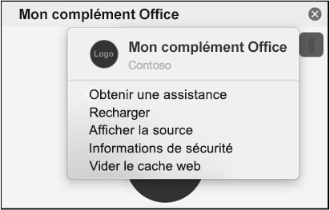

Les compléments sont souvent mis en cache dans Office pour Mac, pour des raisons de performances. En règle générale, vous pouvez effacer le cache en rechargeant le complément. En présence de plusieurs compléments dans le même document, il se peut que le processus d’effacement automatique du cache lors du rechargement ne fonctionne pas systématiquement.

Vous pouvez vider le cache à l’aide du menu personnalité de n’importe quel complément du volet Office.
- Sélectionnez le menu personnalité. Sélectionnez **Effacer le cache web**.
    > [!NOTE]
    > Vous devez exécuter macOS version 10.13.6 ou ultérieure pour afficher le menu personnalité.

    

Vous pouvez également effacer le cache manuellement en supprimant le contenu du dossier `~/Library/Containers/com.Microsoft.OsfWebHost/Data/`.

> [!NOTE]
> Si ce dossier n’existe pas, recherchez les dossiers suivants et, le cas échéant, supprimez le contenu du dossier :
>    - `~/Library/Containers/com.microsoft.{host}/Data/Library/Caches/` où `{host}` est l’application Office (par exemple, `Excel`)
>    - `~/Library/Containers/com.microsoft.{host}/Data/Library/Application Support/Microsoft/Office/16.0/Wef/` où `{host}` est l’application Office (par exemple, `Excel`)
>    - `~/Library/Containers/com.microsoft.Office365ServiceV2/Data/Caches/com.microsoft.Office365ServiceV2/`
>    - `~/Library/Containers/com.microsoft.Office365ServiceV2/Data/Library/Caches/com.microsoft.Office365ServiceV2/`
