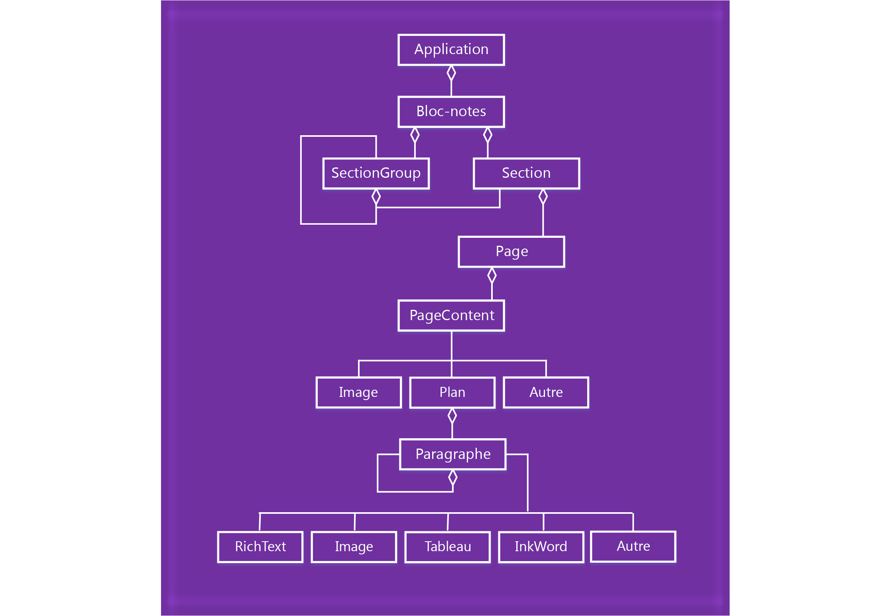

# <a name="onenote-javascript-api-programming-overview"></a>Vue d?ensemble de la programmation de l?API JavaScript de OneNote

OneNote pr?sente une API JavaScript pour les compl?ments OneNote Online. Vous pouvez cr?er des compl?ments de volet de t?ches et de contenu, ainsi que des commandes de compl?ment qui interagissent avec les objets OneNote et se connectent ? des services web ou ? d?autres ressources bas?es sur le web.

> [!NOTE]
> Si vous pr?voyez de [publier](../publish/publish.md) votre compl?ment sur AppSource et de le rendre disponible dans l?exp?rience Office, assurez-vous que vous respectez les [strat?gies de validation AppSource](https://docs.microsoft.com/en-us/office/dev/store/validation-policies). Par exemple, pour r?ussir la validation, votre compl?ment doit fonctionner sur toutes les plateformes prenant en charge les m?thodes d?finies (pour en savoir plus, consultez la [section 4.12](https://docs.microsoft.com/en-us/office/dev/store/validation-policies#4-apps-and-add-ins-behave-predictably) et la [page relative ? la disponibilit? des compl?ments Office sur les plateformes et les h?tes](../overview/office-add-in-availability.md)).

## <a name="components-of-an-office-add-in"></a>Composants d?un compl?ment Office

Les compl?ments sont constitu?s de deux composants de base :

- Une **application web** comportant une page web et les fichiers CSS, JavaScript ou autres requis. Ces fichiers sont h?berg?s sur un serveur web ou un service d?h?bergement web, tel que Microsoft Azure. Dans OneNote Online, l?application web s?affiche dans un contr?le de navigateur ou un iFrame.
    
- Un **manifeste XML** sp?cifiant l?URL de la page web du compl?ment, ainsi que les conditions d?acc?s, les param?tres et fonctionnalit?s du compl?ment. Ce fichier est stock? sur le client. Les compl?ments OneNote utilisent le m?me format de [manifeste](../develop/add-in-manifests.md) que les autres compl?ments Office.

**Compl?ment pour Office = manifeste + page web**


## <a name="using-the-javascript-api"></a>Utilisation de l?API JavaScript

Les compl?ments utilisent le contexte d?ex?cution de l?application h?te pour acc?der ? l?API JavaScript. L?API comporte deux couches : 

- Une **API enrichie** pour les op?rations sp?cifiques de OneNote, accessible via l?objet **Application**.
- Une **API commune** qui est partag?e entre les applications Office, accessible via l?objet **Document**.

### <a name="accessing-the-rich-api-through-the-application-object"></a>Acc?s ? l?API enrichie via l?objet *Application*

Utilisez l?objet **Application** pour acc?der aux objets OneNote tels que **Notebook**, **Section** et **Page**. Gr?ce ? l?API enrichie, vous pouvez ex?cuter des op?rations par lot sur les objets proxy. Le flux de base ressemble ? ceci : 

1. Obtenir l?instance de l?application ? partir du contexte.

2. Cr?er un proxy qui repr?sente l?objet OneNote que vous souhaitez utiliser. Vous interagissez simultan?ment avec les objets proxy en lisant et en ?crivant leurs propri?t?s et en appelant leurs m?thodes. 

3. Appelez la m?thode **load** sur le serveur proxy pour la remplir avec les valeurs de propri?t? sp?cifi?es dans le param?tre. Cet appel est ajout? ? la file d?attente des commandes.

   > [!NOTE]
   > Les appels de m?thode ? l?API (tels que `context.application.getActiveSection().pages;`) sont ?galement ajout?s ? la file d?attente.

4. Appelez la m?thode **context.sync** pour ex?cuter toutes les commandes en attente dans l?ordre dans lequel elles ont ?t? mises en file d?attente. Cela permet de synchroniser l??tat entre votre script d?ex?cution et les objets r?els, en r?cup?rant les propri?t?s des objets OneNote charg?s ? utiliser dans vos scripts. Vous pouvez utiliser l?objet Promise renvoy? pour cr?er une cha?ne avec les actions suppl?mentaires.

Par exemple : 

```js
function getPagesInSection() {
    OneNote.run(function (context) {
        
        // Get the pages in the current section.
        var pages = context.application.getActiveSection().pages;
        
        // Queue a command to load the id and title for each page.            
        pages.load('id,title');
        
        // Run the queued commands, and return a promise to indicate task completion.
        return context.sync()
            .then(function () {
                
                // Read the id and title of each page. 
                $.each(pages.items, function(index, page) {
                    var pageId = page.id;
                    var pageTitle = page.title;
                    console.log(pageTitle + ': ' + pageId); 
                });
            })
            .catch(function (error) {
                app.showNotification("Error: " + error);
                console.log("Error: " + error);
                if (error instanceof OfficeExtension.Error) {
                    console.log("Debug info: " + JSON.stringify(error.debugInfo));
                }
            });
    });
}
```

Vous pouvez d?terminer les objets et les op?rations OneNote pris en charge dans la [r?f?rence de l?API](https://dev.office.com/reference/add-ins/onenote/onenote-add-ins-javascript-reference).

### <a name="accessing-the-common-api-through-the-document-object"></a>Acc?s ? l?API commune via l?objet *Document*

Utilisez l?objet **Document** pour acc?der ? l?API commune, par exemple les m?thodes [getSelectedDataAsync](https://dev.office.com/reference/add-ins/shared/document.getselecteddataasync) et [setSelectedDataAsync](https://dev.office.com/reference/add-ins/shared/document.setselecteddataasync). 

Par exemple :  

```js
function getSelectionFromPage() {
    Office.context.document.getSelectedDataAsync(
        Office.CoercionType.Text,
        { valueFormat: "unformatted" },
        function (asyncResult) {
            var error = asyncResult.error;
            if (asyncResult.status === Office.AsyncResultStatus.Failed) {
                console.log(error.message);
            }
            else $('#input').val(asyncResult.value);
        });
}
```
Les compl?ments OneNote prennent en charge uniquement les API communes suivantes :

| API | Commentaires |
|:------|:------|
| [Office.context.document.getSelectedDataAsync](https://dev.office.com/reference/add-ins/shared/document.getselecteddataasync) | **Office.CoercionType.Text** et **Office.CoercionType.Matrix** uniquement |
| [Office.context.document.setSelectedDataAsync](https://dev.office.com/reference/add-ins/shared/document.setselecteddataasync) | **Office.CoercionType.Text**, **Office.CoercionType.Image** et **Office.CoercionType.Html** uniquement | 
| [var mySetting = Office.context.document.settings.get(name);](https://dev.office.com/reference/add-ins/shared/settings.get) | Les param?tres sont pris en charge par les compl?ments de contenu uniquement | 
| [Office.context.document.settings.set(name, value);](https://dev.office.com/reference/add-ins/shared/settings.set) | Les param?tres sont pris en charge par les compl?ments de contenu uniquement | 
| [Office.EventType.DocumentSelectionChanged](https://dev.office.com/reference/add-ins/shared/document.selectionchanged.event) ||

En r?gle g?n?rale, vous utilisez uniquement l?API commune pour effectuer une action qui n?est pas prise en charge dans l?API enrichie. Pour en savoir plus sur l?utilisation de l?API commune, voir la [documentation](../overview/office-add-ins.md) et les [r?f?rences](https://dev.office.com/reference/add-ins/javascript-api-for-office) concernant les compl?ments Office.


<a name="om-diagram"></a>
## <a name="onenote-object-model-diagram"></a>Diagramme du mod?le objet OneNote 
Le diagramme suivant repr?sente ce qui est actuellement disponible dans l?API JavaScript de OneNote.

  


## <a name="see-also"></a>Voir aussi

- [Cr?er votre premier compl?ment OneNote](onenote-add-ins-getting-started.md)
- [R?f?rence de l?API JavaScript de OneNote](https://dev.office.com/reference/add-ins/onenote/onenote-add-ins-javascript-reference)
- [Exemple de grille d??valuation](https://github.com/OfficeDev/OneNote-Add-in-Rubric-Grader)
- [Vue d?ensemble de la plateforme des compl?ments Office](../overview/office-add-ins.md)
