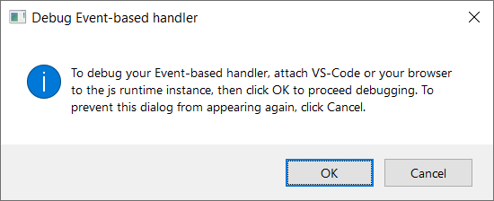
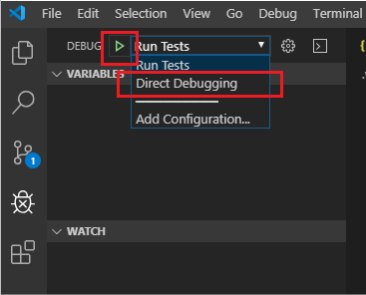

# <a name="debug-your-event-based-outlook-add-in-preview"></a><span data-ttu-id="2e68e-103">Débogez votre module basé sur Outlook’add-in (aperçu)</span><span class="sxs-lookup"><span data-stu-id="2e68e-103">Debug your event-based Outlook add-in (preview)</span></span>

<span data-ttu-id="2e68e-104">Cet article fournit des conseils de débogage lorsque vous implémentez [l’activation](autolaunch.md) basée sur les événements dans votre module supplémentaire.</span><span class="sxs-lookup"><span data-stu-id="2e68e-104">This article provides debugging guidance as you implement [event-based activation](autolaunch.md) in your add-in.</span></span> <span data-ttu-id="2e68e-105">La fonction d’activation basée sur l’événement est actuellement en avant-première.</span><span class="sxs-lookup"><span data-stu-id="2e68e-105">The event-based activation feature is currently in preview.</span></span>

> [!IMPORTANT]
> <span data-ttu-id="2e68e-106">Cette capacité de débogage n’est prise en charge que pour l’aperçu Outlook sur Windows avec un abonnement Microsoft 365'abonnement.</span><span class="sxs-lookup"><span data-stu-id="2e68e-106">This debugging capability is only supported for preview in Outlook on Windows with a Microsoft 365 subscription.</span></span> <span data-ttu-id="2e68e-107">Pour plus d’informations, consultez le [débogage Preview pour la section fonctionnalité d’activation basée sur l’événement](#preview-debugging-for-the-event-based-activation-feature) dans cet article.</span><span class="sxs-lookup"><span data-stu-id="2e68e-107">For more information, see the [Preview debugging for the event-based activation feature](#preview-debugging-for-the-event-based-activation-feature) section in this article.</span></span>

<span data-ttu-id="2e68e-108">Dans cet article, nous discutons des étapes clés pour permettre le débogage.</span><span class="sxs-lookup"><span data-stu-id="2e68e-108">In this article, we discuss the key stages to enable debugging.</span></span>

- [<span data-ttu-id="2e68e-109">Marquer l’add-in pour le débogage</span><span class="sxs-lookup"><span data-stu-id="2e68e-109">Mark the add-in for debugging</span></span>](#mark-your-add-in-for-debugging)
- [<span data-ttu-id="2e68e-110">Configurer Visual Studio Code</span><span class="sxs-lookup"><span data-stu-id="2e68e-110">Configure Visual Studio Code</span></span>](#configure-visual-studio-code)
- [<span data-ttu-id="2e68e-111">Attachez-Visual Studio Code</span><span class="sxs-lookup"><span data-stu-id="2e68e-111">Attach Visual Studio Code</span></span>](#attach-visual-studio-code)
- [<span data-ttu-id="2e68e-112">Debug</span><span class="sxs-lookup"><span data-stu-id="2e68e-112">Debug</span></span>](#debug)

<span data-ttu-id="2e68e-113">Vous avez plusieurs options pour créer votre projet d’ajout.</span><span class="sxs-lookup"><span data-stu-id="2e68e-113">You have several options for creating your add-in project.</span></span> <span data-ttu-id="2e68e-114">Selon l’option que vous utilisez, les étapes peuvent varier.</span><span class="sxs-lookup"><span data-stu-id="2e68e-114">Depending on the option you're using, the steps may vary.</span></span> <span data-ttu-id="2e68e-115">Lorsque c’est le cas, si vous avez utilisé le générateur Yeoman pour Office Add-ins pour créer votre projet add-in (par exemple, en faisant la [procédure pas à pas d’activation basée sur l’événement),](autolaunch.md)puis suivez les étapes yo **bureau,** sinon suivez les **autres** étapes.</span><span class="sxs-lookup"><span data-stu-id="2e68e-115">Where this is the case, if you used the Yeoman generator for Office Add-ins to create your add-in project (for example, by doing the [event-based activation walkthrough](autolaunch.md)), then follow the **yo office** steps, otherwise follow the **Other** steps.</span></span> <span data-ttu-id="2e68e-116">Visual Studio Code doit être au moins la version 1.56.1.</span><span class="sxs-lookup"><span data-stu-id="2e68e-116">Visual Studio Code should be at least version 1.56.1.</span></span>

## <a name="preview-debugging-for-the-event-based-activation-feature"></a><span data-ttu-id="2e68e-117">Débugging d’aperçu pour la fonction d’activation basée sur l’événement</span><span class="sxs-lookup"><span data-stu-id="2e68e-117">Preview debugging for the event-based activation feature</span></span>

<span data-ttu-id="2e68e-118">Nous vous invitons à essayer la capacité de débogage de la fonction d’activation basée sur l’événement !</span><span class="sxs-lookup"><span data-stu-id="2e68e-118">We invite you to try out the debugging capability for the event-based activation feature!</span></span> <span data-ttu-id="2e68e-119">Faites-nous part de vos scénarios et de la façon dont nous pouvons nous améliorer en nous donnant des commentaires par GitHub **(voir la** section Commentaires à la fin de cette page).</span><span class="sxs-lookup"><span data-stu-id="2e68e-119">Let us know your scenarios and how we can improve by giving us feedback through GitHub (see the **Feedback** section at the end of this page).</span></span>

<span data-ttu-id="2e68e-120">Pour prévisualiser cette Outlook sur Windows, la construction minimale requise est de 16.0.13729.20000.</span><span class="sxs-lookup"><span data-stu-id="2e68e-120">To preview this capability for Outlook on Windows, the minimum required build is 16.0.13729.20000.</span></span> <span data-ttu-id="2e68e-121">Pour accéder aux Office bêta, rejoignez le [programme Office Insider](https://insider.office.com).</span><span class="sxs-lookup"><span data-stu-id="2e68e-121">For access to Office beta builds, join the [Office Insider program](https://insider.office.com).</span></span>

## <a name="mark-your-add-in-for-debugging"></a><span data-ttu-id="2e68e-122">Marquez votre add-in pour le débogage</span><span class="sxs-lookup"><span data-stu-id="2e68e-122">Mark your add-in for debugging</span></span>

1. <span data-ttu-id="2e68e-123">Définissez la clé du registre `HKEY_CURRENT_USER\SOFTWARE\Microsoft\Office\16.0\Wef\Developer\[Add-in ID]\UseDirectDebugger` .</span><span class="sxs-lookup"><span data-stu-id="2e68e-123">Set the registry key `HKEY_CURRENT_USER\SOFTWARE\Microsoft\Office\16.0\Wef\Developer\[Add-in ID]\UseDirectDebugger`.</span></span> <span data-ttu-id="2e68e-124">`[Add-in ID]` est **l’Id** dans le manifeste add-in.</span><span class="sxs-lookup"><span data-stu-id="2e68e-124">`[Add-in ID]` is the **Id** in the add-in manifest.</span></span>

    <span data-ttu-id="2e68e-125">**yo office**: Dans une fenêtre de ligne de commande, naviguez jusqu’à la racine de votre dossier d’ajout, puis exécutez la commande suivante.</span><span class="sxs-lookup"><span data-stu-id="2e68e-125">**yo office**: In a command line window, navigate to the root of your add-in folder then run the following command.</span></span>

    ```command&nbsp;line
    npm start
    ```

    <span data-ttu-id="2e68e-126">En plus de construire le code et de démarrer le serveur local, cette commande doit définir la `UseDirectDebugger` clé de registre pour cet add-in à `1` .</span><span class="sxs-lookup"><span data-stu-id="2e68e-126">In addition to building the code and starting the local server, this command should set the `UseDirectDebugger` registry key for this add-in to `1`.</span></span>

    <span data-ttu-id="2e68e-127">**Autre**: Ajouter la clé `UseDirectDebugger` de registre sous `HKEY_CURRENT_USER\SOFTWARE\Microsoft\Office\16.0\WEF\Developer\[Add-in ID]\` .</span><span class="sxs-lookup"><span data-stu-id="2e68e-127">**Other**: Add the `UseDirectDebugger` registry key under `HKEY_CURRENT_USER\SOFTWARE\Microsoft\Office\16.0\WEF\Developer\[Add-in ID]\`.</span></span> <span data-ttu-id="2e68e-128">Remplacer `[Add-in ID]` par **l’id** du manifeste add-in.</span><span class="sxs-lookup"><span data-stu-id="2e68e-128">Replace `[Add-in ID]` with the **Id** from the add-in manifest.</span></span> <span data-ttu-id="2e68e-129">Définissez la clé du registre pour `1` .</span><span class="sxs-lookup"><span data-stu-id="2e68e-129">Set the registry key to `1`.</span></span>

    [!include[Developer registry key](../includes/developer-registry-key.md)]

1. <span data-ttu-id="2e68e-130">Démarrez Outlook bureau (ou redémarrez Outlook s’il est déjà ouvert).</span><span class="sxs-lookup"><span data-stu-id="2e68e-130">Start Outlook desktop (or restart Outlook if it's already open).</span></span>
1. <span data-ttu-id="2e68e-131">Composez un nouveau message ou rendez-vous.</span><span class="sxs-lookup"><span data-stu-id="2e68e-131">Compose a new message or appointment.</span></span> <span data-ttu-id="2e68e-132">Vous devriez voir le dialogue suivant.</span><span class="sxs-lookup"><span data-stu-id="2e68e-132">You should see the following dialog.</span></span> <span data-ttu-id="2e68e-133">*N’interagissez* pas encore avec le dialogue.</span><span class="sxs-lookup"><span data-stu-id="2e68e-133">Do *not* interact with the dialog yet.</span></span>

    

## <a name="configure-visual-studio-code"></a><span data-ttu-id="2e68e-135">Configurer Visual Studio Code</span><span class="sxs-lookup"><span data-stu-id="2e68e-135">Configure Visual Studio Code</span></span>

### <a name="yo-office"></a><span data-ttu-id="2e68e-136">yo bureau</span><span class="sxs-lookup"><span data-stu-id="2e68e-136">yo office</span></span>

1. <span data-ttu-id="2e68e-137">De retour dans la fenêtre de la ligne de commande, Visual Studio Code.</span><span class="sxs-lookup"><span data-stu-id="2e68e-137">Back in the command line window, open Visual Studio Code.</span></span>

    ```command&nbsp;line
    code .
    ```

1. <span data-ttu-id="2e68e-138">Dans Visual Studio Code, ouvrez le fichier **./.vscode/launch.jset** ajoutez l’extrait suivant à votre liste de configurations.</span><span class="sxs-lookup"><span data-stu-id="2e68e-138">In Visual Studio Code, open the file **./.vscode/launch.json** and add the following excerpt to your list of configurations.</span></span> <span data-ttu-id="2e68e-139">Enregistrez vos modifications.</span><span class="sxs-lookup"><span data-stu-id="2e68e-139">Save your changes.</span></span>

    ```json
    {
      "name": "Direct Debugging",
      "type": "node",
      "request": "attach",
      "port": 9229,
      "protocol": "inspector",
      "timeout": 600000,
      "trace": true
    }
    ```

### <a name="other"></a><span data-ttu-id="2e68e-140">Autre</span><span class="sxs-lookup"><span data-stu-id="2e68e-140">Other</span></span>

1. <span data-ttu-id="2e68e-141">Créez un nouveau dossier appelé **Debugging (peut-être** dans votre **dossier** Desktop).</span><span class="sxs-lookup"><span data-stu-id="2e68e-141">Create a new folder called **Debugging** (perhaps in your **Desktop** folder).</span></span>
1. <span data-ttu-id="2e68e-142">Ouvrez Visual Studio Code.</span><span class="sxs-lookup"><span data-stu-id="2e68e-142">Open Visual Studio Code.</span></span>
1. <span data-ttu-id="2e68e-143">Accédez   >  **au dossier d’ouverture** de fichier, naviguez vers le dossier que vous venez de créer, puis **choisissez Select Folder**.</span><span class="sxs-lookup"><span data-stu-id="2e68e-143">Go to **File** > **Open Folder**, navigate to the folder you just created, then choose **Select Folder**.</span></span>
1. <span data-ttu-id="2e68e-144">Sur la barre d’activité, **sélectionnez l’élément Debug** (Ctrl+Shift+D).</span><span class="sxs-lookup"><span data-stu-id="2e68e-144">On the Activity Bar, select the **Debug** item (Ctrl+Shift+D).</span></span>

    

1. <span data-ttu-id="2e68e-146">Sélectionnez **la création d'launch.jssur le lien de** fichier.</span><span class="sxs-lookup"><span data-stu-id="2e68e-146">Select the **create a launch.json file** link.</span></span>

    

1. <span data-ttu-id="2e68e-148">Dans la **baisse de l’environnement** sélectionné, **sélectionnez Edge :** Lancez-le pour créer une launch.jsdans le fichier.</span><span class="sxs-lookup"><span data-stu-id="2e68e-148">In the **Select Environment** dropdown, select **Edge: Launch** to create a launch.json file.</span></span>
1. <span data-ttu-id="2e68e-149">Ajoutez l’extrait suivant à votre liste de configurations.</span><span class="sxs-lookup"><span data-stu-id="2e68e-149">Add the following excerpt to your list of configurations.</span></span> <span data-ttu-id="2e68e-150">Enregistrez vos modifications.</span><span class="sxs-lookup"><span data-stu-id="2e68e-150">Save your changes.</span></span>

    ```json
    {
      "name": "Direct Debugging",
      "type": "node",
      "request": "attach",
      "port": 9229,
      "protocol": "inspector",
      "timeout": 600000,
      "trace": true
    }
    ```

## <a name="attach-visual-studio-code"></a><span data-ttu-id="2e68e-151">Attachez-Visual Studio Code</span><span class="sxs-lookup"><span data-stu-id="2e68e-151">Attach Visual Studio Code</span></span>

1. <span data-ttu-id="2e68e-152">Pour trouver le **bundle.js** de l’add-in, ouvrez le dossier suivant dans Windows Explorer et recherchez **l’id** de votre module d’identification (trouvé dans le manifeste).</span><span class="sxs-lookup"><span data-stu-id="2e68e-152">To find the add-in's **bundle.js**, open the following folder in Windows Explorer and search for your add-in's **Id** (found in the manifest).</span></span>

    ```text
    %LOCALAPPDATA%\Microsoft\Office\16.0\Wef
    ```

    <span data-ttu-id="2e68e-153">Ouvrez le dossier préfixé avec cet ID et copiez son chemin complet.</span><span class="sxs-lookup"><span data-stu-id="2e68e-153">Open the folder prefixed with this ID and copy its full path.</span></span> <span data-ttu-id="2e68e-154">Dans Visual Studio Code, ouvrez **bundle.js** de ce dossier.</span><span class="sxs-lookup"><span data-stu-id="2e68e-154">In Visual Studio Code, open **bundle.js** from that folder.</span></span> <span data-ttu-id="2e68e-155">Le modèle du cheminement de fichiers doit être le suivant :</span><span class="sxs-lookup"><span data-stu-id="2e68e-155">The pattern of the file path should be as follows:</span></span>

    `%LOCALAPPDATA%\Microsoft\Office\16.0\Wef\{[Outlook profile GUID]}\[encoding]\Javascript\[Add-in ID]_[Add-in Version]_[locale]\bundle.js`

1. <span data-ttu-id="2e68e-156">Placez les points de rupture bundle.js où vous voulez que le débugger s’arrête.</span><span class="sxs-lookup"><span data-stu-id="2e68e-156">Place breakpoints in bundle.js where you want the debugger to stop.</span></span>
1. <span data-ttu-id="2e68e-157">Dans le **dropdown DEBUG,** sélectionnez le nom **Debugging Direct,** puis sélectionnez **Exécuter**.</span><span class="sxs-lookup"><span data-stu-id="2e68e-157">In the **DEBUG** dropdown, select the name **Direct Debugging**, then select **Run**.</span></span>

    

## <a name="debug"></a><span data-ttu-id="2e68e-159">Debug</span><span class="sxs-lookup"><span data-stu-id="2e68e-159">Debug</span></span>

1. <span data-ttu-id="2e68e-160">Après avoir confirmé que le débougger est attaché, revenez à Outlook, et dans le dialogue de gestionnaire basé sur **l’événement Debug,** choisissez **OK** .</span><span class="sxs-lookup"><span data-stu-id="2e68e-160">After confirming that the debugger is attached, return to Outlook, and in the **Debug Event-based handler** dialog, choose **OK** .</span></span>

1. <span data-ttu-id="2e68e-161">Vous pouvez maintenant atteindre vos points de rupture dans Visual Studio Code, vous permettant de déboger votre code d’activation basé sur l’événement.</span><span class="sxs-lookup"><span data-stu-id="2e68e-161">You can now hit your breakpoints in Visual Studio Code, enabling you to debug your event-based activation code.</span></span>

## <a name="stop-debugging"></a><span data-ttu-id="2e68e-162">Arrêtez le débogage</span><span class="sxs-lookup"><span data-stu-id="2e68e-162">Stop debugging</span></span>

<span data-ttu-id="2e68e-163">Pour arrêter le débogage pour le reste de la session de bureau Outlook en cours, dans le dialogue de gestionnaire basé sur **l’événement Debug,** choisissez **Annuler**.</span><span class="sxs-lookup"><span data-stu-id="2e68e-163">To stop debugging for the rest of the current Outlook desktop session, in the **Debug Event-based handler** dialog, choose **Cancel**.</span></span> <span data-ttu-id="2e68e-164">Pour ré-activer le débogage, redémarrez Outlook bureau.</span><span class="sxs-lookup"><span data-stu-id="2e68e-164">To re-enable debugging, restart Outlook desktop.</span></span>

<span data-ttu-id="2e68e-165">Pour empêcher le dialogue **de gestionnaire basé sur l’événement Debug** d’apparaître et d’arrêter le débogage pour les sessions de Outlook suivantes, supprimez la clé de registre associée ou définissez sa valeur pour : `0` `HKEY_CURRENT_USER\SOFTWARE\Microsoft\Office\16.0\Wef\Developer\[Add-in ID]\UseDirectDebugger` .</span><span class="sxs-lookup"><span data-stu-id="2e68e-165">To prevent the **Debug Event-based handler** dialog from popping up and stop debugging for subsequent Outlook sessions, delete the associated registry key or set its value to `0`: `HKEY_CURRENT_USER\SOFTWARE\Microsoft\Office\16.0\Wef\Developer\[Add-in ID]\UseDirectDebugger`.</span></span>

## <a name="see-also"></a><span data-ttu-id="2e68e-166">Voir aussi</span><span class="sxs-lookup"><span data-stu-id="2e68e-166">See also</span></span>

- [<span data-ttu-id="2e68e-167">Configurez votre Outlook add-in pour l’activation basée sur l’événement</span><span class="sxs-lookup"><span data-stu-id="2e68e-167">Configure your Outlook add-in for event-based activation</span></span>](autolaunch.md)
- [<span data-ttu-id="2e68e-168">Déboguer votre complément avec la journalisation runtime</span><span class="sxs-lookup"><span data-stu-id="2e68e-168">Debug your add-in with runtime logging</span></span>](../testing/runtime-logging.md#runtime-logging-on-windows)
