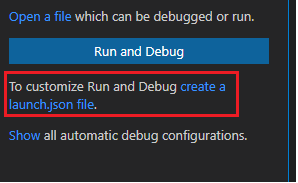

# <a name="debug-your-event-based-outlook-add-in-preview"></a>Débogez votre module basé sur Outlook’add-in (aperçu)

Cet article fournit des conseils de débogage lorsque vous implémentez [l’activation](autolaunch.md) basée sur les événements dans votre module supplémentaire. La fonction d’activation basée sur l’événement est actuellement en avant-première.

> [!IMPORTANT]
> Cette capacité de débogage n’est prise en charge que pour l’aperçu Outlook sur Windows avec un abonnement Microsoft 365'abonnement. Pour plus d’informations, consultez le [débogage Preview pour la section fonctionnalité d’activation basée sur l’événement](#preview-debugging-for-the-event-based-activation-feature) dans cet article.

Dans cet article, nous discutons des étapes clés pour permettre le débogage.

- [Marquer l’add-in pour le débogage](#mark-your-add-in-for-debugging)
- [Configurer Visual Studio Code](#configure-visual-studio-code)
- [Attachez-Visual Studio Code](#attach-visual-studio-code)
- [Debug](#debug)

Vous avez plusieurs options pour créer votre projet d’ajout. Selon l’option que vous utilisez, les étapes peuvent varier. Lorsque c’est le cas, si vous avez utilisé le générateur Yeoman pour Office Add-ins pour créer votre projet add-in (par exemple, en faisant la [procédure pas à pas d’activation basée sur l’événement),](autolaunch.md)puis suivez les étapes yo **bureau,** sinon suivez les **autres** étapes. Visual Studio Code doit être au moins la version 1.56.1.

## <a name="preview-debugging-for-the-event-based-activation-feature"></a>Débugging d’aperçu pour la fonction d’activation basée sur l’événement

Nous vous invitons à essayer la capacité de débogage de la fonction d’activation basée sur l’événement ! Faites-nous part de vos scénarios et de la façon dont nous pouvons nous améliorer en nous donnant des commentaires par GitHub **(voir la** section Commentaires à la fin de cette page).

Pour prévisualiser cette Outlook sur Windows, la construction minimale requise est de 16.0.13729.20000. Pour accéder aux Office bêta, rejoignez le [programme Office Insider](https://insider.office.com).

## <a name="mark-your-add-in-for-debugging"></a>Marquez votre add-in pour le débogage

1. Définissez la clé du registre `HKEY_CURRENT_USER\SOFTWARE\Microsoft\Office\16.0\Wef\Developer\[Add-in ID]\UseDirectDebugger` . `[Add-in ID]` est **l’Id** dans le manifeste add-in.

    **yo office**: Dans une fenêtre de ligne de commande, naviguez jusqu’à la racine de votre dossier d’ajout, puis exécutez la commande suivante.

    ```command&nbsp;line
    npm start
    ```

    En plus de construire le code et de démarrer le serveur local, cette commande doit définir la `UseDirectDebugger` clé de registre pour cet add-in à `1` .

    **Autre**: Ajouter la clé `UseDirectDebugger` de registre sous `HKEY_CURRENT_USER\SOFTWARE\Microsoft\Office\16.0\WEF\Developer\[Add-in ID]\` . Remplacer `[Add-in ID]` par **l’id** du manifeste add-in. Définissez la clé du registre pour `1` .

    [!include[Developer registry key](../includes/developer-registry-key.md)]

1. Démarrez Outlook bureau (ou redémarrez Outlook s’il est déjà ouvert).
1. Composez un nouveau message ou rendez-vous. Vous devriez voir le dialogue suivant. *N’interagissez* pas encore avec le dialogue.

    

## <a name="configure-visual-studio-code"></a>Configurer Visual Studio Code

### <a name="yo-office"></a>yo bureau

1. De retour dans la fenêtre de la ligne de commande, Visual Studio Code.

    ```command&nbsp;line
    code .
    ```

1. Dans Visual Studio Code, ouvrez le fichier **./.vscode/launch.jset** ajoutez l’extrait suivant à votre liste de configurations. Enregistrez vos modifications.

    ```json
    {
      "name": "Direct Debugging",
      "type": "node",
      "request": "attach",
      "port": 9229,
      "protocol": "inspector",
      "timeout": 600000,
      "trace": true
    }
    ```

### <a name="other"></a>Autre

1. Créez un nouveau dossier appelé **Debugging (peut-être** dans votre **dossier** Desktop).
1. Ouvrez Visual Studio Code.
1. Accédez   >  **au dossier d’ouverture** de fichier, naviguez vers le dossier que vous venez de créer, puis **choisissez Select Folder**.
1. Sur la barre d’activité, **sélectionnez l’élément Debug** (Ctrl+Shift+D).

    

1. Sélectionnez **la création d'launch.jssur le lien de** fichier.

    

1. Dans la **baisse de l’environnement** sélectionné, **sélectionnez Edge :** Lancez-le pour créer une launch.jsdans le fichier.
1. Ajoutez l’extrait suivant à votre liste de configurations. Enregistrez vos modifications.

    ```json
    {
      "name": "Direct Debugging",
      "type": "node",
      "request": "attach",
      "port": 9229,
      "protocol": "inspector",
      "timeout": 600000,
      "trace": true
    }
    ```

## <a name="attach-visual-studio-code"></a>Attachez-Visual Studio Code

1. Pour trouver le **bundle.js** de l’add-in, ouvrez le dossier suivant dans Windows Explorer et recherchez **l’id** de votre module d’identification (trouvé dans le manifeste).

    ```text
    %LOCALAPPDATA%\Microsoft\Office\16.0\Wef
    ```

    Ouvrez le dossier préfixé avec cet ID et copiez son chemin complet. Dans Visual Studio Code, ouvrez **bundle.js** de ce dossier. Le modèle du cheminement de fichiers doit être le suivant :

    `%LOCALAPPDATA%\Microsoft\Office\16.0\Wef\{[Outlook profile GUID]}\[encoding]\Javascript\[Add-in ID]_[Add-in Version]_[locale]\bundle.js`

1. Placez les points de rupture bundle.js où vous voulez que le débugger s’arrête.
1. Dans le **dropdown DEBUG,** sélectionnez le nom **Debugging Direct,** puis sélectionnez **Exécuter**.

    

## <a name="debug"></a>Debug

1. Après avoir confirmé que le débougger est attaché, revenez à Outlook, et dans le dialogue de gestionnaire basé sur **l’événement Debug,** choisissez **OK** .

1. Vous pouvez maintenant atteindre vos points de rupture dans Visual Studio Code, vous permettant de déboger votre code d’activation basé sur l’événement.

## <a name="stop-debugging"></a>Arrêtez le débogage

Pour arrêter le débogage pour le reste de la session de bureau Outlook en cours, dans le dialogue de gestionnaire basé sur **l’événement Debug,** choisissez **Annuler**. Pour ré-activer le débogage, redémarrez Outlook bureau.

Pour empêcher le dialogue **de gestionnaire basé sur l’événement Debug** d’apparaître et d’arrêter le débogage pour les sessions de Outlook suivantes, supprimez la clé de registre associée ou définissez sa valeur pour : `0` `HKEY_CURRENT_USER\SOFTWARE\Microsoft\Office\16.0\Wef\Developer\[Add-in ID]\UseDirectDebugger` .

## <a name="see-also"></a>Voir aussi

- [Configurez votre Outlook add-in pour l’activation basée sur l’événement](autolaunch.md)
- [Déboguer votre complément avec la journalisation runtime](../testing/runtime-logging.md#runtime-logging-on-windows)
