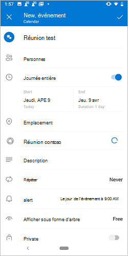
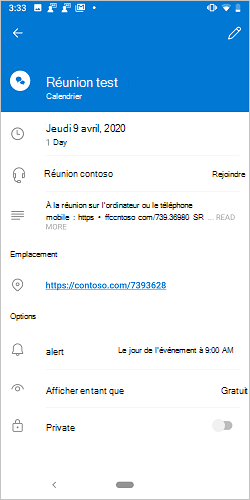

# <a name="create-an-outlook-mobile-add-in-for-an-online-meeting-provider"></a>Créer un Outlook mobile pour un fournisseur de réunion en ligne

La configuration d’une réunion en ligne est une expérience essentielle pour un utilisateur Outlook et il est facile de créer une réunion Teams avec Outlook [mobile.](/microsoftteams/teams-add-in-for-outlook) Toutefois, la création d’une réunion en Outlook avec un service non-Microsoft peut être fastidieuse. En implémentant cette fonctionnalité, les fournisseurs de services peuvent simplifier l’expérience de création de réunions en ligne pour Outlook utilisateurs de leur application.

> [!IMPORTANT]
> Cette fonctionnalité est uniquement prise en charge sur Android et iOS avec Microsoft 365 abonnement.

Dans cet article, vous allez apprendre à configurer votre Outlook pour permettre aux utilisateurs d’organiser et de participer à une réunion à l’aide de votre service de réunion en ligne. Tout au long de cet article, nous allons utiliser un fournisseur fictif de services de réunion en ligne, « Contoso ».

## <a name="set-up-your-environment"></a>Configuration de votre environnement

[Complétez Outlook démarrage](../quickstarts/outlook-quickstart.md?tabs=yeomangenerator) rapide qui crée un projet de compl?ment avec le générateur Yeoman pour Office compl?ments.

## <a name="configure-the-manifest"></a>Configurer le manifeste

Pour permettre aux utilisateurs de créer des réunions en ligne avec votre application, vous devez configurer le [point d’extension MobileOnlineMeetingCommandSurface](../reference/manifest/extensionpoint.md#mobileonlinemeetingcommandsurface) dans le manifeste sous l’élément `MobileFormFactor` parent. Les autres facteurs de forme ne sont pas pris en charge.

1. Dans votre éditeur de code, ouvrez le projet de démarrage rapide.

1. Ouvrez **lemanifest.xml** situé à la racine de votre projet.

1. Sélectionnez l’intégralité du nœud (y compris les balises d’ouverture et de fermeture) et remplacez-le `<VersionOverrides>` par le code XML suivant.

```xml
<VersionOverrides xmlns="http://schemas.microsoft.com/office/mailappversionoverrides" xsi:type="VersionOverridesV1_0">
  <VersionOverrides xmlns="http://schemas.microsoft.com/office/mailappversionoverrides/1.1" xsi:type="VersionOverridesV1_1">
    <Description resid="residDescription"></Description>
    <Requirements>
      <bt:Sets>
        <bt:Set Name="Mailbox" MinVersion="1.3"/>
      </bt:Sets>
    </Requirements>
    <Hosts>
      <Host xsi:type="MailHost">
        <DesktopFormFactor>
          <FunctionFile resid="residFunctionFile"/>
          <ExtensionPoint xsi:type="AppointmentOrganizerCommandSurface">
            <OfficeTab id="TabDefault">
              <Group id="apptComposeGroup">
                <Label resid="residDescription"/>
                <Control xsi:type="Button" id="insertMeetingButton">
                  <Label resid="residLabel"/>
                  <Supertip>
                    <Title resid="residLabel"/>
                    <Description resid="residTooltip"/>
                  </Supertip>
                  <Icon>
                    <bt:Image size="16" resid="icon-16"/>
                    <bt:Image size="32" resid="icon-32"/>
                    <bt:Image size="64" resid="icon-64"/>
                    <bt:Image size="80" resid="icon-80"/>
                  </Icon>
                  <Action xsi:type="ExecuteFunction">
                    <FunctionName>insertContosoMeeting</FunctionName>
                  </Action>
                </Control>
              </Group>
            </OfficeTab>
          </ExtensionPoint>
        </DesktopFormFactor>

        <MobileFormFactor>
          <FunctionFile resid="residFunctionFile"/>
          <ExtensionPoint xsi:type="MobileOnlineMeetingCommandSurface">
            <Control xsi:type="MobileButton" id="insertMeetingButton">
              <Label resid="residLabel"/>
              <Icon>
                <bt:Image size="25" scale="1" resid="icon-16"/>
                <bt:Image size="25" scale="2" resid="icon-16"/>
                <bt:Image size="25" scale="3" resid="icon-16"/>

                <bt:Image size="32" scale="1" resid="icon-32"/>
                <bt:Image size="32" scale="2" resid="icon-32"/>
                <bt:Image size="32" scale="3" resid="icon-32"/>

                <bt:Image size="48" scale="1" resid="icon-48"/>
                <bt:Image size="48" scale="2" resid="icon-48"/>
                <bt:Image size="48" scale="3" resid="icon-48"/>
              </Icon>
              <Action xsi:type="ExecuteFunction">
                <FunctionName>insertContosoMeeting</FunctionName>
              </Action>
            </Control>
          </ExtensionPoint>
        </MobileFormFactor>
      </Host>
    </Hosts>
    <Resources>
      <bt:Images>
        <bt:Image id="icon-16" DefaultValue="https://contoso.com/assets/icon-16.png"/>
        <bt:Image id="icon-32" DefaultValue="https://contoso.com/assets/icon-32.png"/>
        <bt:Image id="icon-48" DefaultValue="https://contoso.com/assets/icon-48.png"/>
        <bt:Image id="icon-64" DefaultValue="https://contoso.com/assets/icon-64.png"/>
        <bt:Image id="icon-80" DefaultValue="https://contoso.com/assets/icon-80.png"/>
      </bt:Images>
      <bt:Urls>
        <bt:Url id="residFunctionFile" DefaultValue="https://contoso.com/commands.html"/>
      </bt:Urls>
      <bt:ShortStrings>
        <bt:String id="residDescription" DefaultValue="Contoso meeting"/>
        <bt:String id="residLabel" DefaultValue="Add a contoso meeting"/>
      </bt:ShortStrings>
      <bt:LongStrings>
        <bt:String id="residTooltip" DefaultValue="Add a contoso meeting to this appointment."/>
      </bt:LongStrings>
    </Resources>
  </VersionOverrides>
</VersionOverrides>
```

> [!TIP]
> Pour en savoir plus sur les manifestes des Outlook, voir les [manifestes](manifests.md) de Outlook et ajouter la prise en charge des commandes de Outlook [Mobile.](add-mobile-support.md)

## <a name="implement-adding-online-meeting-details"></a>Implémenter l’ajout de détails de réunion en ligne

Dans cette section, découvrez comment votre script de add-in peut mettre à jour la réunion d’un utilisateur pour inclure les détails de la réunion en ligne.

1. À partir du même projet de démarrage rapide, ouvrez le fichier **./src/commands/commands.js** dans votre éditeur de code.

1. Remplacez tout le contenu du **fichiercommands.js** par le javaScript suivant.

    ```js
    // 1. How to construct online meeting details.
    // Not shown: How to get the meeting organizer's ID and other details from your service.
    const newBody = '<br>' +
        '<a href="https://contoso.com/meeting?id=123456789" target="_blank">Join Contoso meeting</a>' +
        '<br><br>' +
        'Phone Dial-in: +1(123)456-7890' +
        '<br><br>' +
        'Meeting ID: 123 456 789' +
        '<br><br>' +
        'Want to test your video connection?' +
        '<br><br>' +
        '<a href="https://contoso.com/testmeeting" target="_blank">Join test meeting</a>' +
        '<br><br>';

    var mailboxItem;

    // Office is ready.
    Office.onReady(function () {
            mailboxItem = Office.context.mailbox.item;
        }
    );

    // 2. How to define a UI-less function named `insertContosoMeeting` (referenced in the manifest)
    //    to update the meeting body with the online meeting details.
    function insertContosoMeeting(event) {
        // Get HTML body from the client.
        mailboxItem.body.getAsync("html",
            { asyncContext: event },
            function (getBodyResult) {
                if (getBodyResult.status === Office.AsyncResultStatus.Succeeded) {
                    updateBody(getBodyResult.asyncContext, getBodyResult.value);
                } else {
                    console.error("Failed to get HTML body.");
                    getBodyResult.asyncContext.completed({ allowEvent: false });
                }
            }
        );
    }

    // 3. How to implement a supporting function `updateBody`
    //    that appends the online meeting details to the current body of the meeting.
    function updateBody(event, existingBody) {
        // Append new body to the existing body.
        mailboxItem.body.setAsync(existingBody + newBody,
            { asyncContext: event, coercionType: "html" },
            function (setBodyResult) {
                if (setBodyResult.status === Office.AsyncResultStatus.Succeeded) {
                    setBodyResult.asyncContext.completed({ allowEvent: true });
                } else {
                    console.error("Failed to set HTML body.");
                    setBodyResult.asyncContext.completed({ allowEvent: false });
                }
            }
        );
    }

    function getGlobal() {
      return typeof self !== "undefined"
        ? self
        : typeof window !== "undefined"
        ? window
        : typeof global !== "undefined"
        ? global
        : undefined;
    }

    const g = getGlobal();

    // The add-in command functions need to be available in global scope.
    g.insertContosoMeeting = insertContosoMeeting;
    ```

## <a name="testing-and-validation"></a>Test et validation

Suivez les instructions habituelles [pour tester et valider votre add-in.](testing-and-tips.md) Après [le chargement de](sideload-outlook-add-ins-for-testing.md) version Outlook sur le web, Windows ou Mac, redémarrez Outlook sur votre appareil mobile Android. (Android est le seul client pris en charge pour le moment.) Ensuite, sur un nouvel écran de réunion, vérifiez que le Microsoft Teams ou Skype bascule est remplacé par le vôtre.

### <a name="create-meeting-ui"></a>Créer une interface utilisateur de réunion

En tant qu’organisateur de réunion, vous devriez voir des écrans semblables aux trois images suivantes lorsque vous créez une réunion.

[](../images/outlook-android-create-online-meeting-off-expanded.png#lightbox) [](../images/outlook-android-create-online-meeting-load-expanded.png#lightbox) [](../images/outlook-android-create-online-meeting-on-expanded.png#lightbox)

### <a name="join-meeting-ui"></a>Rejoindre l’interface utilisateur de réunion

En tant que participant à la réunion, vous devez voir un écran semblable à l’image suivante lorsque vous affichez la réunion.

[](../images/outlook-android-join-online-meeting-view-1-expanded.png#lightbox)

> [!IMPORTANT]
> Si le lien Rejoindre  n’est pas disponible, il se peut que le modèle de réunion en ligne de votre service ne soit pas inscrit sur nos serveurs. Pour plus [d’informations, consultez](#register-your-online-meeting-template) la section Inscrire votre modèle de réunion en ligne.

## <a name="register-your-online-meeting-template"></a>Inscrire votre modèle de réunion en ligne

Si vous souhaitez inscrire le modèle de réunion en ligne pour votre service, vous pouvez créer un GitHub avec les détails. Après cela, nous vous contacterons pour coordonner la chronologie d’inscription.

1. Go to the **Feedback** section at the end of this article.
1. Appuyez sur **le lien Cette page.**
1. Définissez **le titre** du nouveau problème sur « Enregistrer le modèle de réunion en ligne pour mon service », en remplaçant par votre nom de `my-service` service.
1. Dans le corps du problème, remplacez la chaîne « [Entrez vos commentaires ici] » par la chaîne que vous avez définie dans la variable ou une variable similaire de la section Implémenter l’ajout de détails de réunion en ligne plus haut dans cet `newBody` article. [](#implement-adding-online-meeting-details)
1. Cliquez **sur Envoyer un nouveau problème.**


## <a name="available-apis"></a>API disponibles

Les API suivantes sont disponibles pour cette fonctionnalité.

- API d’organisateur de rendez-vous
  - [Office.context.mailbox.item.body](/javascript/api/outlook/office.appointmentcompose?view=outlook-js-preview&preserve-view=true#body) ([Body.getAsync](/javascript/api/outlook/office.body?view=outlook-js-preview&preserve-view=true#getasync-coerciontype--options--callback-), [Body.setAsync](/javascript/api/outlook/office.body?view=outlook-js-preview&preserve-view=true#setasync-data--options--callback-))
  - [Office.context.mailbox.item.end](/javascript/api/outlook/office.appointmentcompose?view=outlook-js-preview&preserve-view=true#end) ([Heure](/javascript/api/outlook/office.time?view=outlook-js-preview&preserve-view=true))
  - [Office.context.mailbox.item.loadCustomPropertiesAsync](/javascript/api/outlook/office.appointmentcompose?view=outlook-js-preview&preserve-view=true#loadcustompropertiesasync-callback--usercontext-) ([CustomProperties](/javascript/api/outlook/office.customproperties?view=outlook-js-preview&preserve-view=true))
  - [Office.context.mailbox.item.location](/javascript/api/outlook/office.appointmentcompose?view=outlook-js-preview&preserve-view=true#location) ([Location](/javascript/api/outlook/office.location?view=outlook-js-preview&preserve-view=true))
  - [Office.context.mailbox.item.optionalAttendees](/javascript/api/outlook/office.appointmentcompose?view=outlook-js-preview&preserve-view=true#optionalattendees) ([Recipients](/javascript/api/outlook/office.recipients?view=outlook-js-preview&preserve-view=true))
  - [Office.context.mailbox.item.requiredAttendees](/javascript/api/outlook/office.appointmentcompose?view=outlook-js-preview&preserve-view=true#requiredattendees) ([Recipients](/javascript/api/outlook/office.recipients?view=outlook-js-preview&preserve-view=true))
  - [Office.context.mailbox.item.start](/javascript/api/outlook/office.appointmentcompose?view=outlook-js-preview&preserve-view=true#start) ([Heure](/javascript/api/outlook/office.time?view=outlook-js-preview&preserve-view=true))
  - [Office.context.mailbox.item.subject](/javascript/api/outlook/office.appointmentcompose?view=outlook-js-preview&preserve-view=true#subject) ([Objet](/javascript/api/outlook/office.subject?view=outlook-js-preview&preserve-view=true))
  - [Office.context.roamingSettings](../reference/objectmodel/preview-requirement-set/office.context.md?view=outlook-js-preview&preserve-view=true#roamingsettings-roamingsettings) ([RoamingSettings](/javascript/api/outlook/office.roamingsettings?view=outlook-js-preview&preserve-view=true))
- Gérer le flux d’th
  - [API de boîte de dialogue](../develop/dialog-api-in-office-add-ins.md)

## <a name="restrictions"></a>Restrictions

Plusieurs restrictions s’appliquent.

- Applicable uniquement aux fournisseurs de services de réunion en ligne.
- Seuls les add-ins installés par l’administrateur apparaissent sur l’écran de composition de la réunion, remplaçant l’option Teams ou Skype par défaut. Les add-ins installés par l’utilisateur ne s’activent pas.
- L’icône du add-in doit être en échelles de gris à l’aide de code hexas ou de son équivalent `#919191` dans [d’autres formats de couleur.](https://convertingcolors.com/hex-color-919191.html)
- Une seule commande sans interface utilisateur est prise en charge en mode Organisateur de rendez-vous (composition).

## <a name="see-also"></a>Voir aussi

- [Compléments pour Outlook Mobile](outlook-mobile-addins.md)
- [Ajouter la prise en charge des commandes de Outlook Mobile](add-mobile-support.md)
