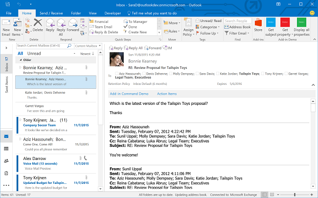

# Présentation des compléments Outlook

Les compléments Outlook sont des intégrations conçues par des tiers dans Outlook à l’aide de notre plate-forme web. Les compléments Outlook comportent trois aspects clés :

- La même logique complémentaire et commerciale fonctionne sur les ordinateurs de bureau (Outlook sur Windows et Mac), sur le web (Microsoft 365 et Outlook.com) et sur les téléphones portables.
- Les compléments Outlook se composent d’un manifeste, qui décrit la manière dont le complément s’intègre dans Outlook (par exemple, un bouton ou un volet de tâches), ainsi que d’un code JavaScript/HTML, qui constitue l’interface utilisateur et la logique métier du complément.
- Les compléments Outlook peuvent être acquis à partir d’[AppSource](https://appsource.microsoft.com) ou [chargés séparément](sideload-outlook-add-ins-for-testing.md) par les utilisateurs finals ou les administrateurs.

Les compléments Outlook diffèrent des compléments COM ou VSTO, qui sont des intégrations plus anciennes spécifiques d’Outlook sous Windows. Contrairement aux compléments COM, les compléments Outlook ne comportent pas de code physiquement installé sur le périphérique de l’utilisateur ou du client Outlook. Pour un complément Outlook, Outlook lit le manifeste et raccorde les contrôles spécifiés dans l’interface utilisateur, puis charge le code JavaScript et HTML. Les composants web s’exécutent tous dans le contexte d’un navigateur dans un bac à sable (sandbox).

Les éléments Outlook qui prennent en charge les compléments incluent notamment les messages électroniques, les demandes de réunion, les réponses à des demandes de réunion, les annulations de réunion et les rendez-vous. Chaque complément Outlook définit le contexte dans lequel il est disponible, y compris les types d’éléments et si l’utilisateur lit ou compose un élément.

[!INCLUDE [publish policies note](../includes/note-publish-policies.md)]

## Points d’extension

Extension points are the ways that add-ins integrate with Outlook. The following are the ways this can be done:

- Add-ins can declare buttons that appear in command surfaces across messages and appointments. For more information, see [Add-in commands for Outlook](add-in-commands-for-outlook.md).

    **Complément avec boutons de commande dans le ruban**

    

- Add-ins can link off regular expression matches or detected entities in messages and appointments. For more information, see [Contextual Outlook add-ins](contextual-outlook-add-ins.md).

    **Complément contextuel pour une entité en surbrillance (adresse)**

    

> [!NOTE]
> [Les volets personnalisés sont déconseillés](https://developer.microsoft.com/outlook/blogs/make-your-add-ins-available-in-the-office-ribbon/). Veuillez donc vérifier que vous utilisez un point d’extension pris en charge.

## Éléments de boîtes aux lettres disponibles pour les compléments

Outlook add-ins are available on messages or appointments while composing or reading, but not other item types. Outlook does not activate add-ins if the current message item, in a compose or read form, is one of the following:

- Protected by Information Rights Management (IRM) or encrypted in other ways for protection. A digitally signed message is an example since digital signing relies on one of these mechanisms.

- un rapport ou une notification de remise qui a la classe de message IPM.Report.* (notamment les rapports de remise et les notifications d’échec de remise, ainsi que les notifications de lecture, de non-lecture et de retard) ;

- un brouillon (aucun expéditeur n’y est affecté), ou dans le dossier Brouillons d’Outlook ;

- un fichier .msg ou .eml joint à un autre message ;

- un fichier .msg ou .eml ouvert à partir du système de fichiers ;

- dans une boîte aux lettres partagée, dans la boîte aux lettres d’un autre utilisateur, dans une boîte aux lettres d’archivage ou dans un dossier public.

- utilise un formulaire personnalisé.

En général, Outlook peut activer des compléments sous forme de lecture pour les éléments dans le dossier Éléments envoyés, à l'exception des compléments qui s’activent en fonction des correspondances de chaînes d'entités connues. Pour plus d'informations sur les raisons de ce problème, reportez-vous à la rubrique "Prise en charge pour les entités connues" dans [Faire correspondre des chaînes dans un élément Outlook en tant qu'entités connues](match-strings-in-an-item-as-well-known-entities.md).

## Hôtes pris en charge

Les add-ins Outlook sont pris en charge dans Outlook 2013 ou plus récent sur Windows, Outlook 2016 ou plus récent sur Mac, Outlook sur le web pour Exchange 2013 sur site et versions ultérieures, Outlook sur iOS, Outlook sur Android, et Outlook sur le web et Outlook.com. Les fonctionnalités les plus récentes ne sont pas toutes prises en charge dans tous les [clients](../reference/requirement-sets/outlook-api-requirement-sets.md#requirement-sets-supported-by-exchange-servers-and-outlook-clients) à la fois. Reportez-vous aux articles et références API relatives à ces fonctionnalités pour savoir dans quels hôtes elles peuvent ou non être prises en charge.

## Commencer à créer des compléments Outlook

Pour commencer à créer des compléments Outlook, procédez comme suit.

- [Démarrage rapide](../quickstarts/outlook-quickstart.md) : créer un volet Office simple.
- [Didacticiel](../tutorials/outlook-tutorial.md) : découvrez comment créer un complément qui insère des gists GitHub dans un nouveau message.

## Voir aussi

- [Meilleures pratiques en matière de développement de compléments Office](../concepts/add-in-development-best-practices.md)
- [Instructions de conception pour les compléments Office](../design/add-in-design.md)
- [Gérer les licences de compléments pour Office et SharePoint](/office/dev/store/license-your-add-ins)
- [Publier votre complément Office](../publish/publish.md)
- [Mise à disposition de vos solutions sur AppSource et dans Office](/office/dev/store/submit-to-the-office-store)
