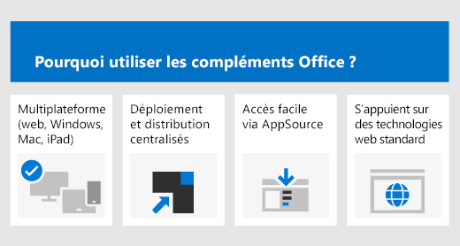

# Vue d’ensemble de la plateforme de compléments pour Office

You can use the Office Add-ins platform to build solutions that extend Office applications and interact with content in Office documents. With Office Add-ins, you can use familiar web technologies such as HTML, CSS, and JavaScript to extend and interact with Word, Excel, PowerPoint, OneNote, Project, and Outlook. Your solution can run in Office across multiple platforms, including Windows, Mac, iPad, and in a browser.

Office Add-ins can do almost anything a webpage can do inside a browser. Use the Office Add-ins platform to:

-  **Add new functionality to Office clients** - Bring external data into Office, automate Office documents, expose third-party functionality in Office clients, and more. For example, use Microsoft Graph API to connect to data that drives productivity.

-  **Créer de nouveaux objets interactifs et enrichis qui peuvent être incorporés dans des documents Office :** vous pouvez incorporer des cartes, des graphiques et des visualisations interactives que les utilisateurs peuvent ajouter à leurs feuilles de calcul Excel et présentations PowerPoint.

## En quoi les compléments Office sont-ils différents des compléments COM et VSTO ?

COM or VSTO add-ins are earlier Office integration solutions that run only on Office on Windows. Unlike COM add-ins, Office Add-ins don't involve code that runs on the user's device or in the Office client. For an Office Add-in, the host application, for example Excel, reads the add-in manifest and hooks up the add-in’s custom ribbon buttons and menu commands in the UI. When needed, it loads the add-in's JavaScript and HTML code, which executes in the context of a browser in a sandbox.

Les compléments Office offrent les avantages suivants par rapport aux compléments créés à l’aide de VBA, COM ou VSTO :

- Cross-platform support. Office Add-ins run in Office on the web, Windows, Mac, and iPad.

- Centralized deployment and distribution. Admins can deploy Office Add-ins centrally across an organization.

- Easy access via AppSource. You can make your solution available to a broad audience by submitting it to AppSource.

- Based on standard web technology. You can use any library you like to build Office Add-ins.

## Composants d’un complément Office

An Office Add-in includes two basic components: an XML manifest file, and your own web application. The manifest defines various settings, including how your add-in integrates with Office clients. Your web application needs to be hosted on a web server, or web hosting service, such as Microsoft Azure.

### Manifeste

Le manifeste est un fichier XML qui spécifie les paramètres et les fonctionnalités du complément, notamment :

- Le nom d’affichage, la description, l’ID, la version et les paramètres régionaux par défaut du complément.

- La façon dont le complément s’intègre à Office.  

- Le niveau d’autorisation et les conditions d’accès aux données pour le complément.

### Application web

The most basic Office Add-in consists of a static HTML page that is displayed inside an Office application, but that doesn't interact with either the Office document or any other Internet resource. However, to create an experience that interacts with Office documents or allows the user to interact with online resources from an Office host application, you can use any technologies, both client and server side, that your hosting provider supports (such as ASP.NET, PHP, or Node.js). To interact with Office clients and documents, you use the Office.js JavaScript APIs.

*Figure 2. Composants d’un complément Office Hello World*

## Extension des clients Office et interaction avec ces clients

Les compléments Office offrent les possibilités suivantes dans une application Office hôte :

-  Étendre les fonctionnalités (toutes les applications Office)

-  Créer de nouveaux objets (Excel ou PowerPoint)
 
### Étendre les fonctionnalités d’Office

Vous pouvez ajouter de nouvelles fonctionnalités aux applications Office via les éléments d’interface suivants :  

-  Commandes de menu et boutons de ruban personnalisées (collectivement appelés « commandes de complément »)

-  Volets Office à insérer

Les éléments d’interface personnalisés et les volets Office sont définis dans le manifeste du complément.  

#### Commandes de menu et boutons personnalisés  

You can add custom ribbon buttons and menu items to the ribbon in Office on the web and Windows. This makes it easy for users to access your add-in directly from their Office application. Command buttons can launch different actions such as showing a task pane with custom HTML or executing a JavaScript function.  

*Figure 3. Commandes des compléments dans le ruban*

#### Volets Office  

You can use task panes in addition to add-in commands to enable users to interact with your solution. Clients that do not support add-in commands (Office 2013 and Office on iPad) run your add-in as a task pane. Users launch task pane add-ins via the **My Add-ins** button on the **Insert** tab.

*Figure 4. Volet Office*

### Extension des fonctionnalités Outlook

Outlook add-ins can extend the Office app ribbon and also display contextually next to an Outlook item when you're viewing or composing it. They can work with an email message, meeting request, meeting response, meeting cancellation, or appointment when a user is viewing a received item or replying or creating a new item. 

Outlook add-ins can access contextual information from the item, such as an address or tracking ID, and then use that data to access additional information on the server and from web services to create compelling user experiences. In most cases, an Outlook add-in runs without modification in the Outlook host application to provide a seamless experience on the desktop, web, and tablet and mobile devices.

Pour accéder à une vue d’ensemble des compléments Outlook, reportez-vous à la rubrique [Présentation des compléments Outlook](../outlook/outlook-add-ins-overview.md).

### Création d’objets dans des documents Office

You can embed web-based objects called content add-ins within Excel and PowerPoint documents. With content add-ins, you can integrate rich, web-based data visualizations, media (such as a YouTube video player or a picture gallery), and other external content.

*Figure 5. Complément de contenu*

## API JavaScript pour Office

The Office JavaScript APIs contain objects and members for building add-ins and interacting with Office content and web services. There is a common object model that is shared by Excel, Outlook, Word, PowerPoint, OneNote and Project. There are also more extensive host-specific object models for Excel and Word. These APIs provide access to well-known objects such as paragraphs and workbooks, which makes it easier to create an add-in for a specific host.  

## Étapes suivantes

Pour une présentation en détails du développement des compléments Office, voir [Création de compléments Office](../overview/office-add-ins-fundamentals.md).

## Voir aussi

- [Création de compléments Office](../overview/office-add-ins-fundamentals.md)
- [Concepts de base pour les compléments Office](../overview/core-concepts-office-add-ins.md)
- [Développement de compléments Office](../develop/develop-overview.md)
- [Concevoir des compléments Office](../design/add-in-design.md)
- [Test et débogage de compléments Office](../testing/test-debug-office-add-ins.md)
- [Publish Office Add-ins](../publish/publish.md)
