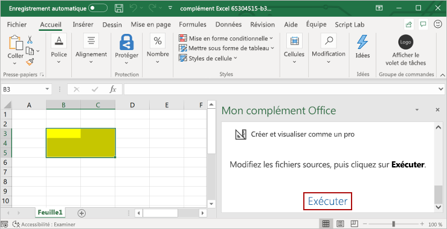

# <a name="build-an-excel-task-pane-add-in-using-angular"></a><span data-ttu-id="f3542-102">Créer un complément de volet de tâches Excel à l’aide d’Angular</span><span class="sxs-lookup"><span data-stu-id="f3542-102">Build an Excel task pane add-in using Angular</span></span>

<span data-ttu-id="f3542-103">Cet article décrit le processus de création d’un complément de volet de tâches Excel à l’aide d’Angular et de l’API JavaScript pour Excel.</span><span class="sxs-lookup"><span data-stu-id="f3542-103">In this article, you'll walk through the process of building an Excel task pane add-in using Angular and the Excel JavaScript API.</span></span>

## <a name="prerequisites"></a><span data-ttu-id="f3542-104">Conditions préalables</span><span class="sxs-lookup"><span data-stu-id="f3542-104">Prerequisites</span></span>

[!include[Yeoman generator prerequisites](../includes/quickstart-yo-prerequisites.md)]

## <a name="create-the-add-in-project"></a><span data-ttu-id="f3542-105">Création du projet de complément</span><span class="sxs-lookup"><span data-stu-id="f3542-105">Create the add-in project</span></span>

[!include[Yeoman generator create project guidance](../includes/yo-office-command-guidance.md)]

- <span data-ttu-id="f3542-106">**Sélectionnez un type de projet :** `Office Add-in Task Pane project using Angular framework`</span><span class="sxs-lookup"><span data-stu-id="f3542-106">**Choose a project type:** `Office Add-in Task Pane project using Angular framework`</span></span>
- <span data-ttu-id="f3542-107">**Sélectionnez un type de script :** `TypeScript`</span><span class="sxs-lookup"><span data-stu-id="f3542-107">**Choose a script type:** `TypeScript`</span></span>
- <span data-ttu-id="f3542-108">**Comment souhaitez-vous nommer votre complément ?**</span><span class="sxs-lookup"><span data-stu-id="f3542-108">**What do you want to name your add-in?**</span></span> `My Office Add-in`
- <span data-ttu-id="f3542-109">**Quelle application client Office voulez-vous prendre en charge ?**</span><span class="sxs-lookup"><span data-stu-id="f3542-109">**Which Office client application would you like to support?**</span></span> `Excel`


<span data-ttu-id="f3542-111">Après avoir exécuté l’assistant, le générateur crée le projet et installe les composants Node de prise en charge.</span><span class="sxs-lookup"><span data-stu-id="f3542-111">After you complete the wizard, the generator will create the project and install supporting Node components.</span></span>

[!include[Yeoman generator next steps](../includes/yo-office-next-steps.md)]

## <a name="explore-the-project"></a><span data-ttu-id="f3542-112">Explorer le projet</span><span class="sxs-lookup"><span data-stu-id="f3542-112">Explore the project</span></span>

<span data-ttu-id="f3542-113">Le projet de complément que vous avez créé à l’aide du générateur Yeoman contient un exemple de code pour un complément de volet de tâches très simple.</span><span class="sxs-lookup"><span data-stu-id="f3542-113">The add-in project that you've created with the Yeoman generator contains sample code for a very basic task pane add-in.</span></span> <span data-ttu-id="f3542-114">Pour explorer les composants clés de votre projet de complément, ouvrez le projet dans votre éditeur de code et passez en revue les fichiers répertoriés ci-dessous.</span><span class="sxs-lookup"><span data-stu-id="f3542-114">If you'd like to explore the key components of your add-in project, open the project in your code editor and review the files listed below.</span></span> <span data-ttu-id="f3542-115">Lorsque vous êtes prêt à tester votre complément, passez à la section suivante.</span><span class="sxs-lookup"><span data-stu-id="f3542-115">When you're ready to try out your add-in, proceed to the next section.</span></span>

- <span data-ttu-id="f3542-116">Le fichier **manifest.xml** du répertoire racine du projet définit les paramètres et fonctionnalités du complément.</span><span class="sxs-lookup"><span data-stu-id="f3542-116">The **manifest.xml** file in the root directory of the project defines the settings and capabilities of the add-in.</span></span>
- <span data-ttu-id="f3542-117">Le fichier **./src/taskpane/app/app.component.html** contient les balises HTML du volet Office.</span><span class="sxs-lookup"><span data-stu-id="f3542-117">The **./src/taskpane/app/app.component.html** file contains the HTML markup for the task pane.</span></span>
- <span data-ttu-id="f3542-118">Le fichier **./src/taskpane/taskpane.css** contient le style CSS appliqué au contenu du volet Office.</span><span class="sxs-lookup"><span data-stu-id="f3542-118">The **./src/taskpane/taskpane.css** file contains the CSS that's applied to content in the task pane.</span></span>
- <span data-ttu-id="f3542-119">Le fichier **./src/taskpane/app/app.component.ts** contient le code d’API JavaScript pour Office qui facilite l’interaction entre le volet Office et Excel.</span><span class="sxs-lookup"><span data-stu-id="f3542-119">The **./src/taskpane/app/app.component.ts** file contains the Office JavaScript API code that facilitates interaction between the task pane and Excel.</span></span>

## <a name="try-it-out"></a><span data-ttu-id="f3542-120">Essayez</span><span class="sxs-lookup"><span data-stu-id="f3542-120">Try it out</span></span>

1. <span data-ttu-id="f3542-121">Accédez au dossier racine du projet.</span><span class="sxs-lookup"><span data-stu-id="f3542-121">Navigate to the root folder of the project.</span></span>

    ```command&nbsp;line
    cd "My Office Add-in"
    ```

2. [!include[Start server section](../includes/quickstart-yo-start-server-excel.md)] 

3. <span data-ttu-id="f3542-122">Dans Excel, sélectionnez l’onglet **Accueil**, puis choisissez le bouton **Afficher le volet Office** du ruban pour ouvrir le volet Office du complément.</span><span class="sxs-lookup"><span data-stu-id="f3542-122">In Excel, choose the **Home** tab, and then choose the **Show Taskpane** button in the ribbon to open the add-in task pane.</span></span>

    

4. <span data-ttu-id="f3542-124">Sélectionnez une plage de cellules dans la feuille de calcul.</span><span class="sxs-lookup"><span data-stu-id="f3542-124">Select any range of cells in the worksheet.</span></span>

5. <span data-ttu-id="f3542-125">En bas du volet Office, cliquez sélectionnez le lien **Exécuter** pour définir la couleur de la plage sélectionnée sur jaune.</span><span class="sxs-lookup"><span data-stu-id="f3542-125">At the bottom of the task pane, choose the **Run** link to set the color of the selected range to yellow.</span></span>

    

## <a name="next-steps"></a><span data-ttu-id="f3542-127">Étapes suivantes</span><span class="sxs-lookup"><span data-stu-id="f3542-127">Next steps</span></span>

<span data-ttu-id="f3542-128">Félicitations, vous avez créé un complément de volet de tâches Excel à l’aide d’Angular !</span><span class="sxs-lookup"><span data-stu-id="f3542-128">Congratulations, you've successfully created an Excel task pane add-in using Angular!</span></span> <span data-ttu-id="f3542-129">Ensuite, découvrez les fonctionnalités d’un complément Excel et créez-en un plus complexe en suivant le didacticiel sur les compléments Excel.</span><span class="sxs-lookup"><span data-stu-id="f3542-129">Next, learn more about the capabilities of an Excel add-in and build a more complex add-in by following along with the Excel add-in tutorial.</span></span>

> [!div class="nextstepaction"]
> [<span data-ttu-id="f3542-130">Didacticiel sur les compléments Excel</span><span class="sxs-lookup"><span data-stu-id="f3542-130">Excel add-in tutorial</span></span>](../tutorials/excel-tutorial.md)

## <a name="see-also"></a><span data-ttu-id="f3542-131">Voir aussi</span><span class="sxs-lookup"><span data-stu-id="f3542-131">See also</span></span>

* [<span data-ttu-id="f3542-132">Didacticiel sur les compléments Excel</span><span class="sxs-lookup"><span data-stu-id="f3542-132">Excel add-in tutorial</span></span>](../tutorials/excel-tutorial-create-table.md)
* [<span data-ttu-id="f3542-133">Concepts fondamentaux de programmation avec l’API JavaScript pour Excel</span><span class="sxs-lookup"><span data-stu-id="f3542-133">Fundamental programming concepts with the Excel JavaScript API</span></span>](../excel/excel-add-ins-core-concepts.md)
* [<span data-ttu-id="f3542-134">Exemples de code pour les compléments Excel</span><span class="sxs-lookup"><span data-stu-id="f3542-134">Excel add-in code samples</span></span>](https://developer.microsoft.com/office/gallery/?filterBy=Samples,Excel)
* [<span data-ttu-id="f3542-135">Référence de l’API JavaScript pour Excel</span><span class="sxs-lookup"><span data-stu-id="f3542-135">Excel JavaScript API reference</span></span>](/office/dev/add-ins/reference/overview/excel-add-ins-reference-overview)
