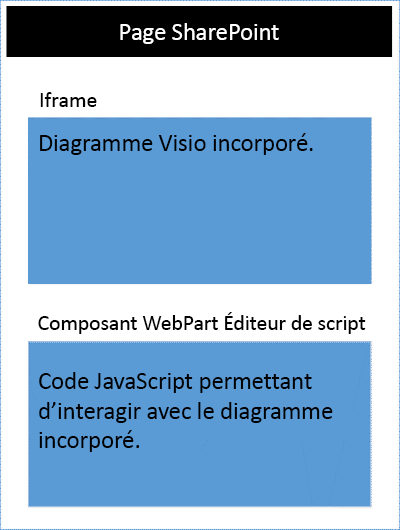
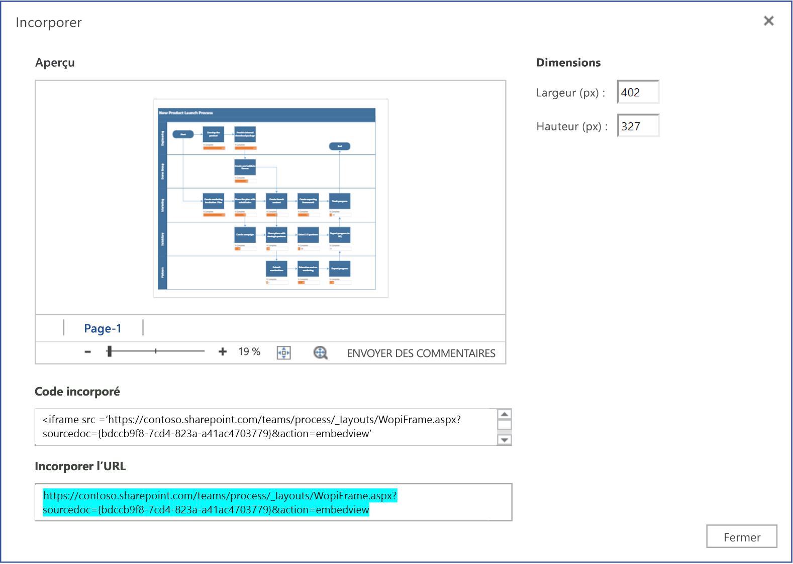

# <a name="visio-javascript-api-overview"></a>Présentation des API JavaScript pour Visio

Vous pouvez utiliser les interfaces API JavaScript pour Visio pour intégrer des diagrammes Visio dans SharePoint Online. Les diagrammes Visio incorporés sont stockés dans une bibliothèque de documents SharePoint et sont affichés sur une page SharePoint. Pour incorporer un diagramme Visio, affichez-le dans un élément HTML`<iframe>`. Ensuite, vous pouvez utiliser les interfaces API JavaScript pour Visio pour programmer le diagramme incorporé.




Vous pouvez utiliser les interfaces API JavaScript pour Visio pour :

* interagir avec les éléments du diagramme Visio, tels que les pages et les formes ;
* créer une marque de révision sur la zone du diagramme Visio ;
* écrire des gestionnaires personnalisés pour les événements de souris dans le dessin ;
* exposer les données du diagramme, tels que le texte de la forme, les données de forme et des liens hypertexte sur votre solution.

Cet article décrit comment utiliser les interfaces API JavaScript pour Visio avec Visio Online pour créer des solutions pour SharePoint Online. Il présente des concepts fondamentaux pour l’utilisation des API, notamment concernant les objets **EmbeddedSession**, **RequestContext**, les objets de proxy JavaScript, ainsi que les méthodes **sync()**, **Visio.run()** et **load()**. Les exemples de code vous montrent comment appliquer ces concepts.

## <a name="embeddedsession"></a>EmbeddedSession

L’objet EmbeddedSession initialise la communication entre le cadre du développeur et le cadre de Visio Online.

```js
var session = new OfficeExtension.EmbeddedSession(url, { id: "embed-iframe",container: document.getElementById("iframeHost") });
session.init().then(function () {
    window.console.log("Session successfully initialized");
});
```

## <a name="visiorunsession-functioncontext--batch-"></a>Visio.run(session, function(context) { batch })

**Visio.run()** exécute un script de commandes qui effectue des actions sur le modèle objet Visio. Les commandes de traitement par lots incluent les définitions des objets de proxy JavaScript locaux et des méthodes **sync()** qui synchronisent l’état entre les objets locaux et Visio, ainsi que la résolution de la promesse. L’avantage de traiter les demandes par lots avec **Visio.run()** est que, une fois la promesse résolue, tous les objets de page suivis qui ont été alloués lors de l’exécution sont automatiquement publiés.

La méthode d’exécution utilise les objets session et RequestContext et renvoie une promesse (en général, le résultat de la méthode **context.sync()**). Il est possible d’exécuter l’opération par lots en dehors de la méthode **Visio.run()**. Toutefois, dans ce cas, toutes les références d’objet de page doivent être suivies et gérées manuellement.

## <a name="requestcontext"></a>RequestContext

L’objet RequestContext facilite les demandes auprès de l’application Visio. Étant donné que le cadre du développeur et l’application Visio Online s’exécutent dans deux iframes différents, l’objet RequestContext (context dans les exemples suivants) est nécessaire pour accéder à Visio et aux objets associés (par exemple, des pages et des formes) depuis le cadre du développeur.

```js
function hideToolbars() {
    Visio.run(session, function(context){
        var app = context.document.application;
        app.showToolbars = false;
        return context.sync().then(function () {
            window.console.log("Toolbars Hidden");
        });
    }).catch(function(error)
    {
        window.console.log("Error: " + error);
    });
};
```

## <a name="proxy-objects"></a>Objets de proxy

Les objets JavaScript pour Visio déclarés et utilisés dans un complément sont des objets de proxy correspondant aux objets réels d’un document Visio. Toutes les actions effectuées sur les objets de proxy ne sont pas réalisées dans Visio et l’état du document Visio n’est pas répercuté sur les objets de proxy tant que cet état n’a pas été synchronisé. L’état de document est synchronisé lors de l’exécution de la méthode `context.sync()`.

Par exemple, l’objet JavaScript local getActivePage est déclaré pour référencer la page sélectionnée. Cela permet par exemple de mettre en file d’attente la valeur de ses propriétés et méthodes d’appel. Les actions appliquées à ces objets ne sont pas réalisées jusqu’à l’exécution de la méthode **sync()**.

```js
var activePage = context.document.getActivePage();
```

## <a name="sync"></a>Sync()

La méthode **sync()** synchronise l’état des objets de proxy JavaScript et des objets réels de Visio en exécutant les instructions mises en file d’attente sur le contexte et en récupérant les propriétés des objets Office chargés pour les utiliser dans votre code. Cette méthode renvoie une promesse, qui est résolue à la fin de la synchronisation. 

## <a name="load"></a>load()

La méthode **load()** permet de remplir les objets de proxy créés dans le calque JavaScript du complément. Lorsque vous essayez de récupérer un objet, comme un document, un objet de proxy local est d’abord créé dans le calque JavaScript. Cet objet peut être utilisé pour mettre en file d’attente la valeur de ses propriétés et méthodes d’appel. Toutefois, pour la lecture des propriétés ou des relations de l’objet, les méthodes **load()** et **sync()** doivent d’abord être appelées. La méthode load() utilise les propriétés et les relations à charger lors de l’appel de la méthode **sync()**.

L’exemple suivant montre la syntaxe de la méthode **load()**.

```js
object.load(string: properties); //or object.load(array: properties); //or object.load({loadOption});
```

1. **properties** est la liste des noms de propriétés à charger, fournis sous forme de chaînes séparées par des virgules ou de tableau de noms. Pour plus d’informations, consultez les méthodes **.load()** décrites sous chaque objet.

2. **loadOption** spécifie un objet qui décrit les propriétés select, expand, top et skip. Pour plus d’informations, reportez-vous aux [options](/javascript/api/office/officeextension.loadoption) de chargement d’objet.

## <a name="example-printing-all-shapes-text-in-active-page"></a>Exemple : impression du texte de toutes les formes de la page active

L’exemple suivant montre comment imprimer la valeur du texte de la forme d’un objet de formes de tableau.
La méthode **Visio.run()** contient un lot d’instructions. Dans le cadre de ce traitement par lots, un objet de proxy faisant référence à des formes est créé dans le document actif.

Toutes ces commandes sont mises en file d’attente et sont exécutées lorsque la méthode **context.sync()** est appelée. La méthode **sync()** renvoie une promesse qui peut être utilisée pour y adjoindre d’autres opérations.

```js
Visio.run(session, function (context) {
    var page = context.document.getActivePage();
    var shapes = page.shapes;
    shapes.load();
    return context.sync().then(function () {
        for(var i=0; i<shapes.items.length;i++) {
            var shape = shapes.items[i];
            window.console.log("Shape Text: " + shape.text );
        }
    });
}).catch(function(error) {
    window.console.log("Error: " + error);
    if (error instanceof OfficeExtension.Error) {
        window.console.log ("Debug info: " + JSON.stringify(error.debugInfo));
    }
});
```

## <a name="error-messages"></a>Messages d’erreur

Les erreurs sont renvoyées à l’aide d’un objet d’erreur qui se compose d’un code et d’un message. Le tableau suivant fournit la liste des erreurs qui peuvent se produire.

| error.code            | error.message |
|-----------------------|----------------------------------------------------------------|
| InvalidArgument       | L’argument est manquant ou non valide, ou a un format incorrect. |
| GeneralException      | Une erreur interne s’est produite lors du traitement de la demande. |
| NotImplemented        | La fonctionnalité demandée n’est pas implémentée  |
| UnsupportedOperation  | L’opération tentée n’est pas prise en charge. |
| AccessDenied          | Vous ne pouvez pas effectuer l’opération demandée. |
| ItemNotFound          | La ressource demandée n’existe pas. |

## <a name="get-started"></a>Prise en main

Vous pouvez utiliser l’exemple de cette section pour commencer. Cet exemple montre comment programmer l’affichage du texte de la forme de la forme sélectionnée dans un diagramme Visio. Pour commencer, créez une page classique dans SharePoint Online ou modifiez une page existante. Ajoutez un composant WebPart Script Editor sur la page, puis copiez-collez le code suivant.

```js
<script src='https://appsforoffice.microsoft.com/embedded/1.0/visio-web-embedded.js' type='text/javascript'></script>

Enter Visio File Url:<br/>
<script language="javascript">
document.write("<input type='text' id='fileUrl' size='120'/>");
document.write("<input type='button' value='InitEmbeddedFrame' onclick='initEmbeddedFrame()' />");
document.write("<br />");
document.write("<input type='button' value='SelectedShapeText' onclick='getSelectedShapeText()' />");
document.write("<textarea id='ResultOutput' style='width:350px;height:60px'> </textarea>");
document.write("<div id='iframeHost' />");

let session; // Global variable to store the session and pass it afterwards in Visio.run()
var textArea;
// Loads the Visio application and Initializes communication between developer frame and Visio online frame
function initEmbeddedFrame() {
    textArea = document.getElementById('ResultOutput');
    var url = document.getElementById('fileUrl').value;
    if (!url) {
        window.alert("File URL should not be empty");
    }
    // APIs are enabled for EmbedView action only.
    url = url.replace("action=view","action=embedview");
    url = url.replace("action=interactivepreview","action=embedview");
    url = url.replace("action=default","action=embedview");
    url = url.replace("action=edit","action=embedview");
  
    session = new OfficeExtension.EmbeddedSession(url, { id: "embed-iframe",container: document.getElementById("iframeHost") });
    return session.init().then(function () {
        // Initialization is successful
        textArea.value  = "Initialization is successful";
    });
}

// Code for getting selected Shape Text using the shapes collection object
function getSelectedShapeText() {
    Visio.run(session, function (context) {
        var page = context.document.getActivePage();
        var shapes = page.shapes;
        shapes.load();
        return context.sync().then(function () {
            textArea.value = "Please select a Shape in the Diagram";
            for(var i=0; i<shapes.items.length;i++) {
                var shape = shapes.items[i];
                if ( shape.select == true) {
                    textArea.value = shape.text;
                    return;
                }
            }
        });
    }).catch(function(error) {
        textArea.value = "Error: ";
        if (error instanceof OfficeExtension.Error) {
            textArea.value += "Debug info: " + JSON.stringify(error.debugInfo);
        }
    });
}
</script>
```

Après cela, vous n’avez plus besoin que de l’URL d’un diagramme Visio que vous voulez utiliser. Téléchargez simplement le diagramme Visio dans SharePoint Online et ouvrez-le dans Visio Online. À partir de là, ouvrez la boîte de dialogue Incorporer et utilisez l’URL à incorporer de l’exemple ci-dessus.



Si vous utilisez Visio Online en mode d’édition, ouvrez la boîte de dialogue Incorporer en sélectionnant **Fichier** > **Partager** > **Incorporer**. Si vous utilisez Visio Online en mode Affichage, ouvrez la boîte de dialogue Incorporer en sélectionnant « ... » puis **Incorporer**.

## <a name="open-api-specifications"></a>Spécifications d’ouverture de l’API

Au fur et à mesure que nous concevons et développons de nouvelles API, nous les mettons à votre disposition sur notre page de [spécifications d’ouverture de l’API](../openspec.md) pour que vous puissiez nous faire part de vos commentaires. Découvrez les nouvelles fonctionnalités du pipeline et donnez-nous votre avis sur nos spécifications de conception.

## <a name="visio-javascript-api-reference"></a>Référence de l’API JavaScript pour Visio

Pour en savoir plus sur l’API JavaScript pour Visio, consultez la [documentation de référence de l’API JavaScript pour Visio](/javascript/api/visio).
