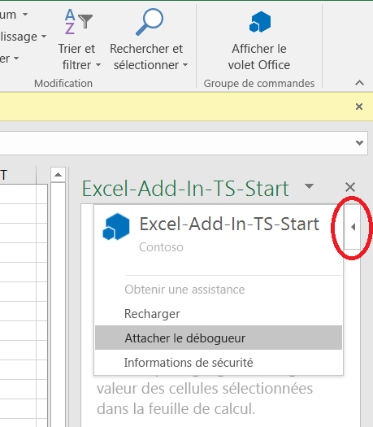

# Attacher un débogueur à partir du volet Office

Dans Office 2016 pour Windows, version 77xx.xxxx ou ultérieure, vous pouvez attacher le débogueur à partir du volet Office. Cette fonctionnalité attache directement le débogueur au processus Internet Explorer approprié pour vous. Vous pouvez attacher un débogueur quel que soit l’outil que vous utilisez (générateur de Yeoman, Visual Studio Code, node.js, Angular ou autre). 

Pour lancer l’outil **Attacher le débogueur**, cliquez sur le coin supérieur droit du volet Office pour activer le menu **Caractéristique** (comme illustré dans le cercle rouge dans l’image suivante).   

 >  **Remarques** :  
   - À l’heure actuelle, le seul outil de débogage pris en charge est [Visual Studio 2015](https://www.visualstudio.com/downloads/) avec la [mise à jour 3](https://msdn.microsoft.com/fr-fr/library/mt752379.aspx) ou version ultérieure. Si vous n’avez pas installé Visual Studio, la sélection de l’option **Attacher le débogueur** ne produit aucune action.   
   - Vous ne pouvez déboguer JavaScript côté client qu’à l’aide de l’outil **Attacher le débogueur**. Pour déboguer du code côté serveur, comme avec un serveur Node.js, vous disposez de nombreuses options. Pour plus d’informations sur le débogage avec Visual Studio Code, reportez-vous à la rubrique sur le [débogage de Node.js dans VS Code](https://code.visualstudio.com/docs/nodejs/nodejs-debugging). Si vous n’utilisez pas Visual Studio Code, recherchez « déboguer Node.js » ou « déboguer {nom de serveur} ».

Sélectionnez **Attacher le débogueur**. Cette action ouvre la boîte de dialogue **Débogueur juste-à-temps Visual Studio**, comme illustré dans l’image suivante. 

Dans Visual Studio, les fichiers de code s’affichent dans **l’Explorateur de solutions**.   Vous pouvez définir des points d’arrêt à la ligne de code que vous souhaitez déboguer dans Visual Studio.

Pour plus d’informations sur le débogage dans Visual Studio, consultez les rubriques suivantes :

-   Pour lancer et utiliser l’explorateur DOM dans Visual Studio, consultez le conseil 4 dans la section relative aux [conseils et astuces](https://blogs.msdn.microsoft.com/officeapps/2013/04/16/building-great-looking-apps-for-office-using-the-new-project-templates/#tips_tricks) du billet de blog sur la [création d’applications attrayantes pour Office à l’aide de nouveaux modèles de projet](https://blogs.msdn.microsoft.com/officeapps/2013/04/16/building-great-looking-apps-for-office-using-the-new-project-templates).
-   Pour définir des points d’arrêt, consultez la rubrique [Utilisation des points d’arrêt](https://msdn.microsoft.com/fr-fr/library/5557y8b4.aspx).
-   Pour utiliser F12, consultez la rubrique [Utilisation des outils de développement F12](https://msdn.microsoft.com/fr-fr/library/bg182326(v=vs.85).aspx).

## Ressources supplémentaires

- [Créer et déboguer des compléments Office dans Visual Studio](../get-started/create-and-debug-office-add-ins-in-visual-studio.md)
- [Créer un complément Office à l’aide d’un éditeur](../get-started/create-an-office-add-in-using-any-editor.md)
- [Publier votre complément Office](../publish/publish.md)
