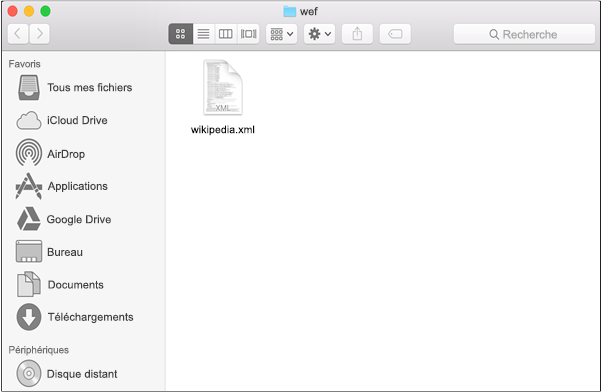

# Chargement de version test des compléments Office sur iPad et Mac

Pour voir comment votre complément s’exécutera dans Office sur iOS, vous pouvez charger une version test du manifeste de votre complément sur un iPad à l’aide d’iTunes ou directement dans Office sur Mac. Cette opération ne vous permettra pas de définir des points d’arrêt ni de déboguer le code de votre complément pendant son exécution, mais vous pourrez observer son comportement, et vérifier que l’interface utilisateur est fonctionnelle et qu’elle s’affiche correctement.

## Configuration requise pour Office sur iOS

- Un ordinateur Windows ou Mac sur lequel [iTunes](https://www.apple.com/itunes/download/) est installé.

- Un iPad fonctionnant sous iOS 8.2 ou version ultérieure sur lequel [Excel sur iPad](https://itunes.apple.com/us/app/microsoft-excel/id586683407?mt=8) est installé et disposant d’un câble de synchronisation.

- Le fichier .xml de manifeste pour le complément que vous voulez tester.

## Configuration requise pour Office sur Mac

- Un Mac fonctionnant sous OS X v10.10 « Yosemite » ou une version ultérieure, avec [Office sur Mac](https://products.office.com/buy/compare-microsoft-office-products?tab=omac) installé.

- Word sur Mac version 15.18 (160109).

- Excel sur Mac version 15.19 (160206).

- PowerPoint sur Mac version 15.24 (160614)

- Le fichier .xml de manifeste pour le complément que vous voulez tester.

## Chargement d’une version test d’un complément dans Excel ou Word sur iPad

1. Utilisez un câble de synchronisation pour connecter votre iPad à votre ordinateur. Si vous connectez l’ordinateur iPad à votre ordinateur pour la première fois, vous êtes invité à **approuver cet ordinateur ?**. Sélectionnez **approuver** pour continuer.

2. Dans iTunes, sélectionnez l’icône **iPad** en dessous de la barre de menu.

3. Sous **Réglages** sur le côté gauche d’iTunes, sélectionnez **Applications**.

4. Sur le côté droite d’iTunes, faites défiler vers **Partage de fichiers**, puis sélectionnez **Excel** ou **Word** dans la colonne **Compléments**.

5. Au bas de la colonne **Excel** ou **documents Word** , sélectionnez **Ajouter un fichier**, puis sélectionnez le fichier manifest. xml du complément que vous souhaitez chargement.

6. Ouvrez l'application Excel ou Word sur votre iPad. Si l’application Excel ou Word est déjà en cours d’exécution, cliquez sur le bouton **Accueil** , puis fermez et redémarrez l’application.

7. Ouvrez un document.

8. Choisissez **compléments** sous l’onglet **insertion** . Votre complément versions test chargées peut être inséré sous le titre **développeur** dans l’interface utilisateur des **compléments** .

    

## Chargement d’une version test de complément dans Office sur Mac

> [!NOTE]
> Pour charger une version test de complément Outlook sur Mac, voir l’article relatif au [chargement de version test des compléments Outlook](../outlook/sideload-outlook-add-ins-for-testing.md).

1. Ouvrez le **Terminal** et accédez à l’un des dossiers suivants, dans lequel vous allez enregistrer le fichier manifeste de votre complément. Si le dossier `wef` n’existe pas sur votre ordinateur, créez-le.

    - Pour Word : `/Users/<username>/Library/Containers/com.microsoft.Word/Data/Documents/wef`    
    - Pour Excel : `/Users/<username>/Library/Containers/com.microsoft.Excel/Data/Documents/wef`
    - Pour PowerPoint : `/Users/<username>/Library/Containers/com.microsoft.Powerpoint/Data/Documents/wef`

2. Ouvrez le dossier dans **Finder** à l’aide `open .` de la commande (y compris le point ou le point). Copier le fichier manifeste de votre complément dans ce dossier.

    

3. Ouvrez Word, puis ouvrez un document. Redémarrez Word si cette application est déjà en cours d'exécution.

4. Dans Word, sélectionnez **Insérer** > des**compléments** > **My Add-ins** (menu déroulant), puis choisissez votre complément.

    

    > [!IMPORTANT]
    > Les versions test chargées de vos compléments ne s’afficheront pas dans la boîte de dialogue Mes compléments. Elles sont visibles uniquement dans le menu déroulant (petite flèche vers le bas à droite de Mes compléments dans l’onglet **Insérer**). Les versions test chargées de vos compléments sont répertoriées sous l’en-tête **Compléments de développeur** dans ce menu.

5. Vérifiez que votre complément apparaît dans Word.

    

## Supprimer un complément versions test chargées

Vous pouvez supprimer un complément précédemment versions test chargées en effaçant le cache Office sur votre ordinateur. Pour plus d’informations sur la façon d’effacer le cache de chaque plateforme et hôte, consultez l’article [effacer le cache Office](clear-cache.md).

## Voir aussi

- [Débogage des compléments Office sur iPad et Mac](debug-office-add-ins-on-ipad-and-mac.md)
